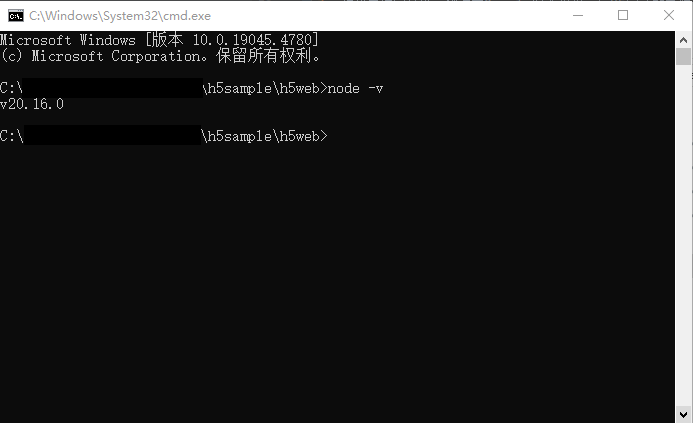
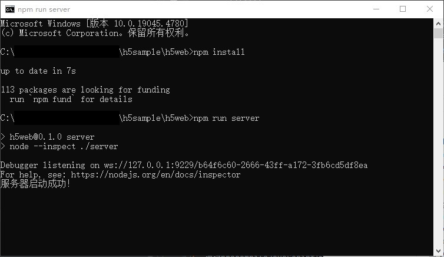

# 实现H5应用冷启动加速功能

### 介绍

本示例主要介绍了使用数据缓存及预解析和预连接优化、资源拦截替换加速、预编译JavaScript生成字节码缓存（Code Cache）、离线资源免拦截注入等最佳实践方案来加速H5 web应用冷启动时延，帮助用户实现H5应用冷启动达标。

### 效果预览


### 工程目录

```markdown
├──entry/src/main/ets/
│  ├──common
│  │  ├──constant                  
│  │  │  └──CommonConstants.ets               // 公共常量
│  │  ├──types  
│  │  │  └──CommonTypes.ets                   // 公共类型
│  │  └──utils 
│  │     └──Common.ets                        // 工具类
│  ├──entryability
│  │  └──EntryAbility.ets                     // 程序入口类
│  ├──entrybackupability
│  │  └──EntryBackupAbility.ets               // 备份恢复派生类
│  └──pages                 
│     └──Index.ets                            // H5页面入口
└──entry/src/main/resources                   // 应用资源目录
```

### 使用说明

1. 搭建nodejs环境：H5 Web网站是基于nodejs实现的，需要安装nodejs，如果您本地已有nodejs环境可以跳过此步骤。
    1. 检查本地是否安装nodejs：打开命令行工具（如Windows系统的cmd和Mac电脑的Terminal，这里以Windows为例），输入node -v，如果可以看到版本信息，说明已经安装nodejs。

       

    2. 如果本地没有nodejs环境，您可以去nodejs官网上下载所需版本进行安装配置。
    3. 配置完环境变量后，重新打开命令行工具，输入node -v，如果可以看到版本信息，说明已安装成功。
2. 启动H5网站：在本项目的h5web目录下打开命令行工具，输入npm install 安装服务端依赖包，安装成功后输入npm run server点击回车。看到“服务器启动成功！”则表示服务端已经在正常运行。
3. 构建局域网环境：测试本Sample时要确保运行H5网站的电脑和测试机连接的是同一局域网下的网络，您可以用您的手机开一个个人热点，然后将测试机和运行H5网站的电脑都连接您的手机热点进行测试。

   

4. 连接H5网站地址：打开命令行工具，输入ipconfig命令查看本地ip，将本地ip地址复制到src/main/ets/common/constant/CommonConstants.ets文件下的16行，注意只替换ip地址部分，不要修改端口号，保存好ip之后即可运行Sample进行测试。

### 具体实现

1. 通过initializeBrowserEngine()来提前初始化ArkWeb组件的内核，然后在初始化内核后调用prepareForPageLoad()对即将要加载的页面进行预连接。源码参考：[EntryAbility.ets](entry/src/main/ets/entryability/EntryAbility.ets)
    - prepareForPageLoad预连接和预解析只和host相关，URL带参数的情况下也能进行预连接、预解析。最佳实践参考：[预解析和预连接优化](https://developer.huawei.com/consumer/cn/doc/best-practices-V5/bpta-web-develop-optimization-V5#section29621418112311)
2. 通过创建一个ArkWeb组件来预启动Web渲染进程。源码参考：[EntryAbility.ets](entry/src/main/ets/entryability/EntryAbility.ets) [Common.ets](entry/src/main/ets/common/utils/Common.ets)
    - 最佳实践参考：[预解析和预连接优化](https://developer.huawei.com/consumer/cn/doc/best-practices-V5/bpta-web-develop-optimization-V5#section2446239101011)
3. 冷启动第一屏数据通过onInterceptRequest拦截替换。源码参考：[Index.ets](entry/src/main/ets/pages/Index.ets)
    - 最佳实践参考：[资源拦截替换加速](https://developer.huawei.com/consumer/cn/doc/best-practices-V5/bpta-web-develop-optimization-V5#section1638162365115)
    - 使用DataCache缓存数据，接口参考：[@hadss/datacache](https://ohpm.openharmony.cn/#/cn/detail/@hadss%2Fdatacache)
4. 通过precompileJavaScript预编译js资源。源码参考：[Index.ets](entry/src/main/ets/pages/Index.ets)
    - 最佳实践参考：[预编译JavaScript生成字节码缓存（Code Cache）](https://developer.huawei.com/consumer/cn/doc/best-practices-V5/bpta-web-develop-optimization-V5#section563844632917)
5. 通过injectOfflineResources离线注入首页需要的静态资源。源码参考：[Index.ets](entry/src/main/ets/pages/Index.ets)
    - 最佳实践参考：[离线资源免拦截注入](https://developer.huawei.com/consumer/cn/doc/best-practices-V5/bpta-web-develop-optimization-V5#section166720457447)
    

### 相关权限

1. ohos.permission.INTERNET 网络权限
2. ohos.permission.GET_NETWORK_INFO 网络状态权限

### 约束与限制

1. 本示例仅支持标准系统上运行，支持设备：华为手机。
2. HarmonyOS系统：HarmonyOS 5.0.0 Release及以上。
3. DevEco Studio版本：DevEco Studio 5.0.0 Release及以上。
4. HarmonyOS SDK版本：HarmonyOS 5.0.0 Release SDK及以上。
