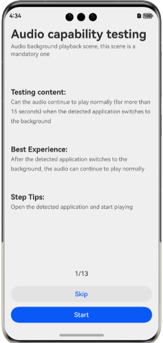
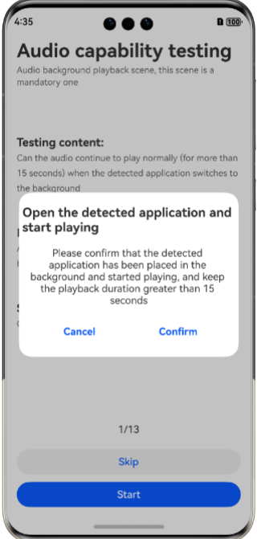
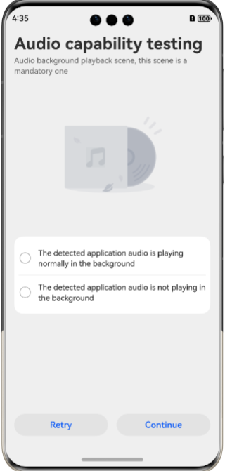
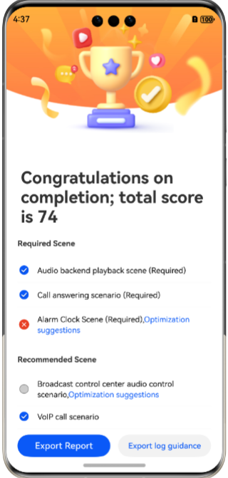

# Implement audio application capability detection function

#### Brief Introduction

This scenario mainly provides the function of detecting the capabilities of audio applications. It is used to detect the functional completeness and accuracy of audio applications in different audio scenarios. It supports audio background playback, call answering, alarm clock, broadcast control center audio control, and VoIP. Various scenarios such as calls, navigation, voice assistant broadcasts, and mute playback.

#### Preview of renderings

| Main Page                               | Confirm Page                               | Marking Page                             | Score Page                               |
|-----------------------------------------|--------------------------------------------|------------------------------------------|------------------------------------------|
|  |  |  |  |

#### Main module structure of the project

```
├──entry/src/main/ets/
│  ├──common
│  │  ├──constants                     // constants
│  │  │  └──ResourceConstants.ets      // resource constants
│  │  ├──store                         // global variable
│  │  │  ├──AppStore.ets               // Variables such as step counting and operation results
│  │  │  ├──DataInterface.ets          // Interface for configuring data
│  │  │  └──Score.ets                  // The interface and class required for counting and operation results
│  │  └──utils                         // tools
│  │     ├──ConfirmService.ets         // Functions used for special comfirmation pop ups
│  │     ├──GenerateFileTips.ets       // File generation prompt box
│  │     └──ListBorder.ets             // Set list border
│  ├──components                       // Each module component
│  │  ├──CheckList.ets                 // marking page options
│  │  ├──Header.ets                    // page header
│  │  ├──IconContent.ets               // marking page image and operation icon
│  │  └──MainContent.ets               // main page content
│  ├──entryability
│  │  └──EntryAbility.ets              // Ability's lifecycle callback content
│  ├──entrybackupability
│  │  └──EntryBackupAbility.ets        // The lifecycle callback content of ExitBackupAbility
│  └──pages                            // Page
│     ├──ExportLog.ets                 // Log export guidance page
│     ├──Index.ets                     // Entry file
│     ├──PlayerPage.ets                // Audio detection selection entrance
│     ├──SceneAdvice.ets               // Optimization suggestion page
│     ├──SceneCheck.ets                // Scene marking page
│     ├──SceneConfirm.ets              // Scene operation confirmation pop-up box
│     ├──SceneHome.ets                 // Scene main page
│     ├──ScorePage.ets                 // Score page
│     └──SkipConfirm.ets               // Scene skipping confirmation pop-up box           
├──MediaService/src/main/ets
│  ├──songDataController               // Song information data
│  │  ├──PlayerData.ets                // Play data
│  │  ├──SongData.ets                  // Song source data
│  │  ├──SongItemBuilder.ets           // Song data processing
│  │  └──SongListData.ets              // Song List Data
│  └──utils
│     ├──AudioCapturerController.ets   // Recording control
│     ├──AudioRendererController.ets   // Audio playback control
│     ├──AVSessionController.ets       // Media session control
│     ├──BackgroundUtil.ets            // Backend playback function
│     ├──CsvFileUtil.ets               // CSV file processing function
│     ├──Logger.ets                    // Log function
│     ├──MediaTools.ets                // Media data conversion tool class
│     └──RequestPermissionUtil.ets     // Recording permission check tool class
└──entry/src/main/resources            // Application static resource directory
```

#### Related permissions

1. Background task permissions: ohos. permission KEEP_BACKGROUND_RUNNING， Used for background playback and recording of audio scenes.
2. Microphone permission：ohos.permission.MICROPHONE,Used for recording audio scenes.

#### Rely on

This scheme uses the third-party library HMRouter. In case of missing dependencies, they can be downloaded through the
command
ohpm i @hadss/hmrouter

#### Constraints and limitations

1. This example only supports running on standard systems and supports devices such as Huawei phones.
2. HarmonyOS system: HarmonyOS NEXT Release and above.
3. DevEco Studio version: DevEco Studio NEXT Release and above.
4. HarmonyOS SDK version: HarmonyOS NEXT Release SDK and above.
