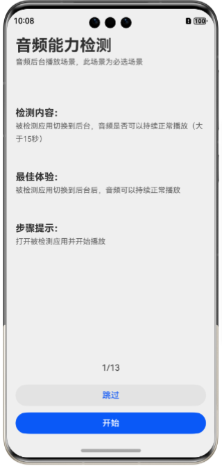
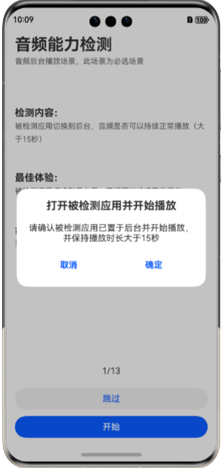
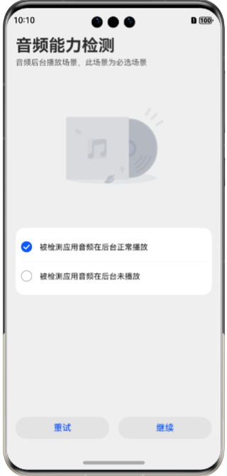

# 实现音频类应用能力检测功能

## 简介
本场景主要提供检测音频类应用能力的功能，用于检测音频类应用在不同音频场景下的功能完备度和准确性，支持如音频后台播放、来电接听、闹钟、播控中心音频控制、VoIP 通话、导航、语音助手播报、静音播放等多种场景。

#### 效果图预览

| 主页面                                | 确认页                                | 打分页                                | 得分页                                |
|--------------------------------------|--------------------------------------|--------------------------------------|---------------------------------------|
|  |  |  |  |

## 工程主要模块结构

```
├──entry/src/main/ets/
│  ├──common
│  │  ├──constants                     // 常量
│  │  │  └──ResourceConstant.ets       // 资源常量
│  │  ├──store                         // 全局变量
│  │  │  ├──AppStore.ets               // 步骤计数，操作结果等变量
│  │  │  ├──DataInterface.ets          // 配置数据对应的接口
│  │  │  └──Score.ets                  // 步骤计数及操作结果需要的接口和类
│  │  └──utils                         // 工具
│  │     ├──ConfirmService.ets         // 特殊确认弹框使用的函数
│  │     ├──GenerateFileTips.ets       // 文件生成提示框
│  │     └──ListBorder.ets             // 设置列表边框
│  ├──components                       // 各模块组件
│  │  ├──CheckList.ets                 // 打分页面选项
│  │  ├──Header.ets                    // 页面头部       
│  │  ├──IconContent.ets               // 打分页面图像及操作图标
│  │  └──MainContent.ets               // 主页面主体内容
│  ├──entryability
│  │  └──EntryAbility.ets              // Ability的生命周期回调内容
│  ├──entrybackupability
│  │  └──EntryBackupAbility.ets        // EntryBackupAbility的生命周期回调内容
│  └──pages                            // 页面
│     ├──ExportLog.ets                 // 日志导出指导页面
│     ├──Index.ets                     // 入口文件
│     ├──PlayerPage.ets                // 音频检测选择入口
│     ├──SceneAdvice.ets               // 优化建议页面
│     ├──SceneCheck.ets                // 场景打分选择页面
│     ├──SceneConfirm.ets              // 场景操作确认弹框
│     ├──SceneHome.ets                 // 场景主页面
│     ├──ScorePage.ets                 // 得分页面
│     └──SkipConfirm.ets               // 场景跳过确认弹框                            
├──MediaService/src/main/ets
│  ├──songDataController               // 歌曲信息数据
│  │  ├──PlayerData.ets                // 播放数据
│  │  ├──SongData.ets                  // 歌曲源数据
│  │  ├──SongItemBuilder.ets           // 歌曲数据处理
│  │  └──SongListData.ets              // 歌曲列表数据
│  └──utils
│     ├──AudioCapturerController.ets   // 录音控制
│     ├──AudioRendererController.ets   // 音频播放控制
│     ├──AVSessionController.ets       // 媒体会话控制
│     ├──BackgroundUtil.ets            // 后台播放功能
│     ├──CsvFileUtil.ets               // csv文件处理功能
│     ├──Logger.ets                    // 日志功能
│     ├──MediaTools.ets                // 媒体数据转换工具类
│     └──RequestPermissionUtil.ets     // 录音权限检查工具类
└──entry/src/main/resources            // 应用静态资源目录
```
## 相关权限
1. 后台任务权限：ohos.permission.KEEP_BACKGROUND_RUNNING，用于音频的后台播放和录制音频场景。
2. 麦克风权限：ohos.permission.MICROPHONE，用于录制音频场景。

## 依赖

本方案使用了三方库HMRouter，如出现缺少依赖的情况可通过命令下载
ohpm i @hadss/hmrouter

## 约束与限制
1.  本示例仅支持标准系统上运行，支持设备：华为手机。
2.  HarmonyOS系统：HarmonyOS NEXT Release及以上。
3.  DevEco Studio版本：DevEco Studio NEXT Release及以上。
4. HarmonyOS SDK版本：HarmonyOS NEXT Release SDK及以上。


