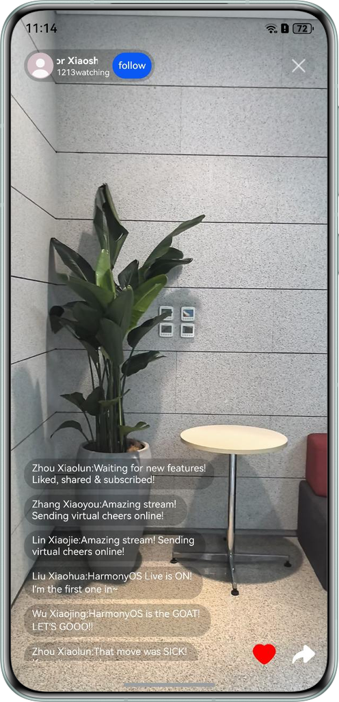

# Implementing media live streaming function based on HarmonyOS media subsystem

## Overview

This example is based on the HarmonyOS media subsystem and implements the live ends and viewing ends for media live
streaming. This example implements commonly used audio and video capture, playback, and focus management in live
streaming scenarios ROI、 Features such as adding background music and flipping front and rear cameras. Based on this
example, it can help application development to start live streaming and watch live streaming scenarios.

- The viewing end is simulated by playing video files. The main process is to play the video files recorded on the live
  end through AvPlayer.
- The main process of live video recording is camera capture -> Opengl rotation -> encoding -> packaging into mp4 files.
- The live broadcast process is simulated through distributed files. The two mobile phones simulate the broadcast end
  and watch the broadcast end respectively. They must log in to the same Huawei account and enable WIFI and Bluetooth to
  complete the distributed networking. The specific process is: live end Save the recorded video file to the sandbox and
  copy it to the distributed directory. Watch the player copy the video file under the distributed file to the sandbox
  and play it through AvPlayer.
- An OpenGL rendering pipeline is added between the camera and the encoding for the recorded scene. Developers can refer
  to this process and add the corresponding Shader, such as live scene plus beauty, filter and other operators.

### Atomic Capability Specifications Supported for Playback

| Media | Muxing Format | Stream Format                                |
|-------|:--------------|:---------------------------------------------|
| Video | mp4           | Video stream: H.264/H.265; audio stream: ACC |

### Atomic Capability Specifications Supported for Recording

| Muxing Format | Video Codec Type | Audio Codec Type | 
|---------------|------------------|------------------|
| mp4           | H.264/H.265      | AAC              |

### Preview

| HomePage                                                                            | Live page                                                                                      | Watch the play page                                                                                   |
|-------------------------------------------------------------------------------------|------------------------------------------------------------------------------------------------|--------------------------------------------------------------------------------------|
|  |  |  |


## How to Use

1. Click "Allow" after the "HMOSLiveStream" to access your camera pops up.
2. Click "Allow" after the "HMOSLiveStream" to access your microphone pops up.
3. After the "HMOSLiveStream" is displayed, click "Allow".

### Open the live broadcast

1. Click "Start Live Broadcast".
2. Confirm to allow recording files to be saved to distributed files.
3. Click the button in the upper right corner to close after recording.

### Watch the live broadcast

1. After the live broadcast, you can watch the live broadcast.
2. Click "Watch Live" to enter the live broadcast page.

## Project Directory

```       
├──entry/src/main/cpp                 // Native layer
│  ├──capbilities                     // Capability interfaces and implementation
│  │  ├──render                       // Display module interface and implementation 
│  │  │  ├──include                   // Display module interface
│  │  │  │  ├──egl_render_context.h   // EGL Rendering Context Interface
│  │  │  │  ├──render_thread.h        // Rendering thread interface
│  │  │  │  └──shader_program.h       // Encapsulates the interface of OpenGL ES shader program
│  │  │  ├──render_thread.cpp         // Rendering thread
│  │  │  ├──egl_render_context.cpp    // EGL Rendering Context Implementation
│  │  │  └──shader_program.cpp        // Encapsulate OpenGL ES shader program
│  │  ├──codec                        // Audio and video acquisition codec
│  │  │  ├──include                   // Audio and video acquisition codec interface
│  │  │  ├──AudioCapturer.cpp         // Audio capturer implementation
│  │  │  ├──AudioDecoder.cpp          // Audio decoding implementation
│  │  │  ├──AudioEncoder.cpp          // Audio encoder Implementation
│  │  │  ├──AudioRender.cpp           // Audio rendering implementation
│  │  │  ├──CodecCallback.cpp         // Codec related callbacks
│  │  │  ├──Demuxer.cpp               // Demuxer Implementation
│  │  │  ├──Muxer.cpp                 // Muxer Implementation
│  │  │  └──VideoEncoder.cpp          // Video encoder implementation
│  ├──common                          // Common modules
│  │  ├──dfx                          // Logs
│  │  ├──ApiCompatibility.h           // API compatibility
│  │  └──SampleInfo.h                 // Common classes for function implementation 
│  ├──player                          // Player interfaces and implementation at the native layer
│  │  ├──include                      // Native layer interfaces
│  │  │  ├──Player.h                  // Player interfaces at the native layer
│  │  │  └──PlayerNative.h            // Player entry at the native layer
│  │  ├──Player.cpp                   // Player implementation at the native layer
│  │  └──PlayerNative.cpp             // Player entry at the native layer
│  └──recorder                        // Recorder interface and implementation at the native layer
│  │     ├──include                   // Native layer interfaces
│  │     │  ├──Recorder.h             // Recorder interfaces at the native layer
│  │     │  └──RecorderNative.h       
│  │     ├──Recorder.cpp              // Recorder implementation at the native layer
│  │     └──RecorderNative.cpp        // Recorder entry at the native layer
│  ├──types                           // Interfaces exposed by the native layer
│  │  ├──libplayer                    // Interfaces exposed by the player to the UI layer
│  │  └──librecorder                  // Interfaces exposed by the recorder to the UI layer
│  └──CMakeLists.txt                  // Compilation entry     
├──ets                                // UI layer
│  ├──common                          // Common modules
│  │  ├──utils                        // Common utility class
│  │  │  ├──BackgroundTaskManager.ets // Background task tool class
│  │  │  ├──CameraCheck.ets           // Check whether camera parameters support
│  │  │  ├──DateTimeUtils.ets         // Time conversion tool class
│  │  │  ├──ImageUtil.ets             // Image processing tool class
│  │  │  └──Logger.ets                // Logging tool
│  │  ├──GlobalConstants.ets          // Global variable name
│  │  └──CommonConstants.ets          // Parameter Constant 
│  ├──components                      // Component Catalog
│  │  └──SettingPopupDialog.ets       // Set related data classes   
│  ├──controller                      // controller layer
│  │  ├──BgmController.ets            // Background music controller
│  │  ├──CameraController.ets         // Camera controller
│  │  ├──DistributeFileManager.ets    // Distributed File Manager
│  │  ├──VideoPlayerController.ets    // Local audio and video playback controller
│  │  └──VideoSessionController.ets   // Audio session controller 
│  ├──entryability                    // Entrance of application
│  │  └──EntryAbility.ets            
│  ├──entrybackupability            
│  │  └──EntryBackupAbility.ets   
│  ├──model            
│  │  ├──CameraDataModel.ets          // Camera parameter data class  
│  │  └──SettingPopupOptionItem.ets   // Set data class  
│  ├──pages                           // Entrance page
│  │  ├──Index.ets                    // Index page
│  │  ├──StartLiveStream.ets          // Live end page
│  │  └──WatchLiveStream.ets          // View the player page
│  └──view                            // Component Page
│     ├──AvplayerView.ets             // Watch AvPlayer audio and video playback
│     ├──StartLiveDecorationView.ets  // Live end data page
│     ├──StartLiveRenderView.ets      // Live end renderer
│     └──WatchLiveDecorationView.ets  // View the data page of the player
├──resources                          // Resource files for storing applications
└──module.json5                       // Module configuration information
```

## How to Implement

### Open the live broadcast

#### UI Layer

1. On the Index page of the UI layer, after the user clicks "Start Live Broadcast", confirm to save the recording file
   to the distributed folder, and a new file will be created.
2. After the file is created, the fd of the file just created and the user preset recording parameters will be used to
   call initNative() of the Native layer for recording initialization. After the initialization is completed, the Native
   layer will call
   OH_NativeWindow_GetSurfaceId interface, get the surfaceId of NativeWindow, and call back the surfaceId to the UI
   layer.
3. After the UI layer gets the surfaceId given by the encoder, it constructs the cameraController and bgmController,
   calls up the page route, and jumps to the StartLiveStream page.
4. When building the XComponent of the StartLiveRenderView component in the StartLiveStream page, the. onLoad() method
   will be called. This method will first get the surfaceId of the XComponent,
   Then call createRecorder() and startNative() of cameraController. This function will establish a production and
   consumption model for camera production, XComponent and encoder surface consumption.

#### Native Layer Encode

1. After entering the recording interface, the encoder starts encoding the camera preview stream on the UI layer.
2. Every time the encoder successfully encodes a frame, the output callback OnNewOutputBuffer() of sample_callback.cpp
   will be activated once, and the user will get the OH_AVBuffer given by the AVCodec framework.
3. In the output callback, the user needs to manually store the frame buffer and index into the output queue and notify
   the output thread to unlock.
4. In the output thread, save the frame information of the previous step as bufferInfo, and pop out of the queue.
5. In the output thread, use the bufferInfo in the previous step to call the encapsulation interface WriteSample, and
   then this frame is encapsulated into MP4.
6. Finally, after calling the FreeOutputBuffer interface, this frame buffer is released back to the AVCodec framework to
   realize buffer rotation.

#### Native Layer Decode

1. Specific implementation principle:
    - After the decoder starts, every time the decoder gets a frame, OnNeedInputBuffer will be called once, and the
      AVCodec framework will give the user an OH_AVBuffer.
    - In the input callback, the user needs to manually store the frame buffer and index into the input queue and unlock
      the input thread at the same time.
    - In the input thread, after storing the frame information of the previous step as bufferInfo, pop will queue up.
    - In the input thread, use the bufferInfo in the previous step to call the ReadSample interface to unpack the frame
      data.
    - In the input thread, use the unpacked bufferInfo to call the decoded PushInputData interface. At this time, the
      buffer runs out and returns to the framework to realize the buffer rotation.
    - After PushInputData, this frame starts decoding. Every time the decoding completes a frame, the output callback
      will
      be called once. The user needs to manually store the frame buffer and index into the output queue.
    - In the output thread, after storing the frame information of the previous step as bufferInfo, pop will queue up.
    - In the output thread, after calling the FreeOutputData interface, the buffer will be sent and released. The
      released
      buffer will return to the framework to realize buffer rotation.
2. In the decoder config phase, the input parameter OHNativeWindow * of the OH_VideoDecoder_SetSurface interface is
   pluginWindow_ in PluginManager.
3. In the decoder config phase, the SetCallback interface, the input-output callback of sample_callback.cpp needs to
   store the recalled frame buffer and index into a user-defined container sample_info. h to facilitate subsequent
   operations.
4. Start() of Player.cpp creates two threads dedicated to input and output.

### Watch the live broadcast

#### UI Layer

1. On the Index page of the UI layer, after the user clicks the View Live button, the click event will be triggered, and
   the application will copy the video files in the distributed directory to the sandbox, and select the latest video
   files to play.
2. Transfer the video file information to AvplayerView, and use Avplayer to play the video.

## Required Permissions

- **ohos.permission.CAMERA**: allows an app to use the camera.
- **ohos.permission.MICROPHONE**: allows an app to use the microphone.
- **ohos.permission.DISTRIBUTED_DATASYNC**: running applications uses distributed files for synchronization.
- **ohos.permission.KEEP_BACKGROUND_RUNNING**: allow running apps to run in the background

## Dependencies

- N/A

## Constraints

1. The sample app is supported only on Huawei phones running the standard system.

2. The HarmonyOS version must be HarmonyOS 5.0.5 Release or later.

3. The DevEco Studio version must be DevEco Studio 6.0.0 Release or later.

4. The HarmonyOS SDK version must be HarmonyOS 6.0.0 Release or later.