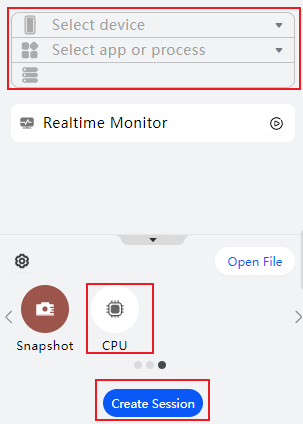
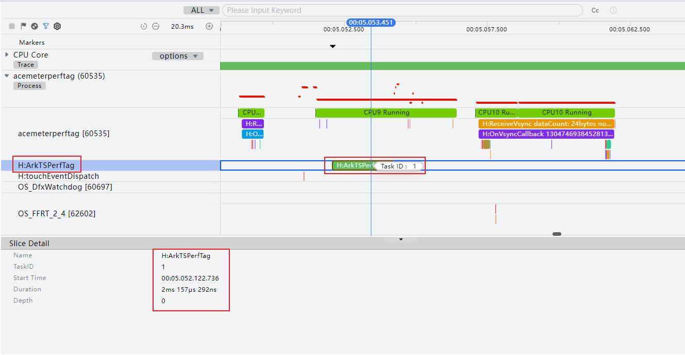
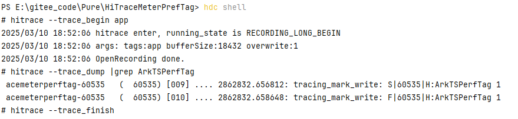

# 基于HiTraceMeter实现性能打点功能

### 简介

本示例主要介绍使用HiTraceMeter实现性能打点，包括在ArkTS侧、Native侧、组件回调中、自定义组件生命周期中进行打点。 开发者可以使用HiTraceMeter进行打点分析，判断应用具体耗时点并进行合理的优化，提高应用性能。

### 效果预览
 

### 使用说明

点击对应按钮会分别跳转到不同场景的页面。 在ArkTS侧HiTraceMeter打点与Native侧HiTraceMeter打点页面中，包含了一个按钮，点击按钮会执行耗时任务并进行打点计时，调用完成后会弹窗显示结果。在组件回调耗时打点页面中，包含了一个Grid组件和一个按钮，点击按钮会跳转到Grid指定位置并进行打点记录。在生命周期耗时打点页面中，包含了一个List列表，在组件刷新时会进行组件复用，在组件复用的生命周期回调中进行打点记录判断其生命周期耗时。

#### 打点信息查询
1. 通过DevEco Studio的Profiler工具查看
   1. 运行项目，然后通过Profiler工具选择应用线程，创建CPU分析任务抓取数据，录制期间需要在设备中执行自己的业务调用逻辑。

      
   2. 等待数据加载完成，查看泳道，当存在Trace任务时，可在对应的线程泳道中查看当前线程已触发的Trace任务层叠图。例如图中的ArkTSPerfTag，该泳道名称对应代码中HiTraceMeter打印的name（如hiTraceMeter.startTrace("ArkTSPerfTag", 1)中的ArkTSPerfTag）。案例中四个场景分别对应的打点name是ArkTSPerfTag，NativePerfTag，ComponentCBPerfTag，LifeCyclePerfTag。

      
2. 通过命令行查看
   1. 运行项目，然后通过hitrace命令获取跟踪任务的相关日志
      在DevEco Studio Terminal中执行如下命令抓取trace(xxx\xxx代表项目路径)：
      
      PS D:\xxx\xxx> hdc shell
      
      $ hitrace --trace_begin app
   2. 执行完抓取trace后，先在设备中执行自己的业务调用逻辑，然后继续执行如下命令（xxx代表代码中HiTraceMeter打印的name，例如hiTraceMeter.startTrace("ArkTSPerfTag", 1)中的ArkTSPerfTag）:
   
      $ hitrace --trace_dump |grep xxx
   
      $ hitrace --trace_finish
   3. 抓取结果：
   
      
### 工程结构
```
├──entry/src/main/cpp                   // C++代码区
│  ├──types
│  │  └──libentry                       // C++接口导出
│  │     ├──Index.d.ts                
│  │     └──oh-package.json5           
│  ├──CMakeLists.txt                    // Cmake配置文件 
│  └──napi_init.cpp                     // Native侧业务代码
├──entry/src/main/ets                   // ArkTS代码区    
│  ├──common                      
│  │  └──CommonConstants.ets            // 常量定义文件                    
│  ├──entryability        
│  │  └──EntryAbility.ets                                
│  ├──entrybackupability 
│  │  └──EntryBackupAbility.ets                           
│  ├──model                
│  │  ├──GridDataSource.ets             // Grid组件接口 
│  │  └──ListDataSource.ets             // List组件接口
│  ├──pages     
│  │  ├──ArkTSPerfTag.ets                 // ArkTS侧性能打点页面 
│  │  ├──ComponentCBPerfTag.ets           // 组件回调打点页面 
│  │  ├──LifeCyclePerfTag.ets             // 生命周期打点页面 
│  │  ├──MainPages.ets                  // 主页面 
│  │  └──NativePerfTag.ets                // Native侧性能打点页面           
│  └──view    
│     ├──ReusableComponent.ets          // 可复用组件
│     └──TextComponent.ets              // 文本组件        
└──entry/src/main/resources             // 应用资源文件
```

### 相关权限

**不涉及**

### 参考资料

**不涉及**

### 约束与限制

1. 本示例仅支持标准系统上运行，支持设备：华为手机。
2. HarmonyOS系统：HarmonyOS 5.0.5 Release及以上。
3. DevEco Studio版本：DevEco Studio 5.0.5 Release及以上。
4. HarmonyOS SDK版本：HarmonyOS 5.0.5 Release SDK及以上。