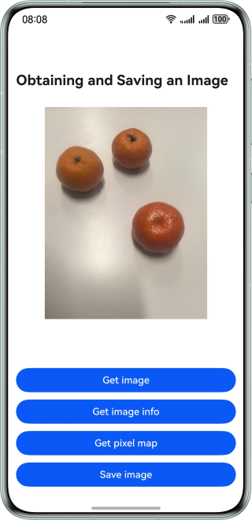

# Obtaining and Saving an Image
## Overview
Based on HarmonyOS APIs such as **Media Library Kit** and **Image Kit**, this sample shows how to implement the functions of obtaining an image, reading image information, and saving an image on HarmonyOS.
## Preview


## How to Implement
1. There are four methods to obtain an image: the **Photo Picker** component, **PhotoViewPicker** API, **CameraPicker** API, and **DocumentViewPicker** API.
2. The **getImageInfo** and **getImageProperties** methods are used to read image information.
3. Use the **imageSource.createPixelMap()** method to create an object of **PixelMap**.
4. The security component and **photoAccessHelper** module are used to save an image.

## How to Use
1. Tap the Obtaining an Image button. On the displayed page, select a method and obtain the corresponding image.
2. Tap the Reading Image Information button to read the image information.
3. Tap the Creating an Object of PixelMap button to convert the image into an object of **PixelMap**.
4. Tap the Save button. On the displayed page, select Save to App Sandbox or Save to Gallery to store the image to the corresponding location.

## Project Directory
```
├──ets
│  ├──common
│  │  └──utils
│  │     └──Utils.ets                  // Common utilities
│  ├──entryability
│  │  └──EntryAbility.ets
│  ├──entrybackupability
│  │  └──EntryBackupAbility.ets
│  └──pages
│     └──Index.ets                     // Home page
└──resources                           // Resources
```

## Permissions
N/A

## Constraints
1. The sample is only supported on Huawei phones with standard systems.
2. The HarmonyOS version must be HarmonyOS 5.0.5 Release or later.
3. The DevEco Studio version must be DevEco Studio 5.0.5 Release or later.
4. The HarmonyOS SDK version must be HarmonyOS 5.0.5 Release SDK or later.