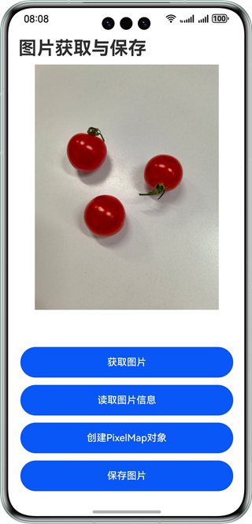

# 实现图片获取与保存功能
## 简介
本项目基于Media Library Kit和Image Kit等HarmonyOS API实现了在HarmonyOS系统上获取图片、读取图片信息和保存图片的方式，开发者可以选择适合自己业务场景的方式参考开发。
## 效果预览


## 技术原理
1. 图片获取提供了四种实现方式：分别是Photo Picker组件、PhotoViewPicker接口、CameraPicker接口和DocumentViewPicker。
2. 读取图片信息使用了getImageInfo和getImageProperties方法。
3. 创建PixelMap对象使用imageSource.createPixelMap()方法。
4. 保存图片使用了安全控件和photoAccessHelper模块。

## 使用说明
1. 点击“获取图片”按钮，在弹出界面中选择一种获取图片方式，然后获取对应的图片。
2. 点击“读取图片信息”按钮，可以读取图片信息。
3. 点击“创建PixelMap对象”按钮，可以将图片转换成PixelMap对象。
4. 点击“保存图片”按钮，在弹出界面中选择“保存至应用沙箱”或者“保存至图库”，可以将图片保存到相应位置。

## 工程目录
```
├──ets
│  ├──common
│  │  └──utils                     
│  │     └──Utils.ets                  // 通用方法类
│  ├──entryability
│  │  └──EntryAbility.ets
│  ├──entrybackupability
│  │  └──EntryBackupAbility.ets
│  └──pages
│     └──Index.ets                     // 首页
└──resources                           // 资源类
```

## 相关权限
无

## 约束与限制
1. 本示例仅支持标准系统上运行，支持设备：华为手机。
2. HarmonyOS系统：HarmonyOS 5.0.5 Release及以上。
3. DevEco Studio版本：DevEco Studio 5.0.5 Release及以上。
4. HarmonyOS SDK版本：HarmonyOS 5.0.5 Release SDK及以上。