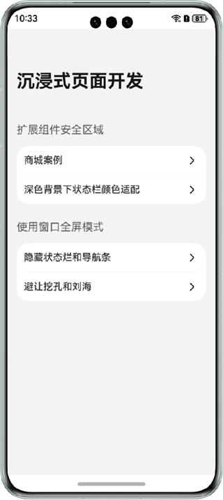
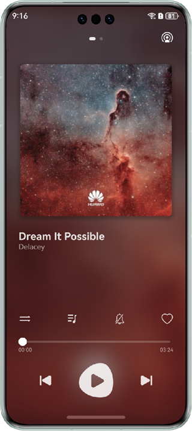
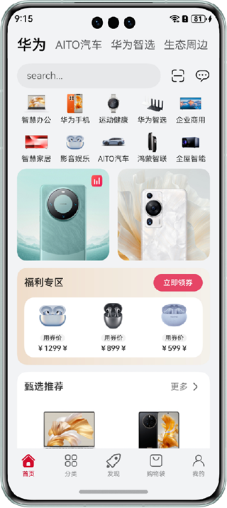
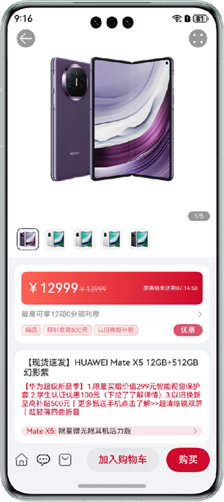
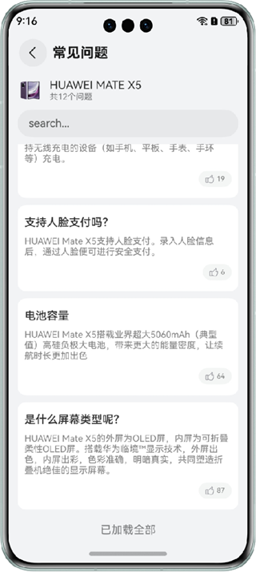

## 实现沉浸式页面效果

### 介绍

本示例介绍设置窗口全屏和扩展组件安全区域两种实现沉浸式效果的方式，并对状态栏、导航栏、挖空区域根据不同场景进行适配，为用户提供更优的视觉体验。

### 效果预览

| 首页                                           | 深色背景状态栏适配                                      | 隐藏状态栏和导航条                                     |
|----------------------------------------------|------------------------------------------------|-----------------------------------------------|
|           |     |    |

| 商城首页（背景色延伸到状态栏）                              | 商品详情页（图片延伸到状态栏）                                | 商品常见问题页（列表底部避让导航条）                            |
| -------------------------------------        | ---------------------------------------------  | --------------------------------------------- |
|  |  |    |

| 避让挖孔（挖孔在中间）                              | 避让挖孔（挖孔在侧边）                                  |
|------------------------------------------|----------------------------------------------|
|  |  |

使用说明：

1. 首页列出了沉浸式页面的实现方式和常见场景，点击对应的菜单项进入即可。
2. 商城首页中点击某个商品进入商品详情页，点击详情页中常见问题区域进入商品常见问题页面，下滑到观察列表底部的避让情况。
3. 避让挖孔的小游戏页面可通过切换不同挖孔位置的机型观察避让挖孔功能。

### 工程目录

```
├──commons
│  ├──commons/src/main/ets
│  │  └──utils	                    
│  │     └──Breakpoint.ets                 // 断点处理模块
│  └──commons/src/main/resources           // 应用静态资源目录
├──features
│  ├──shopping/src/main/ets
│  │  ├──constants
│  │  │  ├──Detail.ets                     // 商品详情页常量资源
│  │  │  ├──Home.ets                       // 商城首页常量资源
│  │  │  └──Index.ets                      // 商城入口页常量资源
│  │  ├──models
│  │  │  ├──Detail.ets                     // 商品详情页数据
│  │  │  ├──Home.ets                       // 商城首页数据
│  │  │  └──Index.ets                      // 商城入口页数据
│  │  └──views	                    
│  │     ├──detail
│  │     │  ├──Banner.ets                  // 商品详情页图片展示模块
│  │     │  ├──Discount.ets                // 商品详情页折扣模块
│  │     │  ├──Faq.ets                     // 商品详情页常见问题模块
│  │     │  ├──FaqList.ets                 // 常见问题列表页
│  │     │  ├──Footer.ets                  // 商品详情页底部按钮
│  │     │  ├──Index.ets                   // 商品详情页
│  │     │  ├──Information.ets             // 商品详情页详细信息模块
│  │     │  └──Toolbar.ets                 // 商品详情页顶部工具栏
│  │  	 ├──home
│  │     │  ├──Banner.ets                  // 商城首页图片展示模块
│  │     │  ├──Categories.ets              // 商城首页分类模块
│  │     │  ├──Header.ets                  // 商品首页头部标签栏和搜索栏
│  │     │  ├──Index.ets                   // 商城首页
│  │     │  ├──Recommend.ets               // 商城首页甄选推荐模块
│  │     │  └──Welfare.ets                 // 商城首页福利专区模块
│  │     └──Index.ets                      // 商城入口页面
│  └──shopping/src/main/resources          // 应用静态资源目录
└──products                  
   ├──entry/src/main/ets
   │  ├──constants
   │  │  └──Constants.ets                  // 常量资源
   │  ├──entryability
   │  │  └──EntryAbility.ets               // 程序入口类
   │  └──pages    
   │     ├──Index.ets                      // 主页面     
   │     ├──MiniGame.ets                   // 小游戏页面（避让挖孔场景） 
   │     ├──MusicPlayer.ets                // 音乐播放页面（深色背景状态栏适配场景） 
   │     └──VideoPlayer.ets                // 视频播放页面（隐藏状态栏和导航条场景）
   └──entry/src/main/resources             // 应用静态资源目录
```

### 具体实现

1. 使用[setWindowLayoutFullScreen()](https://developer.huawei.com/consumer/cn/doc/harmonyos-references/arkts-apis-window-window#setwindowlayoutfullscreen9)方法设置窗口全屏或设置[expandSafeArea](https://developer.huawei.com/consumer/cn/doc/harmonyos-references/ts-universal-attributes-expand-safe-area#expandsafearea)属性扩展组件安全区域实现沉浸式效果。
2. 常见沉浸式效果中的具体适配详见代码。

### 相关权限

不涉及。

### 依赖

不涉及

### 约束与限制

1.本示例仅支持标准系统上运行，支持设备：华为手机。

2.HarmonyOS系统：HarmonyOS 5.0.5 Release及以上。

3.DevEco Studio版本：DevEco Studio 5.0.5 Release及以上。

4.HarmonyOS SDK版本：HarmonyOS 5.0.5 Release SDK及以上。

