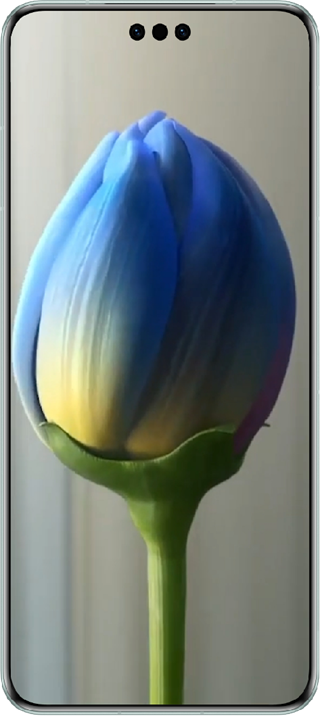
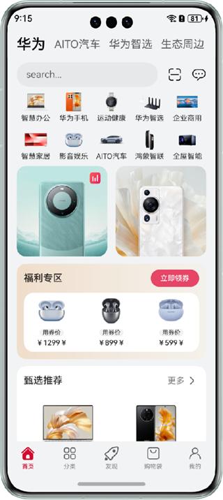
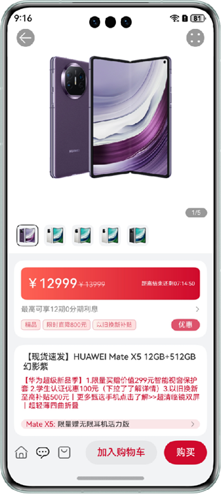
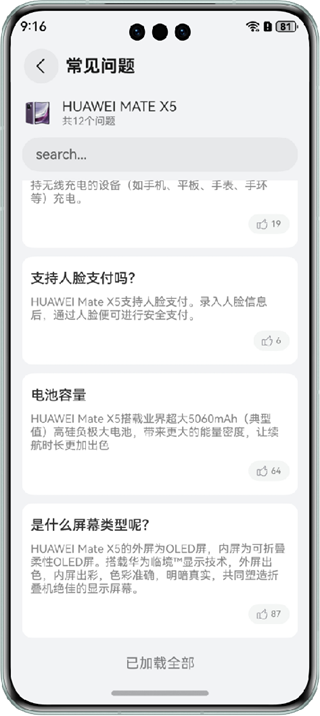
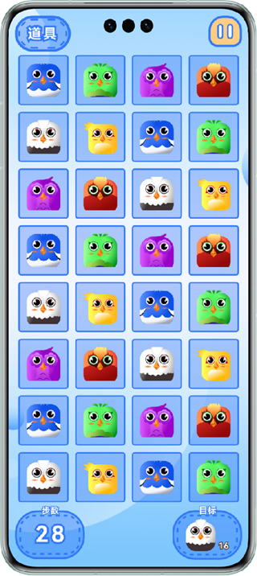
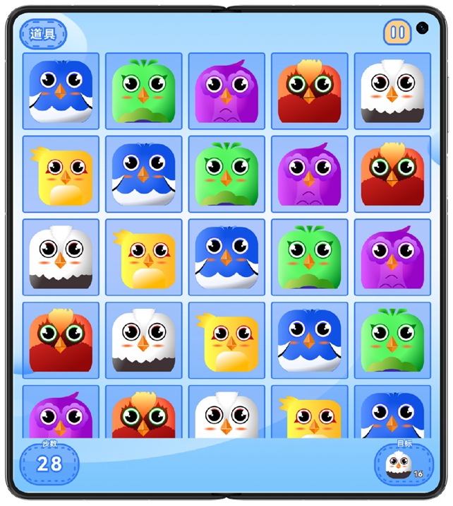

## Immersive Effect

### Overview

This sample demonstrates how to implement immersive effects using a full-screen window and expanded component safe area. It adapts to the status bar, navigation bar, and notched area to better fit user's visual experience.

### Preview

| Homepage                                           | Dark status bar adaptation                                      | Hidden status bar and navigation bar                                     |
|----------------------------------------------|------------------------------------------------|-----------------------------------------------|
|           |     |    |

| Mall home (background color shared by status bar)                             | Offering details page (image covers status bar)                               | Offering FAQs page (bottom navigation bar adaptation)                           |
| -------------------------------------        | ---------------------------------------------  | --------------------------------------------- |
|  |  |    |

| Notch display (middle)                              | Notch display (side)                                  |
|------------------------------------------|----------------------------------------------|
|  |  |

Instructions:

1. The home page lists the implementation modes and common scenarios of immersive pages. You can tap the menu items to see the effects.
2. Tap an offering on the home page of the mall to go to the offering details page. Tap the FAQs area on the details page to go to the offering FAQs page. Swipe down to the bottom to check the adaptation.
3. Navigate between the mini-game screens to check the display adaptation of different notches on different models.

### Project Directory

```
├──commons
│  ├──commons/src/main/ets
│  │  └──utils	                    
│  │     └──Breakpoint.ets                 // Breakpoint module
│  └──commons/src/main/resources           // Static resources
├──features
│  ├──shopping/src/main/ets
│  │  ├──constants
│  │  │  ├──Detail.ets                     // Offering details page constants
│  │  │  ├──Home.ets                       // Mall home constants
│  │  │  └──Index.ets                      // Mall index constants
│  │  ├──models
│  │  │  ├──Detail.ets                     // Offering details page data
│  │  │  ├──Home.ets                       // Offering home data
│  │  │  └──Index.ets                      // Offering index data
│  │  └──views	                    
│  │     ├──detail
│  │     │  ├──Banner.ets                  // Offering details page image display module
│  │     │  ├──Discount.ets                // Offering details page discount module
│  │     │  ├──Faq.ets                     // Offering details page FAQs module
│  │     │  ├──FaqList.ets                 // FAQs list page
│  │     │  ├──Footer.ets                  // Offering details page footer button
│  │     │  ├──Index.ets                   // Offering details page
│  │     │  ├──Information.ets             // Offering details page information module
│  │     │  └──Toolbar.ets                 // Offering details page top tool bar
│  │  	 ├──home
│  │     │  ├──Banner.ets                  // Mall home image display module
│  │     │  ├──Categories.ets              // Mall home category module
│  │     │  ├──Header.ets                  // Offering home header tag bar and search bar
│  │     │  ├──Index.ets                   // Mall index
│  │     │  ├──Recommend.ets               // Mall index recommendation module
│  │     │  └──Welfare.ets                 // Mall index welfare module
│  │     └──Index.ets                      // Mall index page
│  └──shopping/src/main/resources          // Static resources
└──products                  
   ├──entry/src/main/ets
   │  ├──constants
   │  │  └──Constants.ets                  // Constants
   │  ├──entryability
   │  │  └──EntryAbility.ets               // Entry point class
   │  └──pages    
   │     ├──Index.ets                      // Index page     
   │     ├──MiniGame.ets                   // Mini-game (notch display) 
   │     ├──MusicPlayer.ets                // Music playback (dark status bar) 
   │     └──VideoPlayer.ets                // Video playback (hidden status bar and navigation bar)
   └──entry/src/main/resources             // Static resources
```

### How to Implement

1. Use the [**setWindowLayoutFullScreen()**](https://developer.huawei.com/consumer/en/doc/harmonyos-references/js-apis-window#setwindowlayoutfullscreen9) method to set full-screen window, or the [**expandSafeArea**](https://developer.huawei.com/consumer/en/doc/harmonyos-references-V5/ts-universal-attributes-expand-safe-area-V5#expandsafearea) attribute to implement the immersive effect.
2. For details about the adaptation of common immersive effects, see the code.

### Required Permissions

N/A.

### Dependency

N/A

### Constraints

1. The sample is supported only on Huawei phones with standard systems.

2. The HarmonyOS version must be HarmonyOS 5.0.5 Release or later.

3. The DevEco Studio version must be DevEco Studio 5.0.5 Release or later.

4. The HarmonyOS SDK version must be HarmonyOS 5.0.5 Release SDK or later.
