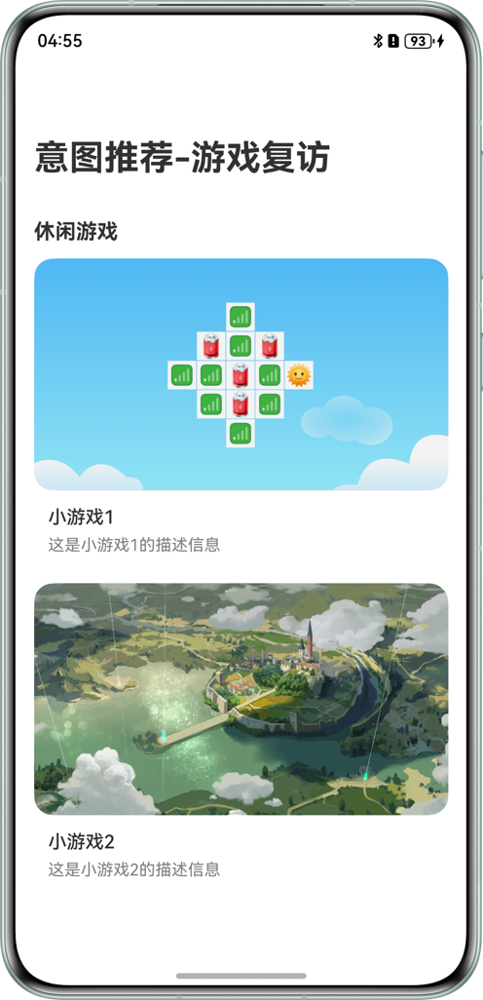
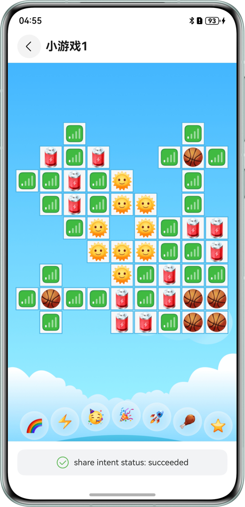
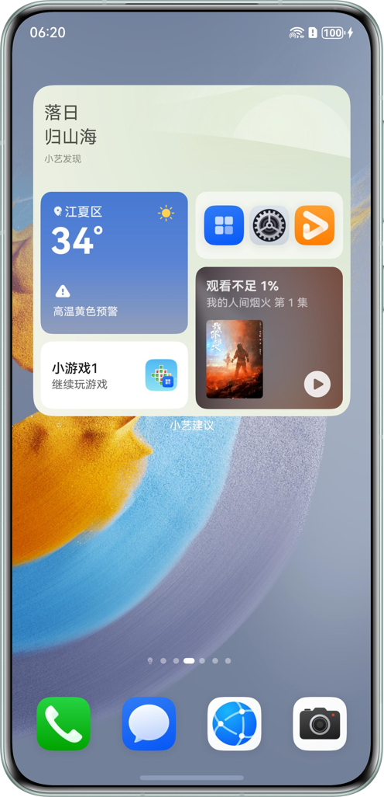

# 基于意图框架及习惯推荐能力实现常用复访

## 介绍

本示例基于意图框架，使用`@kit.IntentsKit`实现意图共享，使用`@kit.AbilityKit`的`InsightIntentExecutor`
  实现意图调用。根据意图调用的参数实现游戏复访。

## 效果预览

| 主页                               | 游戏页                                      | 小艺卡片展示共享意图                               | 点击意图卡片实现复访                                 |
|----------------------------------|------------------------------------------|------------------------------------------|--------------------------------------------|
|  |  | |  |

使用说明：
1. 点击`小游戏1或2`的卡片进入游戏卡片页面。进入游戏页面会调用shareIntent()接口。游戏卡片页面底部会显示接口执行状态。
2. 待系统将共享的意图完成处理后，将会在小艺建议的卡片内展示共享的意图。
3. 点击展示的对应小艺卡片，会重新拉起示例应用，完成游戏卡片的复访。

## 工程目录

```
├──entry/src/main/ets
│  ├──common
│  │  ├──constants
│  │  │  └──CommonConstants.ets         // 公共常量类
│  │  └──utils
│  │     ├──FileReader.ets              // 文件读取类
│  │     └──Logger.ets                  // 日志类
│  ├──entryability
│  │  └──EntryAbility.ets               // 入口Ability
│  ├──entrybackupability
│  │  └──EntryBackupAbility.ets         // 备份Ability
│  ├──insightintents
│  │  └──IntentExecutorImpl.ets         // 意图调用类
│  ├──model
│  │  └──DataModel.ets                  // 游戏模型类
│  └──pages
│     ├──Index.ets                      // Ability实现的应用的入口页面
│     └──PlayPage.ets                   // 详情页
└──entry/src/main/resources            
   ├──base
   │  └──profile
   │     ├──backup_config.json          // 备份配置
   │     ├──insight_intent.json         // 意图注册配置
   │     ├──main_pages.json             // 应用界面列表
   │     └──router_map.json             // 路由配置
   └──rawfile
      ├──game.json                      // 游戏信息示例
      ├──shareIntent.json               // 意图共享数据示例
      └──shareIntent_en.json            // 意图共享数据英文示例
```

## 具体实现

意图共享源码参考`PlayPage.ets`中的`shareIntent`方法，意图调用源码参考`IntentExecutorImpl.ets`中的`onExecuteInUiAbilityForegroundMode`方法

* 首页：从`game.json`文件中读取游戏信息，`ForEach`生成游戏卡片，卡片的`onClick`事件中通过`navPathStack.replacePathByName`跳转到游戏页面
* 游戏页：游戏页根据导航参数，显示游戏相关信息
* 意图共享：游戏页在`aboutToAppear`事件中调用`shareIntent`方法，根据游戏id，在事先读取的`shareIntent.json`数据中筛选出相关意图数据，然后调用`insightIntent.shareIntent`
  API实现意图数据共享
* 意图调用：在`onExecuteInUIAbilityForegroundMode`方法中，使用`eventHub.emit`广播事件，传递`entityId`游戏id参数。
  `Index.ets`中通过`eventHub.on`监听事件，通过`navPathStack.replacePathByName`触发跳转到游戏页面
* 意图调用热启动时通过`eventHub`传递参数给首页，冷启动时通过`onCreate`方法借助`localStorage`对象将want特定参数传递给首页
* 本示例意图调用没有过多介入业务逻辑和UI逻辑，只是通过不同渠道把相关参数传递给业务，将页面跳转主动权交给业务本身。
  `onExecuteInUIAbilityForegroundMode`接口也提供了`WindowStage`实例，可以使用`windowStage.loadContent`加载特定页面，应用根据实际选择合适的方式。


## 相关权限

### 依赖

1. 本示例依赖@ohos/hvigor-ohos-plugin。
2. 使用DevEco Studio版本大于本示例推荐版本，请根据 DevEco Studio 提示更新 hvigor 插件版本。
3. 需联网登录华为账号并同意小艺建议的用户协议和隐私政策。

### 约束与限制

1. <font>**意图共享和意图调用的测试，当前无法由开发者独立完成，请根据[Intents
   Kit接入流程](https://developer.huawei.com/consumer/cn/doc/harmonyos-guides/intents-habit-rec-dp-self-validation)，通过邮箱向华为意图框架接口人提交验收申请，由接口人配合开发者一同完成测试验收。**</font>
2. 本示例仅支持标准系统上运行，支持设备：华为手机。
3. HarmonyOS系统：HarmonyOS 5.0.5 Release及以上。
4. DevEco Studio版本：DevEco Studio 5.0.5 Release及以上。
5. HarmonyOS SDK版本：HarmonyOS 5.0.5 Release SDK及以上。
