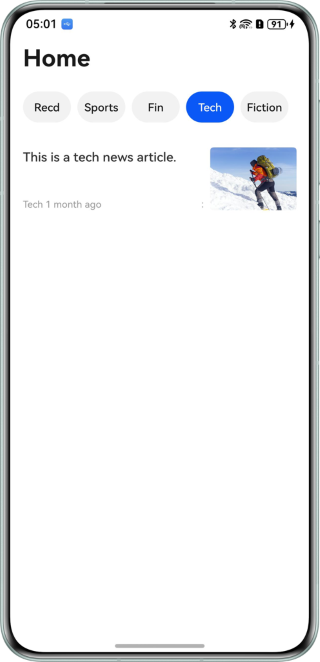
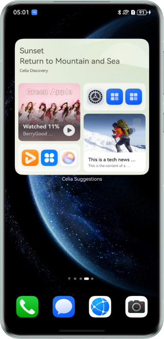

# Habit-based News Recommendation with Intents Kit

## Overview
Based on the Intents Kit, this sample demonstrates how to use **@kit.IntentsKit** for intent sharing and use **InsightIntentExecutor** of **@kit.AbilityKit** for intent calls. It achieves cloud data access by collaborating with cloud functions and cloud databases provided by device-cloud integration. The Intents Kit implements cloud-side intent calls based on the parameter settings of device-side intent sharing, and completes device-cloud integrated habit-based recommendations to realize the news recommendation feature.

## Preview
| News Home Page | News Details Page | Intent Sharing Display on the Celia WidgetPage   |  Recommending News by Tapping the Intent Widget |
|-------------------------|-------------------------|-----------------------|-----------------------|
|  |  |  | |

## How to Use
1. On the main page, switch tabs to view news in different columns.
2. Tap any news to view the news details. The **shareIntent()** API is called to share the intent.
3. After the sharing intent is processed, it will be displayed in a widget in Celia Suggestions.
4. Tap the Celia widget to restart the sample application and recommend news.

## Project Directory
```  
├──IntentsKitNewsUpdate
│  ├──Application                                         // Client project file.
│  │  ├──cloud_objects                                    // Cloud object module.
│  │  │  └──src/main/ets/
│  │  │     └──main
│  │  │        └──ets
│  │  │           ├──id-generator
│  │  │           │  └──IdGenerator.ts                    // Cloud function - automatically generated function API type by the cloud object.
│  │  │           └──ImportObject.ts                      // Cloud function - automatically generated API tool class by the cloud object.
│  │  └──entry
│  │     └──src
│  │        └──main
│  │           ├──ets
│  │           │  ├──clouddb
│  │           │  │  └──news
│  │           │  │     ├──News.ts                        // Cloud database news entity.
│  │           │  │     └──NewsDb.ets                     // Cloud database operation utility class.
│  │           │  ├──common
│  │           │  │  ├──constants
│  │           │  │  │  ├──CloudDatabaseConstants.ets     // Cloud database static configuration class.
│  │           │  │  │  └──CommonConstants.ets            // Common static configuration class.
│  │           │  │  └──utils
│  │           │  │     ├──Logger.ets                     // Log utility.
│  │           │  │     └──Utils.ts                       // Utility class.
│  │           │  ├──entryability
│  │           │  │  └──EntryAbility.ets                  // Entry Ability.
│  │           │  ├──model
│  │           │  │  ├──IntentParam.ets                   // Intent parameters data model class.
│  │           │  │  └──SearchResult.ets                  // Search result data model class.
│  │           │  ├──insightintents
│  │           │  │  └──IntentExecutorImpl.ets            // Intent call class.
│  │           │  └──pages
│  │           │     ├──Index.ets                         // News home page.
│  │           │     └──NewsDetail.ets                    // News details page.
│  │           └──resources
│  │              └──base
│  │                 └──profile
│  │                    ├──insight_intent.json            // Intent registration configuration.
│  │                    ├──route_map.json                 // Navigation component route configuration.
│  │                    └──main_pages.json                // Application UI list.
│  └──CloudProgram                                        // Server project file.
│     ├──clouddb                                          // Cloud database configuration.
│     └──cloudfunctions                                   // Cloud function configuration.
├──README.md                                              // Project description document.
├──SETUP.md                                               // Guide for integrated device-cloud development (habit-based news recommendation with Intents Kit).
└──screenshots
```  

- Before using this sample, you need to build an integrated device-cloud environment with both the client project and server project configured. For details, see chapters 1 to 6 in SETUP.md.
- After the integrated device-cloud environment is built, data requests are sent using AGC cloud functions. Ensure that the configuration information of the AGC server and client corresponds to **bundleName**. Otherwise, the network request fails.

## How to Implement
Refer to the **shareIntent** method in **NewsDetail.ets** for the intent sharing code. Refer to the **onExecuteInUIAbilityForegroundMode** method in **IntentExecutorImpl.ets** for the source code related to intent calls.

- Home page: It reads the news list from the server API, generates the news list using **ForEach**, and switches to the content details page using **pathStack.replacePathByName** in the **onClick** event.
- Content page: It obtains the details through the server API based on the news ID and displays the details.
- Intent sharing: After obtaining the news details data, the intent data is filled based on the intent model, and then the **insightIntent.shareIntent** API is called to implement intent data sharing.
- Intent call (cloud side): The intent management (cloud side) calls the server API on the service side at a proper time to search for news on the cloud side, pushes data to Celia Suggestions, and generates news widgets.
- Intent call (device side): In the **onExecuteInUIAbilityForegroundMode** method, the **eventHub.emit** broadcast event is used to transfer the **entityId** (news ID) parameter. In **Index.ets**, the **eventHub.on** is used to listen for events, and **pathStack.replacePathByName** is used to navigate to the content page.
- For hot start, parameters are passed to the home page via **eventHub**. For cold start, the **onCreate** method is used to transfer **want** parameter to the home page using the **localStorage** object.
- In this sample, the intent call does not involve too much service logic or UI logic. Instead, it simply passes relevant parameters to the service side through different channels, leaving the page navigation decisions to the service itself. The **onExecuteInUIAbilityForegroundMode** API provides a **WindowStage** instance. You can use **windowStage.loadContent** to load a specific page. The application can choose a proper method as required.

## Required Permissions
- **ohos.permission.INTERNET**: allows an application to access the Internet.

## Dependencies
1. This sample depends on **@ohos/hvigor-ohos-plugin.**
2. If you are using a version of DevEco Studio that is later than the recommended version for this sample, please follow the prompts in DevEco Studio to update the hvigor plugin version.
3. You need to be connected to the internet to log in to your HUAWEI ID and accept the Celia Suggestions user agreement and privacy policy.

## Constraints
1. Currently, the intent sharing and intent call tests cannot be completed independently by developers. You need to submit an acceptance application to the Huawei Intents Kit contact via email by following the [Intents Kit Integration Process](https://developer.huawei.com/consumer/en/doc/harmonyos-guides/intents-habit-rec-dp-self-validation). The contact person will assist you to complete the test and acceptance.
2. This sample is only supported on Huawei phones running standard systems.
3. The HarmonyOS version must be HarmonyOS 5.0.5 Release or later.
4. The DevEco Studio version must be DevEco Studio 5.0.5 Release or later.
5. The HarmonyOS SDK version must be HarmonyOS 5.0.5 Release SDK or later.