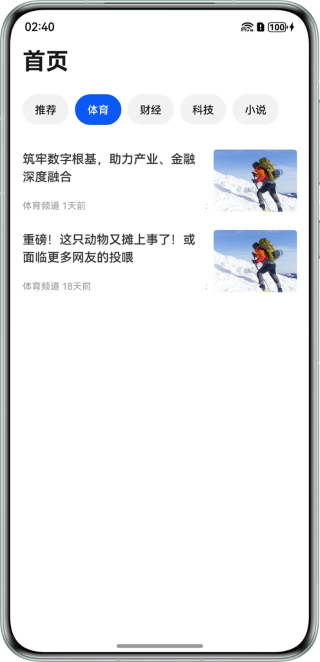
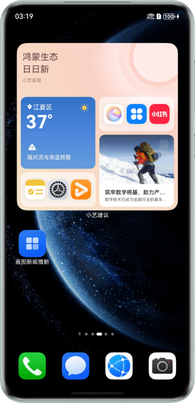

# 基于意图框架习惯推荐能力实现新闻推新

## 介绍
本示例基于意图框架，使用@kit.IntentsKit实现意图共享，使用@kit.AbilityKit提供的InsightIntentExecutor实现意图调用。配合端云一体化提供的云函数，云数据库实现云端数据访问。意图框架根据端侧意图共享的参数实现云测意图调用，完成端云结合的习惯推荐实现新闻推新功能。

## 效果预览
| 新闻首页                                                  | 新闻详情页 | 小艺卡片展示共享意图 | 点击意图卡片实现推新 |
|-------------------------------------------------------|-----------------------------------------------------|----------------------------------------------------------------|---------------------------------------------------------------------|
|  |  |  |  |


使用说明：
1. 在主页面，切换tab，查看不同专栏下的新闻。
2. 点击任意新闻，查看新闻详情会调用shareIntent()接口完成意图共享。
3. 待系统将共享的意图完成处理后，将会在小艺建议的卡片内展示共享的意图。
4. 点击展示的对应小艺卡片，会重新拉起示例应用，完成新闻推新。


## 工程目录
```
├──IntentsKitNewsUpdate
│  ├──Application                                         // 客户端工程文件
│  │  ├──cloud_objects                                    // 云对象 module
│  │  │  └──src/main/ets/
│  │  │     └──main
│  │  │        └──ets
│  │  │           ├──id-generator
│  │  │           │  └──IdGenerator.ts                    // 云函数-云对象自动生成的函数接口类型
│  │  │           └──ImportObject.ts                      // 云函数-云对象自动生成的接口工具类
│  │  └──entry
│  │     └──src
│  │        └──main
│  │           ├──ets
│  │           │  ├──clouddb
│  │           │  │  └──news
│  │           │  │     ├──News.ts                        // 云数据库新闻实体
│  │           │  │     └──NewsDb.ets                     // 云数据库操作工具类
│  │           │  ├──common     
│  │           │  │  ├──constants
│  │           │  │  │  ├──CloudDatabaseConstants.ets     // 云数据库静态配置类
│  │           │  │  │  └──CommonConstants.ets            // 公共静态配置类
│  │           │  │  └──utils
│  │           │  │     ├──Logger.ets                     // 日志工具类
│  │           │  │     └──Utils.ts                       // 通用工具类
│  │           │  ├──entryability
│  │           │  │  └──EntryAbility.ets                  // 入口 Ability
│  │           │  ├──model
│  │           │  │  ├──IntentParam.ets                   // 意图参数据模型类
│  │           │  │  └──SearchResult.ets                  // 搜索结果数据模型类
│  │           │  ├──insightintents
│  │           │  │  └──IntentExecutorImpl.ets            // 意图调用类
│  │           │  └──pages
│  │           │     ├──Index.ets                         // 新闻首页
│  │           │     └──NewsDetail.ets                    // 新闻详情页
│  │           └──resources            
│  │              └──base
│  │                 └──profile
│  │                    ├──insight_intent.json            // 意图注册配置
│  │                    ├──route_map.json                 // Navigation 组件路由配置
│  │                    └──main_pages.json                // 应用界面列表
│  └──CloudProgram                                        // 服务端工程文件
│     ├──clouddb                                          // 云数据库相关配置
│     └──cloudfunctions                                   // 云函数相关配置
├──README.md                                              // 项目说明文档
├──SETUP.md                                               // 基于意图框架推荐能力实现新闻推新端云一体化搭建指导文档
└──screenshots
```

- 本示例使用前，需完成端云一体化配置，要求客户端工程与服务端工程协同配置，具体配置过程请参见第[SETUP.md](./SETUP.md)1-6章。
- 本示例完成端云一体化配置后，数据请求使用的是AGC云函数，运行安装时请保证AGC服务端和客户端的配置信息是与bundleName一一对应的，否则会导致网络请求失败。

## 具体实现
意图共享代码参考NewsDetail.ets中的shareIntent方法，意图调用源码参考IntentExecutorImpl.ets中的onExecuteInUiAbilityForegroundMode方法。
- 首页：从服务端api读取新闻列表信息，ForEach生成新闻列表，列表的onClick事件中通过pathStack.replacePathByName跳转到内容详情页面。
- 内容页：内容详情页根据新闻id，通过服务端api获取新闻详细内容进行展示。
- 意图共享：内容页获取到新闻详情数据后，根据意图模型填充意图数据，然后调用insightIntent.shareIntent API实现意图数据共享。
- 意图调用（云侧）：意图管理云侧会在合适的时机调用业务侧服务端API实现云测新闻搜索，推送数据给端侧小艺建议，生成新闻卡片。
- 意图调用（端侧）：在onExecuteInUIAbilityForegroundMode方法中，使用eventHub.emit广播事件，传递entityId新闻id参数。
index.ets中通过eventHub.on监听事件，通过pathStack.replacePathByName触发跳转到内容页面。
- 意图调用热启动时通过eventHub传递参数给首页，冷启动时通过onCreate方法借助localStorage对象将want特定参数传递给首页。
- 本示例意图调用没有过多介入业务逻辑和UI逻辑，只是通过不同渠道把相关参数传递给业务，将页面跳转主动权交给业务本身。
onExecuteInUIAbilityForegroundMode接口也提供了WindowStage实例，可以使用windowStage.loadContent加载特定页面，应用根据实际选择合适的方式。

## 相关权限
- 网络权限：ohos.permission.INTERNET。

## 依赖
1. 本示例依赖@ohos/hvigor-ohos-plugin。
2. 使用DevEco Studio版本大于本示例推荐版本，请根据DevEco Studio提示更新hvigor插件版本。
3. 需联网登录华为账号并同意小艺建议的用户协议和隐私政策。

## 约束与限制
1. 意图共享和意图调用的测试，当前无法由开发者独立完成，请根据[Intents
   Kit接入流程](https://developer.huawei.com/consumer/cn/doc/harmonyos-guides/intents-habit-rec-dp-self-validation)，通过邮箱向华为意图框架接口人提交验收申请，由接口人配合开发者一同完成测试验收。
2. 本示例仅支持标准系统上运行，支持设备：华为手机。
3. HarmonyOS系统：HarmonyOS 5.0.5 Release及以上。
4. DevEco Studio版本：DevEco Studio 5.0.5 Release及以上。
5. HarmonyOS SDK版本：HarmonyOS 5.0.5 Release SDK及以上。