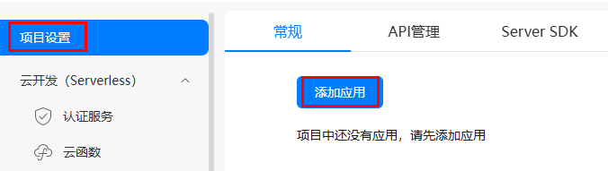
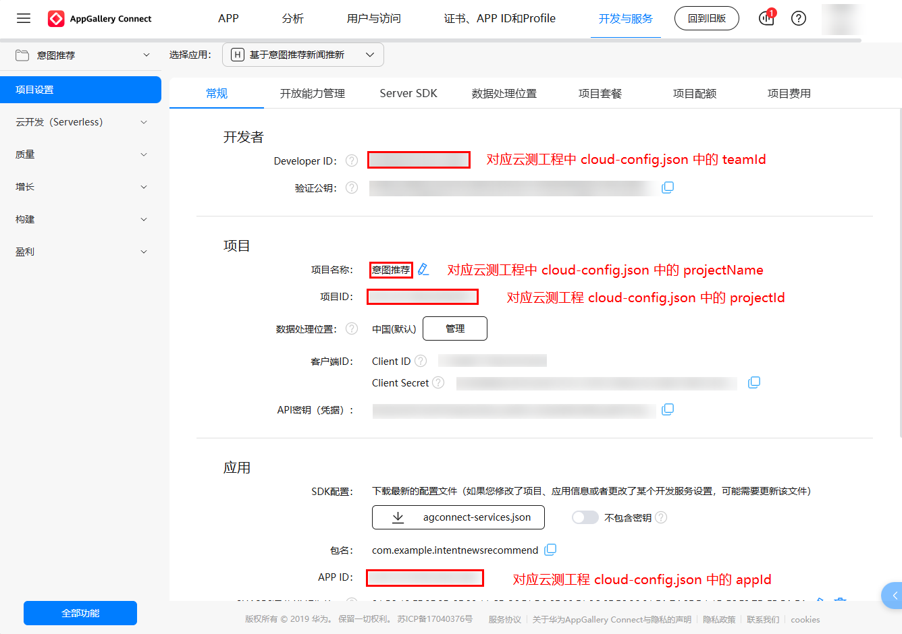
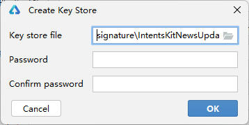

# 基于意图框架习惯推荐能力实现新闻推新端云一体化环境搭建

### 1. 简介

基于意图框架习惯推荐能力实现新闻推新涉及端云一体化开发，[开源代码](https://gitee.com/harmonyos_samples/IntentsKitNewsUpdate)包含客户端工程（Application）和服务端工程（CloudProgram）两部分，需要进行端云一体化配置从而体验完整的基于意图框架习惯推荐能力实现新闻推新的功能，本文章将讲述基于意图框架习惯推荐能力实现新闻推新新端云一体化配置过程。

### 2. 项目准备

1. 注册华为账号

   基于意图框架习惯推荐能力实现新闻推新端云一体化搭建依托于[AppGallery Connect（AGC）](https://developer.huawei.com/consumer/cn/service/josp/agc/index.html#/)平台，使用AGC平台需要前往[华为开发者联盟官网](https://developer.huawei.com/consumer/cn/)进行华为账号注册，并完成实名认证，具体请参见[注册账号](https://developer.huawei.com/consumer/cn/doc/start/registration-and-verification-0000001053628148)。如果您已经拥有华为账号，并已完成实名认证，可跳过本步骤。

2. 项目打开

   选择[DevEco Studio](https://developer.huawei.com/consumer/cn/deveco-studio/)，选择File > Open，选择“IntentsKitNewsUpdate”，点击“OK”打开项目。请注意，IntentsKitNewsUpdate目录下客户端工程（Application）可以作为单独项目打开，在低版本（低于当前工程使用版本 5.0.5）的DevEco Studio可能会编译失败或无法识别服务端工程（CloudProgram）；服务端工程（CloudProgram）仅可以通过打开IntentsKitNewsUpdate整个项目打开。建议您直接选择打开“IntentsKitNewsUpdate”目录，保证可以同时打开客户端工程（Application）和服务端工程（CloudProgram），而不是只打开客户端工程（Application）。

   

### 3. AGC基本环境搭建

基于意图框架习惯推荐能力实现新闻推新端云一体化配置，首先需要在[AGC](https://developer.huawei.com/consumer/cn/service/josp/agc/index.html#/)中创建本应用，完成AGC配置，为服务端工程在云端实现提供基础。操作步骤如下：

1. 登录[AGC](https://developer.huawei.com/consumer/cn/service/josp/agc/index.html#/)平台，点击“我的项目”，在项目页面中点击“添加项目”。

   
2. 在“创建项目”页面中输入项目名称后，本文章项目名称以“意图推荐”为例，点击“完成”。

   

3. 完成项目创建后，点击左侧导航栏的“项目设置”中的“添加应用”即可进行后续操作。

   

4. 进入“添加应用”页面后选择“APP（HarmonyOS）”，会提示前往证书、APP ID和Profile的APP ID页面，点击“APP ID”。

   

5. 进入“设置应用开发基础信息”页面，填写应用基础信息：

    - “应用类型”选择“HarmonyOS应用”；

    - “应用名称”以“基于意图推荐新闻推新”为例；

    - “应用包名”以“com.example.intentnewsrecommend”为例，因为应用包名唯一，创建相同包名应用会创建失败，所以配置时请修改为其他应用包名。此处的应用包名必须与客户端工程中配置的Bundle name一致，在后文客户端工程配置时会详细说明，具体命名规范参照[软件包规范](https://developer.huawei.com/consumer/cn/doc/app/agc-help-createharmonyapp-0000001945392297)；

    - “应用分类”选择“应用”。

    - 点击“下一步”。

   

6. 选择“应用所属项目”为当前项目“意图推荐”。并点击“确认”。

   

7. 点击“确认”后，页面下会出现多个API的开放能力，根据项目实际需要选择对应的能力，再点击最下方的“确认”。

   

8. 如果未开启以上开放能力，并已点击“确认”完成应用创建，可前往“我的项目”，在左侧导航栏选择“项目设置”，进入“项目设置”页面，点击“开放能力管理”打开对应开放能力。如果您已在第7步完成“定位服务”、“位置服务”、“地图服务”和“推送服务”等开放能力打开，请跳过第8步，进行第9步及以后配置。

   

9. 点击AGC平台“我的项目”，在左侧导航栏选择“云开发（Serverless）”，并开通“云函数”和“云数据库”服务。

    

    在首次开通服务时，需设置“数据处理位置”，选择“中国”并将其设为“默认”。

    

至此，已完成基于意图框架习惯推荐能力实现新闻推新AGC基本环境搭建。

### 4. 客户端适配

基于意图框架习惯推荐能力实现新闻推新端云一体化配置，需要修改客户端项目中的部分配置，为端云一体化搭建提供基础。操作步骤如下：

1. 修改客户端Bundle name，打开客户端代码AppScope > app.json5，修改Bundle name为包名，与第3章第5步的包名保持一致，以“com.example.intentnewsrecommend”为例。

   

2. 在DevEco Studio中，依次点击主菜单栏的File > Project Structure > Project > Signing Configs，勾选“Automatically generate signature”选项，随后点击“Sign in”登录华为账号，最后点击“OK”完成自动签名配置。请注意，操作过程中需确保设备已连接。

   

至此，已完成基于意图框架习惯推荐能力实现新闻推新客户端适配。

### 5.服务端项目配置

基于意图框架习惯推荐能力实现新闻推新端云一体化配置，服务端需要配置信息与[AGC平台](https://developer.huawei.com/consumer/cn/service/josp/agc/index.html#/)链接。操作步骤如下：

1. 修改配置文件CloudProgram > cloud-config.json。

   修改cloud-config.json中的appId、projectName、projectId和teamId为[AGC平台](https://developer.huawei.com/consumer/cn/service/josp/agc/index.html#/)创建基于意图推荐新闻推新“项目设置”中的对应信息。

   

2. 登录[AGC平台](https://developer.huawei.com/consumer/cn/service/josp/agc/index.html#/)，依次选择“我的项目” > “云数据库” > “存储区”，然后点击“新增”。在设置“存储区名称”时，请填写“News”。由于第3步上传的数据已关联此存储区名称，建议不要更改为其他名称。

   

3. 在项目中选中CloudProgram，右击选择Deploy Cloud Program，即可上传云数据库和云函数，请确保上传完成并成功。

   

   如果上传超时，请检查是否登录DevEco Studio；如果仍然上传超时或显示teamId报错，可重启DevEco Studio后再次上传。

   

至此，已完成基于意图推荐新闻推新服务端适配，可以体验新闻服务的基本功能。

### 6. 特殊功能配置

#### 6.1 手动签名

为确保端云一体化项目能够正常运行，客户端工程需进行手动签名。新闻服务在完成手动签名后重新卸载安装应用即可使用。步骤如下：

1. 生成密钥（.p12文件），详见[手动签名](https://developer.huawei.com/consumer/cn/doc/harmonyos-guides-V5/ide-signing-V5#section297715173233)。

    - 在DevEco Studio主菜单栏点击Build > Generate Key and CSR。单击Choose Existing选择已有的密钥库文件（存储有密钥的.p12文件）；如果没有密钥库文件，单击New进行创建。

   

    - 在Create Key Store窗口中，选择并填入密钥（.p12文件）存储位置，建议在客户端工程（Application文件）下新建signature文件作为存储位置，以“signature\IntentsKitNewsUpdate.p12”为例，设置完Password后单击OK，请记住设置的Password，Password将被用于第5步完成手动签名。

   

2. 生成证书请求文件（.csr文件），详见[手动签名](https://developer.huawei.com/consumer/cn/doc/harmonyos-guides-V5/ide-signing-V5#section297715173233)。

    - 此时，在Generate Key and CSR界面中，继续填写Alias，以“IntentsKitNewsUpdate”为例，单击Next。

   

    - 设置CSR文件存储路径和CSR文件名，建议在客户端工程（Application文件）下新建signature文件作为存储位置，以“signature/IntentsKitNewsUpdate.csr”为例，Key password与Key store password保持一致，无需手动输入。单击Finish，创建CSR文件成功。

   

    - 可以在存储路径下获取生成的密钥库文件（.p12）、证书请求文件（.csr）和material文件夹（存放签名方案相关材料，如密码、证书等），请妥善保存，建议统一存放在客户端工程的signature文件中。

3. 使用密钥（.p12文件）和证书请求文件（.csr文件）申请发布证书（.cer文件），详见[申请发布证书](https://developer.huawei.com/consumer/cn/doc/app/agc-help-add-releasecert-0000001946273961)。

    - 登录[AGC](https://developer.huawei.com/consumer/cn/service/josp/agc/index.html#/)，选择“证书、APP ID和Profile”，在左侧导航栏选择“证书”，点击“新增证书”。

   

    - 填写“证书名称”，以“IntentsKitNewsUpdate”为例，选择“证书类型”为“调试证书”，选取在第2步中生成的证书请求文件（.csr文件）。

   

    - 下载生成的发布证书（.cer文件），建议在客户端工程（Application文件）下新建signature文件作为存储位置。

4. 使用发布证书（.cer文件）申请发布Profile（.p7b文件），详见[申请发布Profile](https://developer.huawei.com/consumer/cn/doc/app/agc-help-add-releaseprofile-0000001914714796)。

   申请发布Profile（.p7b文件）前，请确认在左边栏“设备”中存在注册设备，若未拥有设备，需要添加设备，详见[注册调试设备](https://developer.huawei.com/consumer/cn/doc/app/agc-help-add-device-0000001946142249)。

    - 登录[AGC](https://developer.huawei.com/consumer/cn/service/josp/agc/index.html#/)，选择“证书、APP ID和Profile”，在左侧导航栏选择“Profile”，点击“添加”。
e
   

    - “应用名称”选择“基于意图推荐新闻推新”，填写“Profile名称”，以“基于意图推荐新闻推新”为例，“类型”选择调试，“选择证书”为刚刚生成的发布证书（.cer文件）。

   

    - 下载生成的发布Profile（.p7b文件），建议在客户端工程（Application文件）下新建signature文件作为存储位置。

5. 使用密钥（.p12文件），发布证书（.cer文件）和Profile（.p7b文件）完成手动签名，建议将全部文件放于客户端代码中的signature文件，详见[手动配置签名信息](https://developer.huawei.com/consumer/cn/doc/harmonyos-guides-V5/ide-signing-V5#section112371245115818)。

    - 在DevEco Studio主菜单栏File > Project Structure > Project > Signing Configs窗口中，取消勾选“Automatically generate signature”，然后配置工程的签名信息。此处输入的两处密码为第1步和第2步设置的Key password与Key store password，且两密码默认为第1步中设置的Password。

   

6. 登录[AGC平台](https://developer.huawei.com/consumer/cn/service/josp/agc/index.html#/)，选择“项目设置”，并点击“添加公钥指纹 (HarmonyOS API 9及以上)”，选择在第4步申请的调试证书“IntentsKitNewsUpdate”。

   

7. 重新安装客户端应用。

#### 6.2 API网关配置

申请 API 网关用于后续开发云函数可以使用公网地址提供http(s)接口用于和意图框架云测意图对接。

1. 申请 [API 网关](https://developer.huawei.com/consumer/cn/doc/AppGallery-connect-Guides/agc-apigateway-getstarted-0000001142214987) 白名单权限。

2. 白名单申请通过后，在我的项目，云开发tab下可以看到出现API网关列 , 

3. 选中API网关列，点击创建按钮，我们以IntentKitNewsUpdate为名创建一个API分组 

4. 当我们的云函数云测接口开发完成后，我们需要给云函数接口新增一个API网关触发器，我们可以回到云函数，选择我们开发好的云函数 `cloud-intent-search-news`，新建一个触发器，选择前面已经创建好的API网关触发器分组IntentKitNewsUpdate，配置API名称为searchBlog，路径配置为`/SearchBlog`，这个是固定的接口请求路径。请求方法为 POST，为了方便调试，我们这边选择免鉴权，发布环境改为生产环境，只有这样这个接口才可以被公网访问

5. 然后我们就可以看到创建好的API网关触发器，我们把这个公网接口路径拷贝下来，参考[端云结合的习惯推荐接入流程](https://developer.huawei.com/consumer/cn/doc/harmonyos-guides/intents-habit-rec-dp-self-validation#section85691847152810)，并提供给对应的意图接口负责人帮我们完成云测接口配置即可。

**注意**：每次本地开发完云函数并部署至云端时，会覆盖当前的云端配置，需要重新配置API网关触发器，但是不用找接口人重新配置云测接口。

### 7. 服务端日志查询

1. [AGC](https://developer.huawei.com/consumer/cn/service/josp/agc/index.html#/)平台提供了在线查询服务端日志的功能，您可以登录[AGC平台](https://developer.huawei.com/consumer/cn/service/josp/agc/index.html#/)，选择“我的项目”后，在左侧边栏选择“质量”下的“云监控”中的“日志服务”进行查看。

   

2. 如需查看特定云函数的日志，请点击“增加过滤条件”，依次选择“function_name” > “等于”，并输入目标云函数的名称。例如，若需查看云函数“id-generator”的日志，请在输入框中填写“id-generator”，如下图所示。

   
