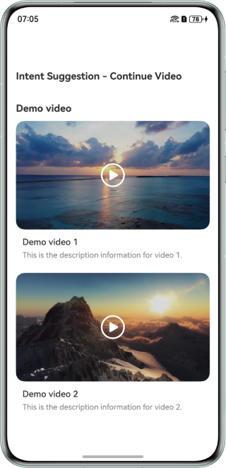
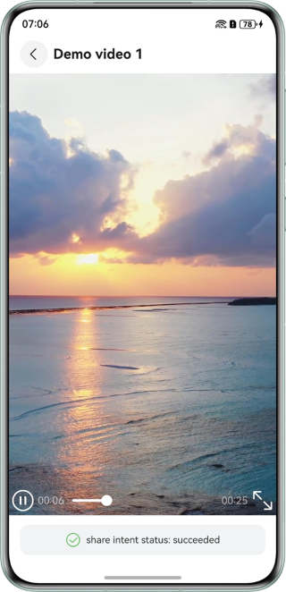
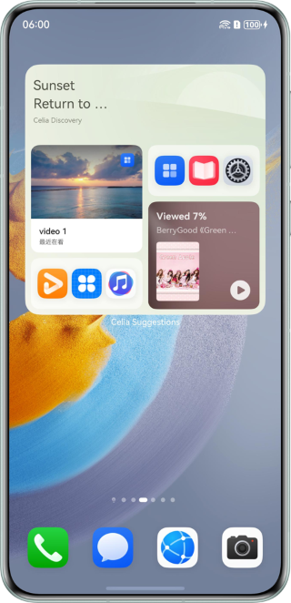
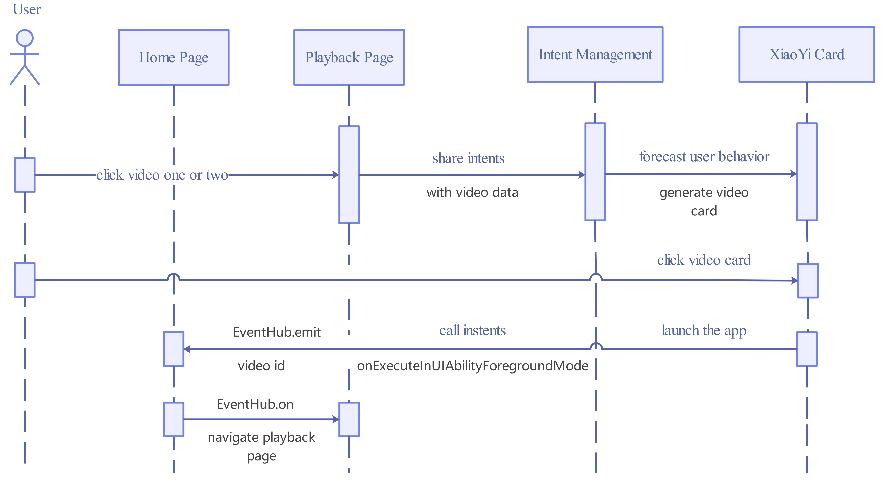

# Continuous Access to Frequently Used Content Based on the Intent Framework and Habit Recommendation Capability

## Overview

- Based on the intent framework, this sample demonstrates how to use `@kit.IntentsKit` for intent sharing and use `InsightIntentExecutor` of `@kit.AbilityKit` for intent calls. The video connection is implemented based on the parameters from intent calls.

## Preview

| Home page                                             | Playback page                                                   | Sharing Intent Display on the Celia Widget                                                                              | Continuity by Tapping the Intent Widget                                                                            |
|-------------------------------------------------------|-----------------------------------------------------------------|-------------------------------------------------------------------------------------------------------------------------|--------------------------------------------------------------------------------------------------------------------|
|  |  |  |  |

How to use
1. Tap the widget of `video 1 or 2` to enter the video playback page. During video playback, the `shareIntent()` API is automatically called. The API execution status is displayed at the bottom of the page.
2. After the sharing intent is processed, it will be displayed in a widget in Celia Suggestions.
3. Tap the Celia widget to restart the sample application and resume the video playback.

## Project Directory

```
entry/src/main/
├──ets
│  ├──common/constants
│  │  └──CommonConstants.ets                               // Common constants class
│  ├──common/utils
│  │  ├──FileReader.ets                                    // File reading class
│  │  └──Logger.ets                                        // Log class
│  ├──entryability
│  │  └──EntryAbility.ets                                  // Entry Ability
│  ├──entrybackupability
│  │  └──EntryBackupAbility.ets                            // Backup Ability
│  ├──insightintents
│  │  └──IntentExecutorImpl.ets                            // Intent call class
│  ├──model
│  │  └──DataModel.ets                                     // Video model class
│  └──pages
│     ├──Index.ets                                         // Home page
│     └──PlayPage.ets                                      // Video playback page
└──resources
   ├──base
   │  └──profile
   │     ├──backup_config.json                             // Backup config
   │     ├──insight_intent.json                            // Intent registration
   │     ├──main_pages.json                                // App UI list
   │     └──router_map.json                                // Router config
   └──rawfile
      ├──shareIntent.json                                  // Example of sharing intent data
      ├──shareIntent_en.json                               // English example of sharing intent data
      ├──video1.mp4                                        // Example of video one
      ├──video2.mp4                                        // Example of video two
      └──video.json                                        // Example of video information
```

## How to Implement

Refer to the `shareIntent` method in `PlayPage.ets` for the source code related to intent sharing. Refer to the `onExecuteInUIAbilityForegroundMode` method in `IntentExecutorImpl.ets` for the source code related to intent calls.

- **Home Page**: Read video information from the `video.json` file, generate video widgets using `ForEach`, and use `navPathStack.replacePathByName` in the `onClick` event of the widget to navigate to the video playback page.
- **Video playback Page**: The video playback page queries the playback progress via `videoPreference` based on the video ID, and calls `controller.setCurrentTime` to resume from the specified progress.
- **Intent Sharing**: The `Video` component of the video playback page calls the `shareIntent` method in the `onStart` event to filter the intent data from the `shareIntent.json` data that has been read based on the video ID, and then calls `insightIntent.shareIntent` API to share the intent data.
- **Intent call**: In the `onExecuteInUIAbilityForegroundMode` method, use `eventHub.emit` to broadcast events and pass the entityId (video ID) parameter. In Index.ets, use eventHub.on to listen for events and navigate to the video playback page by calling navPathStack.replacePathByName.
- For hot start, parameters are passed to the home page via `eventHub`. For cold start, the `onCreate` method is used to transfer want parameter to the home page using the `localStorage` object.
- In this example, the intent call does not involve too much service logic or UI logic. Instead, it simply passes relevant parameters to the service side through different channels, leaving the page navigation decisions to the service itself. The `onExecuteInUIAbilityForegroundMode` API provides a `WindowStage` instance. You can use `windowStage.loadContent` to load a specific page. The application can choose a proper method based on the actual requirements.
## Sequence Diagram


## Required Permissions

### Dependencies

1. This sample depends on `@ohos/hvigor-ohos-plugin`.
2. If you are using a version of DevEco Studio that is later than the recommended version for this sample, please follow the prompts in DevEco Studio to update the hvigor plugin version.
3. You need to be connected to the internet to log in to your HUAWEI ID and accept the Celia Suggestions user agreement and privacy policy.

### Constraints
1. Currently, the intent sharing and intent call tests cannot be completed independently by developers. You need to submit an acceptance application to the Huawei Intents Kit contact via email by following the [Intents Kit Integration Process](https://developer.huawei.com/consumer/en/doc/harmonyos-guides/intents-habit-rec-dp-self-validation). The contact person will assist you to complete the test and acceptance.
2. The sample is only supported on Huawei phones and tablets running standard systems.
3. The HarmonyOS version must be HarmonyOS 5.0.5 Release or later.
4. The DevEco Studio version must be DevEco Studio 5.0.5 Release or later.
5. The HarmonyOS SDK version must be HarmonyOS 5.0.5 Release SDK or later.