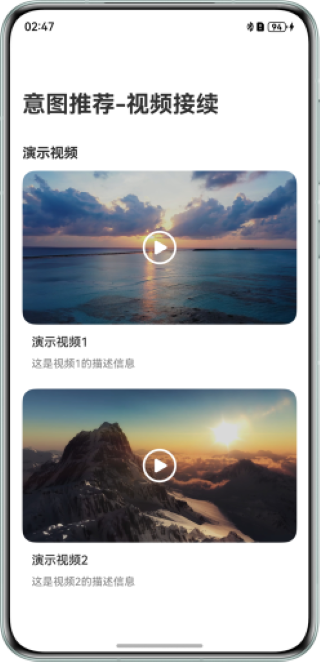
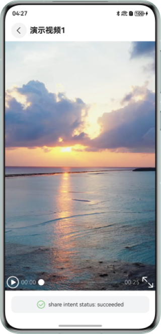
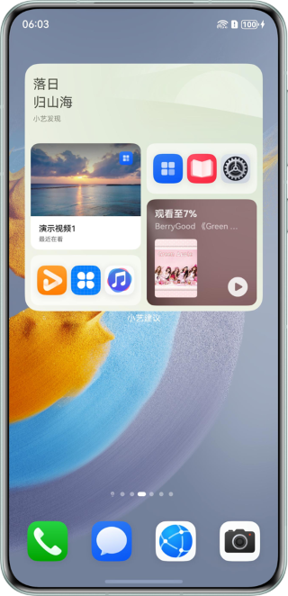
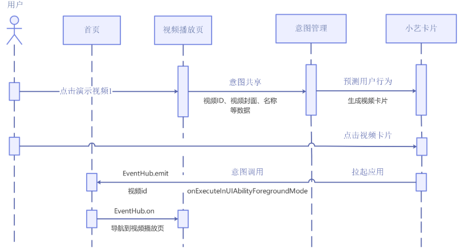

# 基于意图框架习惯推荐常用接续

## 介绍

- 本示例基于意图框架，使用`@kit.IntentsKit`实现意图共享，使用`@kit.AbilityKit`的`InsightIntentExecutor`
  实现意图调用。根据意图调用的参数实现视频接续。

## 效果预览

| 主页                               | 播放页                                 | 小艺卡片展示共享意图                               | 点击意图卡片实现接续                                 |
|----------------------------------|-------------------------------------|------------------------------------------|----------------------------------------------------|
|  |  | |  |

使用说明：
1. 点击`演示视频1或2`的卡片进入视频播放页面。视频播放时会自动触发shareIntent()接口的调用。视频页面底部会显示接口执行状态。
2. 待系统将共享的意图完成处理后，将会在小艺建议的卡片内展示共享的意图。
3. 点击展示的对应小艺卡片，会重新拉起示例应用，并进行视频接续播放。

## 工程目录

```
entry/src/main/
├──ets
│  ├──common/constants
│  │  └──CommonConstants.ets                               // 公共常量类
│  ├──common/utils
│  │  ├──FileReader.ets                                    // 文件读取类
│  │  └──Logger.ets                                        // 日志类
│  ├──entryability
│  │  └──EntryAbility.ets                                  // 入口Ability
│  ├──entrybackupability
│  │  └──EntryBackupAbility.ets                            // 备份Ability
│  ├──insightintents
│  │  └──IntentExecutorImpl.ets                            // 意图调用类
│  ├──model
│  │  └──DataModel.ets                                     // 视频模型类
│  └──pages
│     ├──Index.ets                                         // 首页
│     └──PlayPage.ets                                      // 视频播放页
└──resources
   ├──base
   │  └──profile
   │     ├──backup_config.json                             // 备份配置
   │     ├──insight_intent.json                            // 意图注册配置
   │     ├──main_pages.json                                // 应用界面列表
   │     └──router_map.json                                // 路由配置
   └──rawfile
      ├──shareIntent.json                                  // 意图共享数据示例
      ├──shareIntent_en.json                               // 意图共享数据英文示例
      ├──video1.mp4                                        // 示例视频 1
      ├──video2.mp4                                        // 示例视频 2
      └──video.json                                        // 视频信息示例
```

## 具体实现

意图共享源码参考PlayPage.ets中的shareIntent方法，意图调用源码参考IntentExecutorImpl.ets中的onExecuteInUiAbilityForegroundMode方法

* 首页：从video.json文件中读取视频信息，ForEach生成视频卡片，卡片的onClick事件中通过navPathStack.replacePathByName跳转到视频播放页面
* 视频播放页：视频播放页根据视频id，通过videoPreference首选项查找到视频播放的进度，调用controller.setCurrentTime从指定的进度接续播放
* 意图共享：视频播放页面的Video组件在onStart事件中调用shareIntent方法，根据视频id，在事先读取的shareIntent.json数据中筛选出相关意图数据，然后调用insightIntent.shareIntent
  API实现意图数据共享
* 意图调用：在onExecuteInUIAbilityForegroundMode方法中，使用eventHub.emit广播事件，传递entityId视频id参数。Index.ets中通过eventHub.on监听事件，通过navPathStack.replacePathByName触发跳转到视频播放页面
* 意图调用热启动时通过eventHub传递参数给首页，冷启动时通过onCreate方法借助localStorage对象将want特定参数传参给首页
* 本示例意图调用没有过多介入业务逻辑和UI逻辑，只是通过不同渠道把相关参数传递给业务，将页面跳转主动权交给业务本身。onExecuteInUIAbilityForegroundMode接口也提供了WindowStage实例，可以使用windowStage.loadContent加载特定页面，应用根据实际选择合适的方式。

## 时序交互图



## 相关权限

### 依赖

1. 本示例依赖 `@ohos/hvigor-ohos-plugin`。
2. 使用DevEco Studio版本大于本示例推荐版本，请根据 DevEco Studio 提示更新 hvigor 插件版本。
3. 需联网登录华为账号并同意小艺建议的用户协议和隐私政策。

### 约束与限制

1. <font>**意图共享和意图调用的测试，当前无法由开发者独立完成，请根据[Intents
   Kit接入流程](https://developer.huawei.com/consumer/cn/doc/harmonyos-guides/intents-habit-rec-dp-self-validation)，通过邮箱向华为意图框架接口人提交验收申请，由接口人配合开发者一同完成测试验收。**</font>
2. 本示例仅支持标准系统上运行，支持设备：华为手机、华为平板。
3. HarmonyOS系统：HarmonyOS 5.0.5 Release及以上。
4. DevEco Studio版本：DevEco Studio 5.0.5 Release及以上。
5. HarmonyOS SDK版本：HarmonyOS 5.0.5 Release SDK及以上。