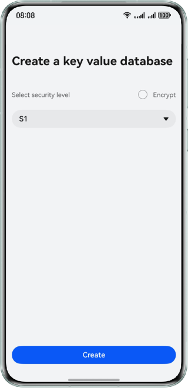
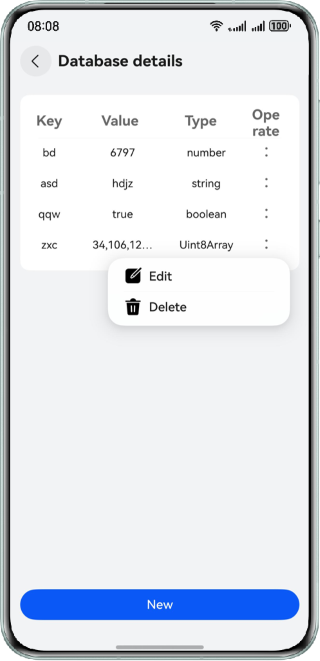
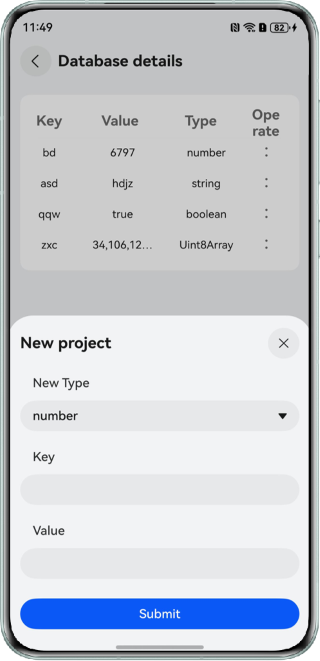

# Reading and Writing a KV Store

### Overview

This sample demonstrates how to use @ohos.data.distributedKVStore APIs to access a Key-Value (KV) store and add, delete, modify, and query records in it.

### Preview

| Home Page                              | Details Page                               | New Page                            |
|----------------------------------------|--------------------------------------------|-------------------------------------|
|  |  |  |


How to Use

1. Select the data level, determine whether to encrypt the data, and touch Create. The details page is displayed.
2. Touch Add to display a window for adding KV pairs. You can customize the type, key, and value.
3. Touch Submit to add a data record to the database. (Every key must be unique). Then you can touch the × icon in the upper right corner or the mask area to exit. The data is not updated.
4. Touch Delete to delete the data record from the database.
5. Touch Edit to display the editing page. You can modify the data type and value, but cannot change the key name.
6. Touch Submit. The data in the database is updated.

### Project Directory

```
├──entry/src/main/ets                              // Code
│  ├──constants                                  
│  │  └──utils
│  │     └──KVStore.ets                            // Operations related to the KV store
│  ├──entryability  
│  │  └──EntryAbility.ets 
│  ├──entrybackupability  
│  │  └──EntryBackupAbility.ets 
│  ├──pages
│  │  ├──Index.ets                                 // Home page                                
│  │  └──ReadWritePage.ets                         // Page for reading and writing
│  └──viewmodel
│     └──KVStoreType.ets                           // Database information class     
└──entry/src/main/resources                        // Application resources
```

### How to Implement
1. Call createKVManager() to create a KVManager instance for database management.
2. Call getKVStore() and specify options and storeId to create and obtain a KV store of the SingleKVStore type.
3. Call put() to add a KV pair of a specified type to the database.
4. Call getEntries() to obtain all keys.
5. Call delete() to delete data of specified key from the database.

### Permissions

N/A

### Dependencies

N/A

### Constraints

1. The sample is only supported on Huawei phones with standard systems.
2. The HarmonyOS version must be HarmonyOS 5.0.5 Release or later.
3. The DevEco Studio version must be DevEco Studio 5.0.5 Release or later.
4. The HarmonyOS SDK version must be HarmonyOS 5.0.5 Release SDK or later.
