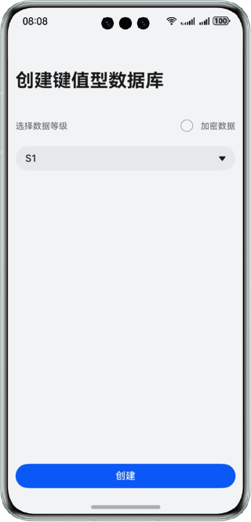
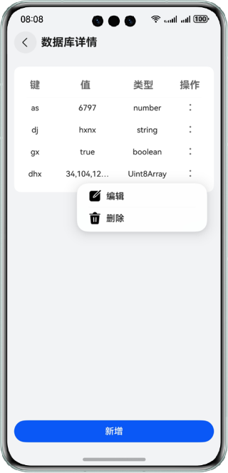
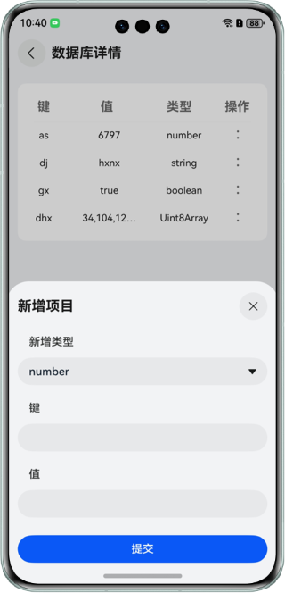

# 实现键值型数据库读写功能

### 介绍

本示例主要使用@ohos.data.distributedKVStore接口，实现了键值型数据库的访问及增删改查功能。帮助开发者在键值型数据库使用场景开发中，实现数据库的增删改查功能。

### 效果预览

| 首页                                  | 详情页                                     | 新增页                              |
|-------------------------------------|-----------------------------------------|----------------------------------|
|  |  |  |


使用说明：

1. 选择数据等级及是否加密数据后，点击“创建”按钮，进入详情页；
2. 点击“新增”，弹出新增半模态，可以自定义新增类型、键、值；
3. 点击“提交”，数据库增加一条数据（相同键名只能存在一条），点击右上X键或者蒙层区域，退出半模态，数据不更新；
4. 数据库每条数据可编辑，可删除，点击“删除”，数据库删除该条数据；
5. 点击“编辑”，弹出编辑半模态，可修改数据的类型和值，不允许修改键名；
6. 点击“提交”，数据库该条数据信息更新。

### 工程目录

```
├──entry/src/main/ets                              // 代码区
│  ├──constants                                  
│  │  └──utils
│  │     └──KVStore.ets                            // 键值数据库相关操作
│  ├──entryability  
│  │  └──EntryAbility.ets 
│  ├──entrybackupability  
│  │  └──EntryBackupAbility.ets 
│  ├──pages
│  │  ├──Index.ets                                 // 首页                                
│  │  └──ReadWritePage.ets                         // 读写页
│  └──viewmodel
│     └──KVStoreType.ets                           // 数据库信息类     
└──entry/src/main/resources                        // 应用资源目录
```

### 具体实现

1. 使用createKVManager()接口，创建一个KVManager对象实例，用于管理数据库对象。
2. 使用getKVStore()接口，指定options和storeId，创建并得到SingleKVStore类型的KVStore数据库。
3. 使用put()接口，添加指定类型的键值对到数据库。
4. 使用getEntries()接口，获取所有键值。
5. 使用delete()接口，从数据库中删除指定键值的数据。

### 相关权限

不涉及。

### 依赖

不涉及。

### 约束与限制

1. 本示例仅支持标准系统上运行，支持设备：华为手机。

2. HarmonyOS系统：HarmonyOS 5.0.5 Release及以上。

3. DevEco Studio版本：DevEco Studio 5.0.5 Release及以上。

4. HarmonyOS SDK版本：HarmonyOS 5.0.5 Release SDK及以上。