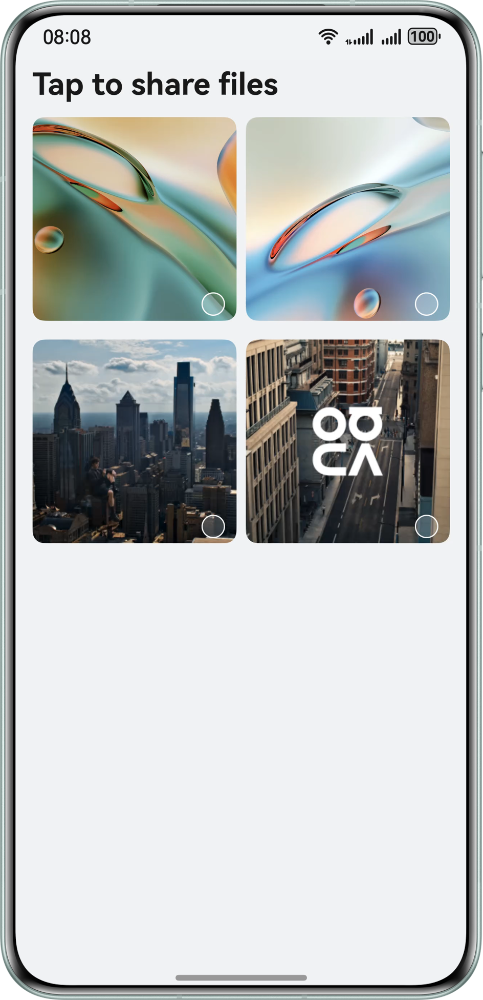

# Tap to Transfer for Files Using Share Kit

## Overview

This sample demonstrates how to implement cross-device file sharing using Share Kit. To enable tap-to-transfer functionality, you can call harmonyShare.on('knockShare') to register a listener for tap-to-transfer events. In the callback, sharableTarget.share() is triggered to transfer file data. The received files are stored in Gallery or File Manager by default. For PC recipients, you can call harmonyShare.on('dataReceive') to register a listener for file receiving. After that, the files are automatically saved to the sandbox directory of the application.

## Effect

| 首页                                                    |
|-------------------------------------------------------|
|  |

## How to Use

1. Once the application is installed, you can use the Tap to Transfer feature to share files.
2. On the home screen, select your desired files and share them using Tap to Transfer.
3. If the receiver is a PC, ensure both the phone and PC are logged in to the same HUAWEI ID.
4. The received files are stored in Gallery or File Manager by default. For PC applications, you can call harmonyShare.on('dataReceive') to register a listener for file receiving. After that, the files are automatically saved to the sandbox directory of the application.
5. A maximum of five files can be received by PC applications.

## Project Structure

```
├───entry/src/main/ets 
│   ├───constants                       
│   │   └───BreakpointConstants.ets    // Constants 
│   ├───controller                      
│   │   └───KnockController.ets        // Tap to Transfer control 
│   ├───entryability                    
│   │   └───EntryAbility.ets           // Application entry 
│   ├───entrybackupability              
│   │   └───EntryBackupAbility.ets     // Data backup and restore 
│   ├───model                           
│   │   └───FileData.ets               // File data 
│   ├───pages                           
│   │   └───Index.ets                  // Home page 
│   └───utils                           
│       ├───BreakpointSystem.ets       // Breakpoint utility 
│       └───FileUtil.ets               // File utility 
└───entry/src/main/resources           // Resources
```

## How to Implement
* Use the systemShare module of Share Kit to implement the Tap to Transfer feature and the file receiving functionality in PC applications.

## Required Permissions

**N/A**

## Dependencies

**N/A**

## Constraints

1. This sample is only supported on Huawei phones and PCs/2-in-1 devices running standard systems.
2. The HarmonyOS version must be HarmonyOS 6.0.0 Beta2 or later.
3. The DevEco Studio version must be DevEco Studio 6.0.0 Beta2 or later.
4. The HarmonyOS SDK version must be HarmonyOS 6.0.0 Beta2 SDK or later.