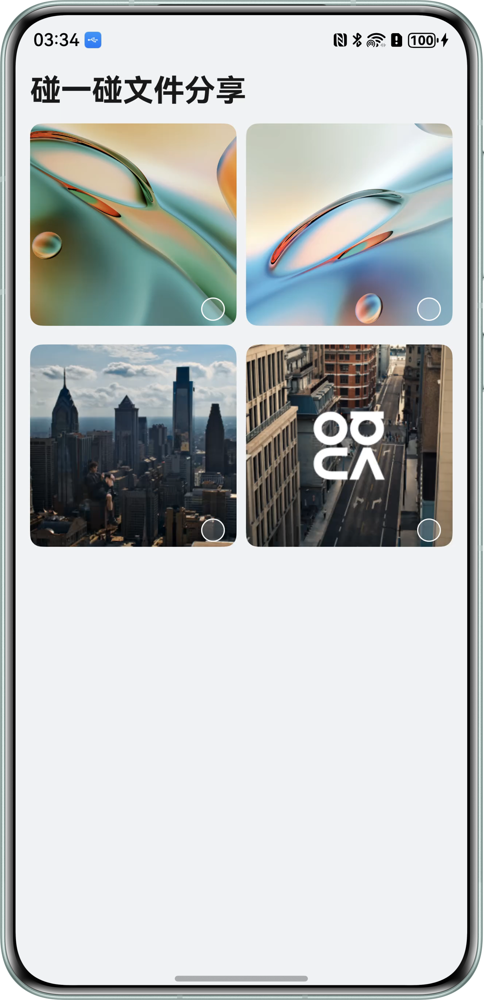

# 基于Share Kit实现碰一碰文件分享

### 介绍

本示例基于Share Kit实现了跨设备文件的快速分享功能：通过调用`harmonyShare.on('knockShare')`方法注册碰一碰监听事件，在回调中触发`sharableTarget.share()`方法传输文件数据，即可完成碰一碰文件分享流程，供接收端设备获取。其中，接收端接收的文件默认存储于图库或文件管理系统，若接收端为PC端，应用可通过`harmonyShare.on('dataReceive')`方法注册文件接收监听，碰一碰后文件会自动保存至应用的沙箱目录。

### 效果图预览

| 首页                                                 |
|----------------------------------------------------|
|  |

**使用说明**

1. 设设备安装应用后，即可使用碰一碰文件分享功能，具体使用约束可参考[手机与手机碰一碰分享](https://developer.huawei.com/consumer/cn/doc/harmonyos-guides/knock-share-phone-to-phone)、[手机与PC/2in1碰一碰分享](https://developer.huawei.com/consumer/cn/doc/harmonyos-guides/knock-share-phone-to-pc)。
2. 在首页勾选文件后，通过碰一碰即可分享已选文件。
3. 若接收端为PC设备，需确保手机与PC登录同一华为账号，方可实现碰一碰分享。
4. 接收端文件默认存储于图库或文件管理器中，其中PC端应用可通过调用`harmonyShare.on('dataReceive')`方法注册文件接收监听，碰一碰传输的文件将存储至该应用的沙箱路径下。
5. PC端应用接收时最大支持接收5个文件。

### 工程结构

```
├───entry/src/main/ets
│   ├───constants                      
│   │   └───BreakpointConstants.ets    // 常量
│   ├───controller                     
│   │   └───KnockController.ets        // 碰一碰分享控制类
│   ├───entryability                   
│   │   └───EntryAbility.ets           // 程序入口类
│   ├───entrybackupability             
│   │   └───EntryBackupAbility.ets     // 数据备份恢复类
│   ├───model                          
│   │   └───FileData.ets               // 文件数据
│   ├───pages                          
│   │   └───Index.ets                  // 首页
│   └───utils                          
│       ├───BreakpointSystem.ets       // 一多断点工具类
│       └───FileUtil.ets               // 文件工具类
└───entry/src/main/resources           // 资源目录    
```

### 具体实现
* 通过Share Kit的systemShare模块实现碰一碰分享功能以及PC设备应用内文件接收功能。

### 相关权限

**不涉及**

### 模块依赖

**不涉及**

### 约束与限制

1. 本示例仅支持标准系统上运行，支持设备：华为手机、PC/2in1。
2. HarmonyOS系统：HarmonyOS 6.0.0 beta2及以上。
3. DevEco Studio版本：DevEco Studio 6.0.0 beta2及以上。
4. HarmonyOS SDK版本：HarmonyOS 6.0.0 beta2 SDK及以上。