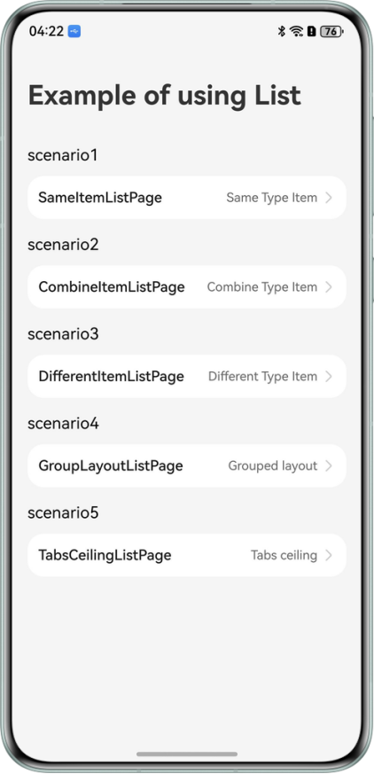

# Implementing a Long List Based on ScrollComponents

## Overview

This sample demonstrates how to use ScrollComponents to build a long list page, covering the following scenarios:

- Item component reuse in long lists
- Group layouts in long lists
- Cross-page reuse of long lists
- Accelerated first-screen rendering
- Long list data processing: pull-down-to-refresh and pull-up-to-load
- Infinite scrolling of long lists
- Swipe-to-delete in long lists
- Multiple item types in long lists
- Tabs ceiling in long lists
- Group header ceiling in long lists
- Level-2 linkage in long lists
- Dynamically adjusting the column count in long lists
- Edge fading setting for long lists

## Preview



## How to use

1. Open the app homepage to display the scene list. Click SameItemListPage to implements the reuse of components
   with the same grid cell structure and grid arrangement mode setting.
2. Return to the homepage, click CombineItemListPage to implements reuse for list items with composable child
   components, accelerated first-screen rendering, and infinite scrolling for long lists.
3. Return to the homepage, click DifferentItemListPage to implements component reuse for different list item
   structures, pull-down-to-refresh and pull-up-to-load for long lists.
4. Return to the homepage, click GroupLayoutListPage to implements group layouts, multiple item types
   (ListHeaderView), group header ceiling, and Level-2 linkage in long lists.
5. Return to the homepage, click TabsCeilingListPage to implements the tabs ceiling and cross-page reuse of long lists.

## Project Directory

```
├─entry/src/main/ets
├── common  
│  ├── contants  
│  │  └── CommonConstants.ets         // Common constants. 
│  └── utils   
│     ├── Logger.ets                  // Log class. 
│     ├── ToastUtil.ets               // Pop-up Utility class.
│     └── Utils.ets                   // Utility class. 
├── component  
│  └── PublicView.ets                 // Common component class.
├── entryability  
│  └── EntryAbility.ets               // Entry point class. 
├── entrybackupability  
│  └── EntryBackupAbility.ets         // Data backup and restore class. 
├── model                              
│  ├── mock.ets                       // Mock data loading class. 
│  ├── types.ets                      // Data model. 
│  └── CategoryModel.ets              // Category model. 
├── viewmodel   
│  ├── SameItemViewModel.ets          // View model for pages of the same list item structures. 
│  ├── CombineItemViewModel.ets       // View model for pages of list items with composable child components.
│  ├── DifferentItemViewModel.ets     // View model for pages of different list item structures. 
│  ├── GroupLayoutViewModel.ets       // View model for group layout page. 
│  └── TabsCeilingViewModel.ets       // View model for tabs ceiling page. 
└── pages                                   
   ├── Index.ets                      // Home page. 
   ├── SameItemListPage.ets           // Page of the same list item structures. 
   ├── CombineItemListPage.ets        // Page of list items with composable child components.
   ├── DifferentItemListPage.ets      // Page of list items with different structures. 
   ├── GroupLayoutListPage.ets        // Page of group layout.
   └── TabsCeilingListPage.ets        // Page of tabs ceiling.
```

## How to Implement

> This section introduces the efficient rendering of infinite long list pages.

### 1. Define the long list view management class and register the item node template.

ListManager is a view manager. Developers can customize the view manager class based on service requirements.

- During page initialization, developers can customize child node templates and bind them to components to enable
  reuse capabilities.

- If a pre-created node is used, the corresponding template should be registered before pre-creation.

```c
// src/main/ets/pages/StandardWaterFlowPage.ets 
 
import { ListManager, NodeItem, RecyclerView } from '@hadss/scroll_components'; 
 
@Builder 
function StandardGridImageContainer($$: ESObject) { 
  GridImageView({blogItem: $$.blogItem}) 
} 
 
// 1. Customize a view manager. 
class MyListManager extends ListManager { 
  onWillCreateItem(index: number, data: BlogData) { 
    // 3. Obtain reusable node by unique ID and pass node data. 
    let node: NodeItem<Params> | null = this.dequeueReusableNodeByType('EasyBlogItemContainer'); 
    node?.setData({ blogItem: data }); 
    return node; 
  } 
} 

@Component 
export struct SameItemListPage { 
  // Instantiation of the view manager. 
  myListManager: MyListManager = new MyListManager({ 
    defaultNodeItem: 'EasyBlogItemContainer', 
    context: this.getUIContext() 
  }); 
  ... 
 
  aboutToAppear(): void { 
    ... 
    this.initView(); 
    // 2. Register the node template. 
    this.myListManager.registerNodeItem('EasyBlogItemContainer', wrapBuilder(EasyBlogItemContainer)); 
  } 
  ... 
}
```

### 2. Initialize the List component.

```c
// src/main/ets/pages/SameItemListPage.ets 
 
initView() { 
  this.myListManager.setItemViewStyle((item, index, data: ESObject) => { 
    item({ style: ListItemStyle.NONE }) 
      .width('100%') 
      .height('auto') 
      .swipeAction({ 
        end: { 
          builder: () => { 
            this.ItemActionEnd(index) 
          }, 
        }, 
        start: { 
          builder: () => { 
            this.ItemActionStart(index) 
          }, 
        }, 
        onOffsetChange: (offset: number) => { 
          Logger.info("offset:" + offset) 
        } 
      }) 
      .onClick(() => { 
        Logger.info("index:" + index) 
      }) 
  }) 
 
  this.myListManager.setViewStyle({ space: 10, scroller: this.scroller, }) 
    .cachedCount(2) 
    .width('100%') 
    .layoutWeight(1) 
    .contentStartOffset(20)  
    .contentEndOffset(20)  
    .scrollBar(BarState.On) 
    .divider({ 
      strokeWidth: 2, 
      color: '#F5F5F5', 
      startMargin: 20, 
      endMargin: 20 
    })   
    .onClick((event) => { 
      Logger.info('ListView onClick') 
    }) 
    .onScrollIndex((start: number, end: number, center: number) => { 
      Logger.info('SameItemListPage onScrollIndex: start: ' + start + ' end: '+ end + ' center ' + center) 
    }) 
    .onScrollVisibleContentChange((start: VisibleListContentInfo, end: VisibleListContentInfo) => { 
      Logger.info(' start index: ' + start.index + ' end index: ' + end.index); 
    }) 
    .onDidScroll((scrollOffset: number, scrollState: ScrollState) => { 
      Logger.info(`onScroll scrollState = ScrollState` + scrollState + `, scrollOffset = ` + scrollOffset); 
    }) 
    .alignListItem(ListItemAlign.Start) 
    .lanes(1) 
    .childrenMainSize(this.listChildrenSize)  
    .fadingEdge(true, { fadingEdgeLength: LengthMetrics.vp(80) })  
    .nestedScroll({ 
      scrollForward: NestedScrollMode.PARENT_FIRST, 
      scrollBackward: NestedScrollMode.SELF_FIRST 
    }) 
}
```

### 3. Set the data source for component rendering.

- ScrollComponents supports lazy loading by default. Developers can use setDataSource to pass in a common array. There
  is no need to define complex data sources like Datasource for lazyForEach.

- By performing RecyclerView for component placeholder and binding the view container instance, the long list can be
  rendered.

```c
// src/main/ets/pages/SameItemListPage.ets 
 
import { RecyclerView } from '@hadss/scroll_components'; 
 
@Observed 
class BlogData { 
  id: number = -1; 
  images: string[] = []; 
  imagePixelMap: image.PixelMap | undefined; 
  ... 
} 
 
@Component 
export struct SameItemListPage { 
  myListManager: MyListManager = new MyListManager({ 
    defaultNodeItem: 'EasyBlogItemContainer', 
    context: this.getUIContext() 
  }); 
  @State myViewModel: SameItemViewModel = new SameItemViewModel(this.myListManager); 
  scroller: Scroller = new Scroller(); 
  @State data: BlogData[] = []; 
  ... 
 
  aboutToAppear(): void { 
    ... 
    this.initView(); 
    // 1. Use setDataSource to set the long list data. 
    this.myViewModel.loadData(); 
  } 
 
  build() { 
    Column() { 
      ... 
      // 2. Bind the view container instance. 
      RecyclerView({ 
        viewManager: this.waterFlowView 
      }) 
    } 
  } 
}
```

```c
@Observed 
export class SameItemViewModel { 
  ... 
  loadData() { 
    setTimeout(() => { 
      generateRandomBlogData(300, false).then((data: BlogData[]) => { 
        this.data = data; 
        this.myListManager.setDataSource(data); 
      }) 
    }, this.NetworkTime) 
  }
}
```

## Permission

- The `ohos.permission.INTERNET` permission is required for downloading network resources.

## Constraints

1. The sample app is only supported on Huawei phones with standard systems.
2. The HarmonyOS version must be HarmonyOS 6.0.0 Beta1 or later.
3. The DevEco Studio version must be DevEco Studio 6.0.0 Beta1 or later.
4. The HarmonyOS SDK version must be HarmonyOS 6.0.0 Beta1 SDK or later.
5. Pinch gesture recognition is not supported.

# Introduction to ScrollComponents

As a high-performance scrolling solution, ScrollComponents helps developers achieve smoother scrolling experiences in
complex page scenarios such as long lists and waterfalls.

Its underlying system uses a custom reuse pool to address efficiency issues under complex scenarios, offering higher
reuse efficiency compared to the native Reusable.

Developers can achieve high-performance scrolling with minimal code, without needing to handle the complexities of
component reuse pool management or other performance optimization interactions.

# Features

- Smooth scrolling for long list pages.
- Lazy loading by default.
- Component pre-creation by frame, helping developers reduce the time required for a single frame.
- Reused pool sharing across pages, reducing frame loss during scrolling.
- Dynamic content preloading, reducing white blocks during scrolling.

# FAQ

[View Details](https://gitcode.com/openharmony-sig/scroll_components/blob/master/docs/FAQ.md)

# Principles

[View Details](https://gitcode.com/openharmony-sig/scroll_components/blob/master/README.md#%E5%8E%9F%E7%90%86%E4%BB%8B%E7%BB%8D)

# Open source license

This project is licensed under [Apache License 2.0](./LICENSE) .