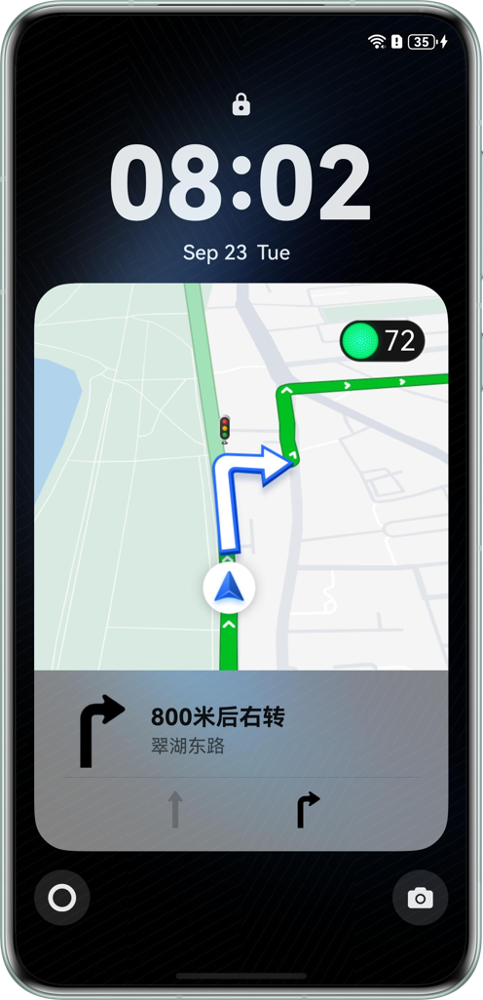
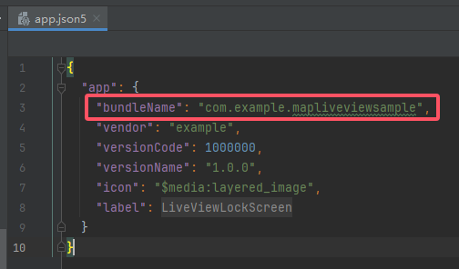

# Lock Screen Immersive Live Views

## Overview

Based on HarmonyOS, Live View Kit allows you to create, update, and close live view in multiple scenarios, such as instant delivery. Customized status nodes are provided for different scenarios to help users focus on key information and improve user experience. Through the Live View Kit, lock screen immersive live views provide users with real-time access to essential application activity details directly on the lock screen, eliminating the need to unlock their device and enter the application. These live views are especially suitable for scenarios with high real-time requirements, where users need to stay updated on the current status.

## Concepts

- Live view: Live views help users focus on ongoing tasks, facilitating quick viewing and instant processing of these tasks. Live view messages feature a specific period, timeliness, and updates.

## Preview

Lock Screen:



## How to Use

1. After the application is started, the live view and immersive live view are automatically activated. The home page does not have specific functionalities and is only for display purposes.

2. After swiping up to go back to the home page, a user can swipe down the notification panel or tap the live view capsule on the left side of the page navigation bar to check message notifications and all live view pages.

3. Turn on the lock screen and tap the lock screen button again to view the lock screen immersive live views.

4. This sample provides only the capabilities of creating, updating, and ending a live view locally. (The live view cannot be updated in the background. To update it in the background, use Push Kit.) If you want to use Push Kit for update, you can use an existing server to call the corresponding REST API. For details, see [Service for pushing live view messages](https://developer.huawei.com/consumer/en/doc/harmonyos-guides/push-update-liveview).

## Project Directory

```
├─entry/src/main/ets                 
│   ├───constant                            
│   │   └───Constant.ets                   // Constant 
│   ├───entryability                        
│   │   └───EntryAbility.ets               // EntryAbility 
│   ├───liveview                            
│   │   ├───LiveViewExtAbility.ets         // Live view 
│   │   └───LockScreenPage.ets             // Lock screen page 
│   ├───model                               
│   │   └───RouteDataModel.ets             // Navigation data model 
│   ├───pages                               
│   │   └───Index.ets                      // Home page 
│   ├───utils                               
│   │   ├───BreakpointUtil.ets             // Breakpoint utility 
│   │   ├───LiveView.ets                   // Live view class 
│   │   └───LiveViewUtil.ets               // Live view utility 
│   ├───view                                
│   │   ├───RoadView.ets                   // Road 
│   │   ├───TrafficInfoView.ets            // Navigation information 
│   │   └───TrafficView.ets                // Navigation page 
│   └───viewmodel                          
│       └───RouteDataViewModel.ets         // Navigation data ViewModel 
└───entry/src/main/resources    
```

## How to Implement

1. After the **HomePage** is created, create a live view and a scheduled task. The **liveViewManager.updateLiveView()** API is called at fixed intervals to update the live view, and the **commonEventManager.publish()** API is used to pass new parameters to the immersive live view page, so as to realize the update of the live view and the immersive live view.

## Required Permissions

1. To use this instance, replace **bundleName** in the **AppScope/app.json5** file with your bundle name.

  

2. If your own bundle name has not applied for the permissions of live view and immersive live view, please refer to the [development preparations of Live View Kit](https://developer.huawei.com/consumer/en/doc/harmonyos-guides/liveview-preparations) and first activate the permissions of push service and live view.

3. **ohos.permission.KEEP_BACKGROUND_RUNNING**: Obtains the permission to run the application in the background.

## Constraints

1. This sample is only supported on Huawei phones running standard systems.
2. The HarmonyOS version must be HarmonyOS 5.0.5 Release or later.
3. The DevEco Studio version must be DevEco Studio 5.0.5 Release or later.
4. The HarmonyOS SDK version must be HarmonyOS 5.0.5 Release SDK or later.