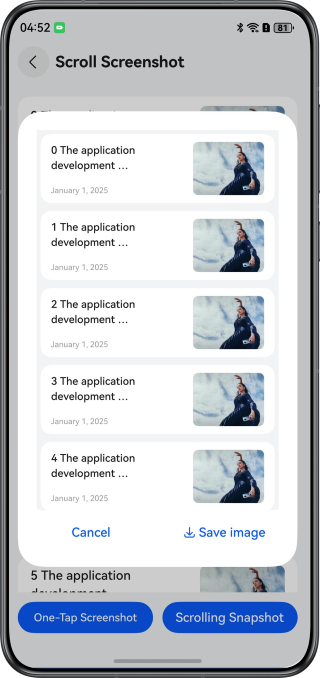
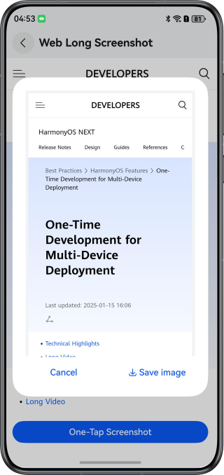

# Implementing the Long Screenshot Function

### Overview

This sample describes how to implement the long screenshot function of scrollable components (such as **List**) and the **Web** component. The **Scroller** (scroll controller), **WebViewController**, and **@ohos.arkui.componentSnapshot** (component screenshot module) are used to implement the long screenshot function.

### Preview

| Scrollable Component                | Web Component                       |
|-------------------------------------|-------------------------------------|
|  |  |

### Project Directory

```
├──entry/src/main/ets/
│  ├──common
│  │  ├──CommonUtils.ets                  // Common utilities
│  │  ├──ImageUtils.ets                   // Image processing utilities
│  │  ├──LazyDataSource.ets               // Data source management for lazy loading
│  │  ├──Logger.ets                       // Logger
│  │  └──PopupUtils.ets                   // Pop-up position utilities
│  ├──entryability
│  │  └──EntryAbility.ets                 // Entry ability
│  ├──entrybackupability
│  │  └──EntryBackupAbility.ets           // Data backup and restoration
│  ├──pages
│  │  └──Index.ets                        // App entry
│  └──view
│     ├──NewsItem.ets                     // List item view
│     ├──ScrollSnapshot.ets               // Long screenshot view of scrollable components
│     ├──SnapshotPreview.ets              // Preview pop-up window of the long screenshot
│     ├──WebSnapshot.ets                  // Long screenshot view of the Web component
│     └──WebSnapshotWebTag.ets            // Use the webPageSnapshot() method to take a full screenshot of the web page
└──entry/src/main/resources               // Static resources of the app
```

### How to Use

1. Tap the Long Screenshot of Scrollable Components or Long Screenshot of the Web Component button on the app home page to go to the corresponding page.
2. On the page of Long Screenshot of Scrollable Components, tap the One-Tap Screenshot button to automatically generate the long screenshot thumbnail of the entire scrollable component page. You can tap the thumbnail to zoom in and preview the screenshot, and tap the Save button to save the image to the album.
3. On the page of Long Screenshot of Scrollable Components, tap the Scroll Screenshot button. Then, the list view automatically scrolls. When you tap the list or when the list scrolls to the bottom, a long screenshot of the period when the scroll starts and ends is automatically generated. For the thumbnail, the operations are the same as those in step 2.
4. On the page of Long Screenshot of the Web Component, tap One-Tap Screenshot button. After a while, a long screenshot of the entire web page is automatically generated. For the thumbnail, the operations are the same as those in step 2.

### How to Implement

1.  To scroll the list, the **List** component uses the scrolling controller ([Scroller](https://developer.huawei.com/consumer/en/doc/harmonyos-references/ts-container-scroll#scroller)), and the **Web** component uses the WebView controller ([WebViewController](https://developer.huawei.com/consumer/en/doc/harmonyos-references/ts-basic-components-web#webviewcontroller9)).
2. Use the [componentSnapshot.getSync()](https://developer.huawei.com/consumer/en/doc/harmonyos-references/js-apis-arkui-componentsnapshot#componentsnapshotgetsync12) method to take a screenshot of the current view of the component, and call the [pixelMap.readPixelsSync()](https://developer.huawei.com/consumer/en/doc/harmonyos-references/js-apis-image#readpixelssync12) method to read the screenshot data to the array in the buffer area.
3. Create a long screenshot object **longPixelMap**, call [longPixelMap.writePixelsSync()](https://developer.huawei.com/consumer/en/doc/harmonyos-references/js-apis-image#writepixelssync12) to write the segments to the correct positions of **longPixelMap** in sequence, and finally combine the segments into a complete long screenshot.
4. Use the security component [SaveButton](https://developer.huawei.com/consumer/en/doc/harmonyos-references/ts-security-components-savebutton) and the [photoAccessHelper](https://developer.huawei.com/consumer/en/doc/harmonyos-references/js-apis-photoaccesshelper) module to save the screenshot to the album.

### Permissions

**ohos.permission.INTERNET**: allows an app to access the Internet.

### Constraints

1. The sample is only supported on Huawei phones with standard systems.
2. The HarmonyOS version must be HarmonyOS 5.0.5 Release or later.
3. The DevEco Studio version must be DevEco Studio 5.0.5 Release or later.
4. The HarmonyOS SDK version must be HarmonyOS 5.0.5 Release SDK or later.