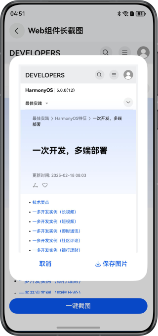

# 实现长截图功能

### 介绍

本示例介绍了如何实现滚动组件（如List组件）以及Web组件长截图功能。分别通过滚动控制器Scroller和WebView的控制器WebviewController，结合组件截图@ohos.arkui.componentSnapshot模块，实现长截图功能。

### 效果预览

| 滚动组件长截图                                    | Web组件长截图                                |
|--------------------------------------------|-----------------------------------------|
|  |  |

### 工程目录

```
├──entry/src/main/ets/
│  ├──common
│  │  ├──CommonUtils.ets                  // 通用工具类
│  │  ├──ImageUtils.ets                   // 图片处理工具类
│  │  ├──LazyDataSource.ets               // 懒加载数据源管类
│  │  ├──Logger.ets                       // 日志打印工具类
│  │  └──PopupUtils.ets                   // 弹窗位置计算工具类
│  ├──entryability
│  │  └──EntryAbility.ets                 // 程序入口类
│  ├──entrybackupability
│  │  └──EntryBackupAbility.ets           // 数据备份恢复类
│  ├──pages
│  │  └──Index.ets                        // 应用入口页
│  └──view
│     ├──NewsItem.ets                     // List列表项视图
│     ├──ScrollSnapshot.ets               // 滚动组件长截图视图
│     ├──SnapshotPreview.ets              // 长截图预览弹窗
│     ├──WebSnapshot.ets                  // Web组件长截图视图
│     └──WebSnapshotWebTag.ets            // 使用webPageSnapshot()方法进行网页全量截图
└──entry/src/main/resources               // 应用静态资源目录
```

### 使用说明

1. 分别点击应用首页“滚动组件长截图”和“Web组件长截图”按钮，分别跳转到对应的界面。
2. 在滚动组件长截图页面，点击“一键截图”按钮，稍等后自动生成整个滚动组件页面长截图缩略图，点击缩略图可以进行放大预览，点击“保存图片”按钮，图片会保存到图库。
3. 在滚动组件长截图页面，点击“滚动截图”按钮，列表视图会自动滚动，此时点击列表或者直到列表滑动到底部，会自动生成从滑动开始到滑动结束这段期间的的长截图，缩略图操作与步骤2相同。
4. 在Web组件长截图页面，点击“一键截图”按钮，稍等后自动生成整个网页的长截图，缩略图操作与步骤2相同。

### 实现说明

1. List组件通过运用滚动控制器（[Scroller](https://developer.huawei.com/consumer/cn/doc/harmonyos-references/ts-container-scroll#scroller)
）,Web组件通过WebView控制器（[WebViewController](https://developer.huawei.com/consumer/cn/doc/harmonyos-references/arkts-apis-webview-webviewcontroller)
）来对列表进行滚动。
2. 使用[componentSnapshot.getSync()](https://developer.huawei.com/consumer/cn/doc/harmonyos-references/js-apis-arkui-componentsnapshot#componentsnapshotgetsync12)
方法对组件当前画面进行截图，调用[pixelMap.readPixelsSync()](https://developer.huawei.com/consumer/cn/doc/harmonyos-references/arkts-apis-image-pixelmap#readpixelssync12)
将截图数据读取到缓冲区域Area数组中。
3. 创建长截图PixelMap对象longPixelMap，通过调用[longPixelMap.writePixelsSync()](https://developer.huawei.com/consumer/cn/doc/harmonyos-references/arkts-apis-image-pixelmap#writepixelssync12)
将这些片段依次写入到longPixelMap的正确位置，最终拼接成完整的长截图。
4. 通过安全控件[SaveButton](https://developer.huawei.com/consumer/cn/doc/harmonyos-references/ts-security-components-savebutton)
结合[photoAccessHelper](https://developer.huawei.com/consumer/cn/doc/harmonyos-references/js-apis-photoaccesshelper)
模块保存截图到相册。

### 相关权限

ohos.permission.INTERNET：允许使用Internet网络。

### 约束与限制

1. 本示例仅支持标准系统上运行，支持设备：华为手机。
2. HarmonyOS系统：HarmonyOS 5.0.5 Release及以上。
3. DevEco Studio版本：DevEco Studio 5.0.5 Release及以上。
4. HarmonyOS SDK版本：HarmonyOS 5.0.5 Release SDK及以上。
