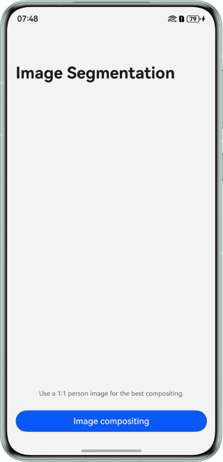
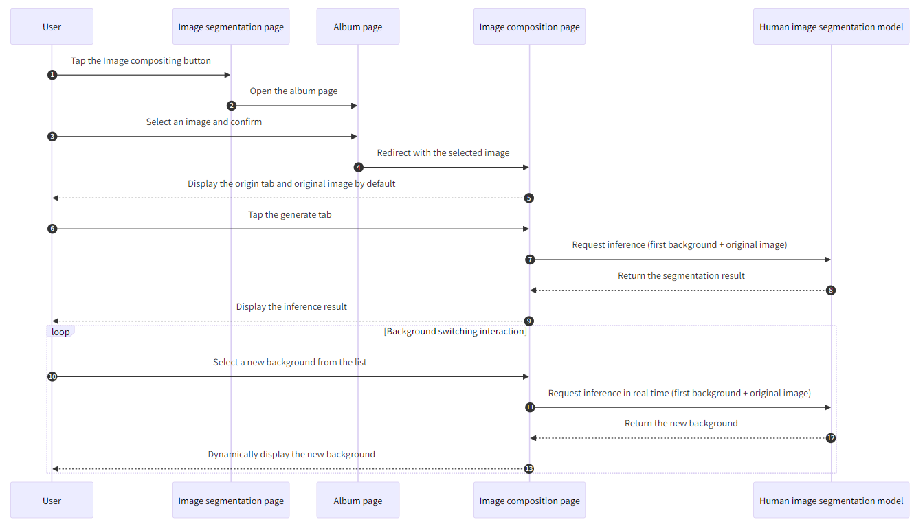

# On-Device Human Image Segmentation Using MindSpore Lite
## Overview
This sample demonstrates how to implement on-device human image segmentation using the ArkTS APIs provided by `@ohos.ai.mindSporeLite`.

## Effect
| Home Page                                                          | Album Page                                                           | Original Image                                                               | Composite Image                                                                |  
|--------------------------------------------------------------------|----------------------------------------------------------------------|------------------------------------------------------------------------------|--------------------------------------------------------------------------------|  
|  |  |  |  |  

## How to Use
1. On the image segmentation page, tap the `Image compositing` button to go to the album page for selecting an image.
2. On the album page, select an image (recommended 1:1 dimensions) and confirm.
3. After the image is selected, the image composition page is displayed. By default, the origin tab is selected and the selected original image is displayed.
4. Tap the generate tab. The inference is performed on the first background image and the original image by default, and the inference result is displayed on the main page. Note that the inference involves model loading to the memory and inference execution. Given the model's large size, this process is relatively time-consuming. You can refer to the capabilities provided by [@ohos.ai.mindSporeLite](https://developer.huawei.com/consumer/en/doc/harmonyos-references/js-apis-mindsporelite) and configure NPU inference to enhance efficiency.
5. On the generate tab page, you can select any background in the list. The inference result is displayed on the main page.

## Project Directory
```  
├──entry/src/main/ets/
│  ├──common
│  │  └──constants 
│  │     └──ImageDataListConstant.ets  // Static configuration of image inference
│  ├──entryability
│  │  └──EntryAbility.ets              // Entry Ability lifecycle callbacks
│  ├──model
│  │  └──NavigationParam.ets           // Navigation parameter transfer class
│  ├──pages
│  │  ├──Index.ets                     // Home page 
│  │  └──ImageGenerate.ets             // Composition page  
│  └──utils                  
│     ├──Gaussion.ets                  // Gaussian filtering algorithm utility
│     ├──Logger.ets                    // Log utility
│     └──Predict.ets                   // Model inference implementation
└──entry/src/main/resources/          
   └──rawfile
      └──rmbg_fp16.ms                  // Model file rmbg_fp16.ms
```  

## How to Implement
The image segmentation model used in this sample is `rmbg_fp16.ms`, which is stored in the `entry\src\main\resources\rawfile` project directory.

- On the home page, call APIs in [@ohos.file.photoAccessHelper](https://developer.huawei.com/consumer/en/doc/harmonyos-references/js-apis-photoaccesshelper) (album management), [@ohos.multimedia.image](https://developer.huawei.com/consumer/en/doc/harmonyos-references/js-apis-image) (image processing), and [@ohos.file.fs](https://developer.huawei.com/consumer/en/doc/harmonyos-references/js-apis-file-fs) (file management). For details about the complete code, see [Index.ets](entry/src/main/ets/pages/Index.ets) and [ImageGenerate.ets](entry/src/main/ets/pages/ImageGenerate.ets).

- On the image composition page, call APIs in [@ohos.ai.mindSporeLite](https://developer.huawei.com/consumer/en/doc/harmonyos-references/js-apis-mindsporelite) (on-device ai framework) to implement inference on the device. For details about the complete code, see [Predict.ets](entry/src/main/ets/utils/Predict.ets).

- Call the inference APIs and process the result. For details about the complete code, see [ImageGenerate.ets](entry/src/main/ets/pages/ImageGenerate.ets).

## Sequence Diagram


## Required Permissions
N/A

## Dependencies
Add the `syscap.json` file to the `main` directory of the project.

```json5
{  
  "devices": {  
    "general": [  
      "phone" // Enter the device type as required.
    ]  
  },  
  "development": {  
    "addedSysCaps": [  
      "SystemCapability.Ai.MindSpore"
    ]  
  }  
}  
```  

## Constraints
1. This sample is only supported on Huawei phones running standard systems.
2. The HarmonyOS version must be HarmonyOS 5.1.0 Release or later.
3. The DevEco Studio version must be DevEco Studio 5.1.0 Release or later.
4. The HarmonyOS SDK version must be HarmonyOS 5.1.0 Release SDK or later.