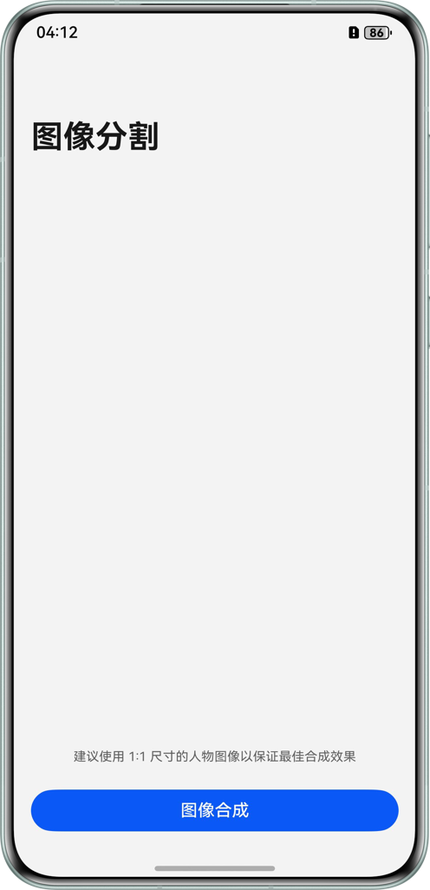
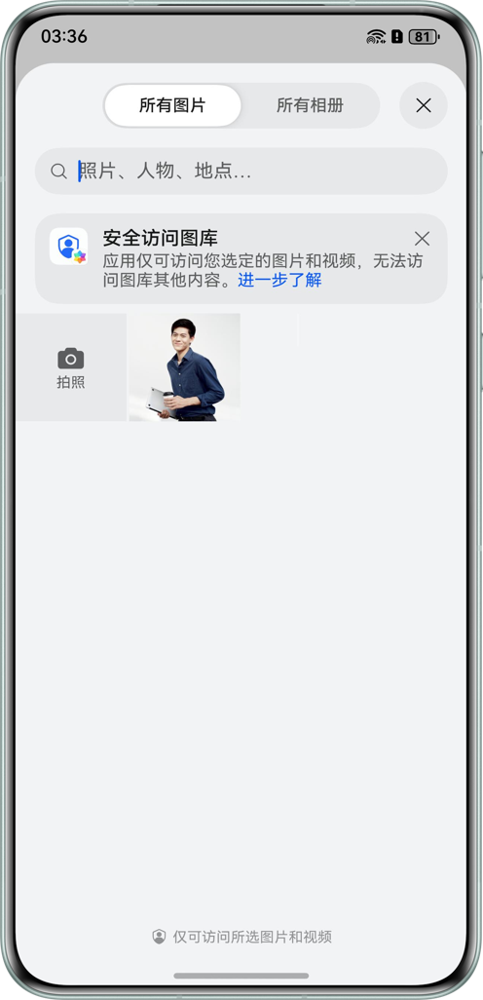
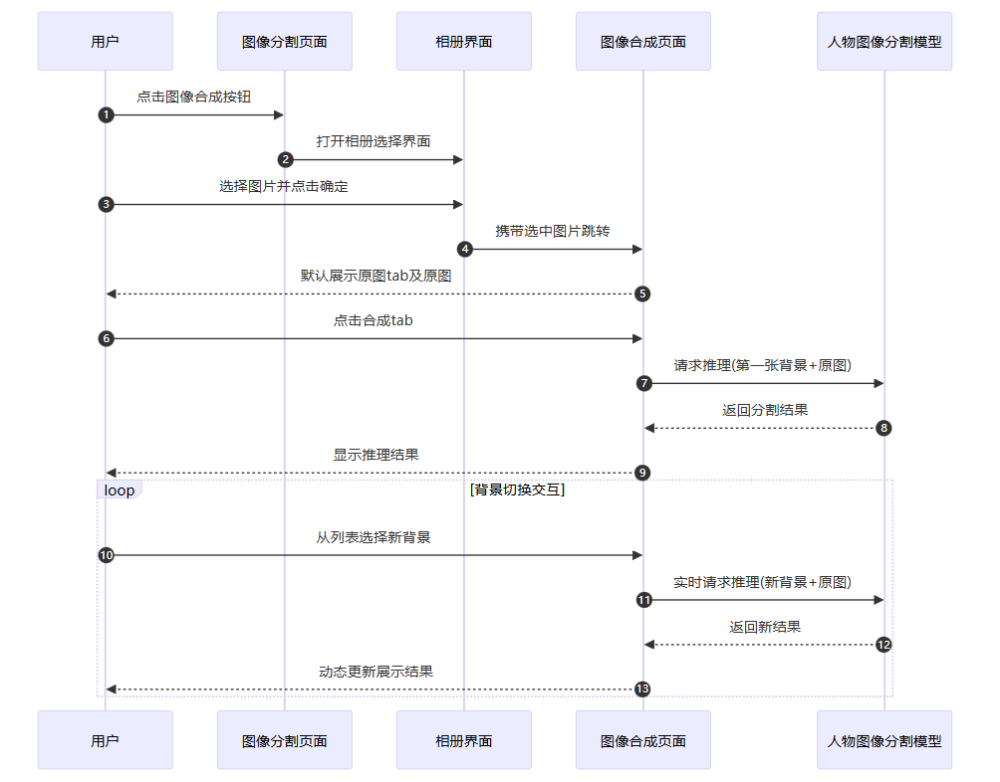

# 基于 MindSpore Lite 实现端侧人物图像分割
## 介绍
本示例基于`@ohos.ai.mindSporeLite`提供的ArkTS API，实现“端侧人物图像分割”示例程序。

## 效果预览
| 主页                                                | 相册页                                                     | 原图预览页                                                          | 人物图像分割合成结果页                                                         |
|---------------------------------------------------|---------------------------------------------------------|----------------------------------------------------------------|---------------------------------------------------------------------|
|  |  |  |  |


使用说明
1. 在图像分割页面，可以点击图像合成按钮，进入相册选择图片界面。
2. 在相册界面，选择`一张人物图像`（建议开发者使用1:1尺寸的人物图像以保证最佳合成效果），点击确定按钮。
3. 图像选择好后，会跳转到图像合成页面，默认选中原图tab并展示选择后的原图。
4. 点击合成tab会默认对第一张背景图和原图进行人物图像分割推理（推理过程会涉及模型加载到内存，执行推理，由于模型较大，这个过程会比较耗时，开发者可以参考[@ohos.ai.mindSporeLite](https://developer.huawei.com/consumer/cn/doc/harmonyos-references/js-apis-mindsporelite)配置NPU推理以提高推理效率），推理的结果会显示在主界面。
5. 在合成tab下，可以选择列表中的任意背景，进行人物图像分割推理，并在主界面展示推理结果。

## 工程目录
```
├──entry/src/main/ets/
│  ├──common
│  │  └──constants 
│  │     └──ImageDataListConstant.ets  // 图像推理静态配置
│  ├──entryability
│  │  └──EntryAbility.ets              // Ability的生命周期回调内容
│  ├──model
│  │  └──NavigationParam.ets           // Navigation参数传递类
│  ├──pages
│  │  ├──Index.ets                     // 首页，获取相册图片
│  │  └──ImageGenerate.ets             // 原图和合成图预览界面
│  └──utils                  
│     ├──Gaussion.ets                  // 高斯滤波算法工具类
│     ├──Logger.ets                    // 日志工具类
│     └──Predict.ets                   // 模型推理实现
└──entry/src/main/resources/          
   └──rawfile
      └──rmbg_fp16.ms                  // 存放的模型文件：rmbg_fp16.ms
```


## 具体实现
本示例程序中使用的终端图像分割模型为`rmbg_fp16.ms`，放置在`entry\src\main\resources\rawfile`工程目录下。

- 首页调用[@ohos.file.photoAccessHelper](https://developer.huawei.com/consumer/cn/doc/harmonyos-references/js-apis-photoaccesshelper)（相册管理模块）拉起相册、[@ohos.multimedia.image](https://developer.huawei.com/consumer/cn/doc/harmonyos-references/js-apis-image) （图片处理）、[@ohos.file.fs](https://developer.huawei.com/consumer/cn/doc/harmonyos-references/js-apis-file-fs) （文件管理）等API实现相册图片获取及图片处理。完整代码请参见[Index.ets](entry/src/main/ets/pages/Index.ets)、[ImageGenerate.ets](entry/src/main/ets/pages/ImageGenerate.ets)。

- 图像合成页调用[@ohos.ai.mindSporeLite](https://developer.huawei.com/consumer/cn/doc/harmonyos-references/js-apis-mindsporelite) (端侧AI框架) API实现端侧推理。完整代码请参见[Predict.ets](entry/src/main/ets/utils/Predict.ets)。

- 调用推理函数并处理结果。完整代码请参见[ImageGenerate.ets](entry/src/main/ets/pages/ImageGenerate.ets)。

## 时序流程图


## 相关权限
无。

## 依赖
在工程 main 目录中，添加 `syscap.json` 文件，添加如下配置

```json5
{
  "devices": {
    "general": [
      "phone" // 根据实际需要填写设备类型
    ]
  },
  "development": {
    "addedSysCaps": [
      "SystemCapability.Ai.MindSpore"
    ]
  }
}
```

## 约束与限制
1. 本示例仅支持标准系统上运行，支持设备：华为手机。

2. HarmonyOS系统：HarmonyOS 5.1.0 Release及以上。

3. DevEco Studio版本：DevEco Studio 5.1.0 Release及以上。

4. HarmonyOS SDK版本：HarmonyOS 5.1.0 Release SDK及以上。