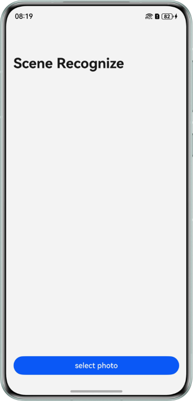
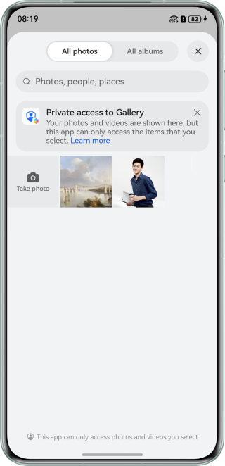
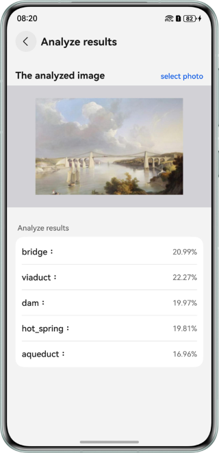
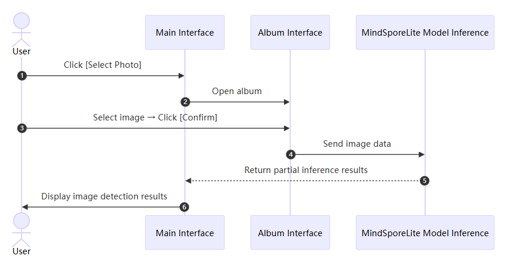

# On-Device Scenario Detection Based on MindSpore Lite
## Overview
This sample demonstrates the implementation of on-device scenario detection using the Native C++ API provided by `@ohos.ai.mindSporeLite`.

## Preview
| Home Page                                                          | Album Selection Page                                                                     | Scenario Analysis Result Page                                                                              |  
|--------------------------------------------------------------------|------------------------------------------------------------------------------------------|------------------------------------------------------------------------------------------------------------|  
|  |  |  |

## How to use:
1. On the scenario detection page, tap `Select Photo` to go to the album page.
2. Select an image from the album and tap `Confirm`.
3. After the image is selected, you will be redirected to the scenario analysis result page. The model is automatically called for inference, with the scenario detection result subsequently displayed on the UI.

## Project Directory
```  
├──entry/src/main/cpp
│  ├──types
│  │  └──libentry
│  │     ├──index.d.ts                  // Import NAPI for JS to call
│  │     └──oh-package.json5            // API registration 
│  ├──CMakeLists.txt                    // CMake build configuration file for compiling dynamic libraries, dependent header files, cpp files, and related dependencies
│  └──napi_init.cpp                     // Communication between JS and C++ implemented based on NAPI
├──entry/src/main/ets
│  ├──entryability
│  │  └──EntryAbility.ets               // Entry Ability lifecycle callbacks
│  ├──constants
│  │  └──Constants.ets                  // Static configuration class
│  ├──model
│  │  └──NavigationParam.ets            // Navigation parameter transmission class.
│  ├──pages
│  │  ├──Index.ets                      // Entry page of the application implemented via Ability
│  │  └──ResultPage.ets                 // Scenario detection result page
│  └──utils
│     └──Logger.ets                     // Log utility
└──entry/src/main/resources             // Application resource directory
   └──rawfile
      └──resnet18-place365.ms           // Stored model file
```  

## How to Implement
The scenario detection model used in this sample is `resnet18-place365.ms`, located in the `entry\src\main\resources\rawfile` directory.

- On the home page, call [@ohos.file.photoAccessHelper (Album Management)](https://developer.huawei.com/consumer/en/doc/harmonyos-references/js-apis-photoaccesshelper) to start the album. For details about the complete code, see [Index.ets](entry/src/main/ets/pages/Index.ets).
- On the scenario detection result page, call APIs such as [@ohos.multimedia.image (Image Processing)](https://developer.huawei.com/consumer/en/doc/harmonyos-references/js-apis-image) and [@ohos.file.fs (File Management)](https://developer.huawei.com/consumer/en/doc/harmonyos-references/js-apis-file-fs) to obtain and process images in the album. For details about the complete code, see [ResultPage.ets](entry/src/main/ets/pages/ResultPage.ets)
- On the `ResultPage`, call the `MindSpore Lite` model inference APIs, which are encapsulated in cpp file, to load the model and perform scenario detection. For details about the complete code, see [napi_init.cpp](entry/src/main/cpp/napi_init.cpp).

## Sequence Diagram


## Required Permissions
None.

## Dependencies
Add the `syscap.json` file to the `main` directory of the project.

```json5  
{  
  "devices": {  
    "general": [  
      "phone" // Fill in the device type as needed  
    ]  
  },  
  "development": {  
    "addedSysCaps": [  
      "SystemCapability.Ai.MindSpore"
    ]  
  }  
}  
```  

## Constraints
1. This sample is only supported on Huawei phones running standard systems.
2. The HarmonyOS version must be HarmonyOS 5.1.0 Release or later.
3. The DevEco Studio version must be DevEco Studio 5.1.0 Release or later.
4. The HarmonyOS SDK version must be HarmonyOS 5.1.0 Release SDK or later.