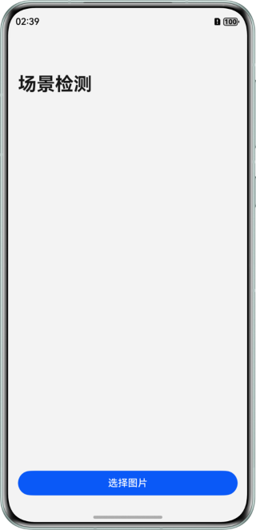
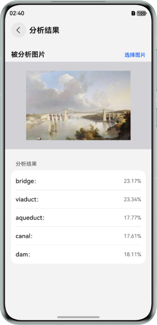
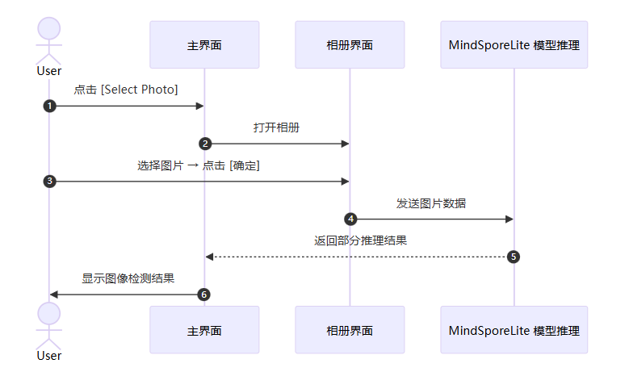

# 基于 MindSpore Lite 实现端侧场景检测
## 介绍
本示例基于`@ohos.ai.mindSporeLite`提供的 Native C++ API，实现“端侧场景检测”示例程序。

## 效果预览
| 主页                                                | 相册选取页                                                     | 场景分析结果页                                                     |
|---------------------------------------------------|-----------------------------------------------------------|-------------------------------------------------------------|
|  |    |  |


使用说明
1. 在场景检测页面，可以点击“选择图片”按钮，进入相册选择图片界面。
2. 在相册界面，选择一张图片，点击确定按钮。
3. 图像选择好后，会跳转到场景分析结果页，会自动调用模型进行推理，场景检测结果会显示到界面上。

## 工程目录
```
├──entry/src/main/cpp
│  ├──types
│  │  └──libentry
│  │     ├──index.d.ts                  // 导入NAPI接口供JS调用
│  │     └──oh-package.json5            // 接口注册配置文件
│  ├──CMakeLists.txt                    // Cmake打包配置文件，编译工程动态库脚本，依赖头文件、cpp以及相关依赖
│  └──napi_init.cpp                     // NAPI实现JS与C++通信的接口
├──entry/src/main/ets
│  ├──entryability
│  │  └──EntryAbility.ets               // Ability的生命周期回调内容
│  ├──constants
│  │  └──Constants.ets                  // 静态配置类
│  ├──model
│  │  └──NavigationParam.ets            // 导航参数传输类 
│  ├──pages
│  │  ├──Index.ets                      // Ability实现的应用的入口页面
│  │  └──ResultPage.ets                 // 场景检测结果页
│  └──utils
│     └──Logger.ets                     // 日志工具类
└──entry/src/main/resources             // 应用资源目录
   └──rawfile 
      └──resnet18-place365.ms           // 存放的模型文件
```


## 具体实现
本示例程序中使用的场景检测模型为`resnet18-place365.ms`，放置在`entry\src\main\resources\rawfile`工程目录下。

- 首页调用[@ohos.file.photoAccessHelper（相册管理模块）](https://developer.huawei.com/consumer/cn/doc/harmonyos-references/js-apis-photoaccesshelper)拉起相册，完整代码请参见[Index.ets](entry/src/main/ets/pages/Index.ets)。
- 场景检测分析结果页会用到[@ohos.multimedia.image（图片处理）](https://developer.huawei.com/consumer/cn/doc/harmonyos-references/js-apis-image)、[@ohos.file.fs（文件管理）](https://developer.huawei.com/consumer/cn/doc/harmonyos-references/js-apis-file-fs) 等API实现相册图片获取及图片处理。完整代码请参见[ResultPage.ets](entry/src/main/ets/pages/ResultPage.ets)。
- 场景检测结果页 ResultPage 通过调用 cpp 封装好 MindSpore Lite 相关模型推理接口完成模型加载，实现推理场景检测。完整代码请参见[napi_init.cpp](entry/src/main/cpp/napi_init.cpp)。


## 时序流程图


## 相关权限
无。

## 依赖
在工程 main 目录中，添加 `syscap.json` 文件，添加如下配置。

```json5
{
  "devices": {
    "general": [
      "phone" // 根据实际需要填写设备类型
    ]
  },
  "development": {
    "addedSysCaps": [
      "SystemCapability.Ai.MindSpore"
    ]
  }
}
```

## 约束与限制
1. 本示例仅支持标准系统上运行，支持设备：华为手机。
2. HarmonyOS系统：HarmonyOS 5.1.0 Release及以上。
3. DevEco Studio版本：DevEco Studio 5.1.0 Release及以上。
4. HarmonyOS SDK版本：HarmonyOS 5.1.0 Release SDK及以上。