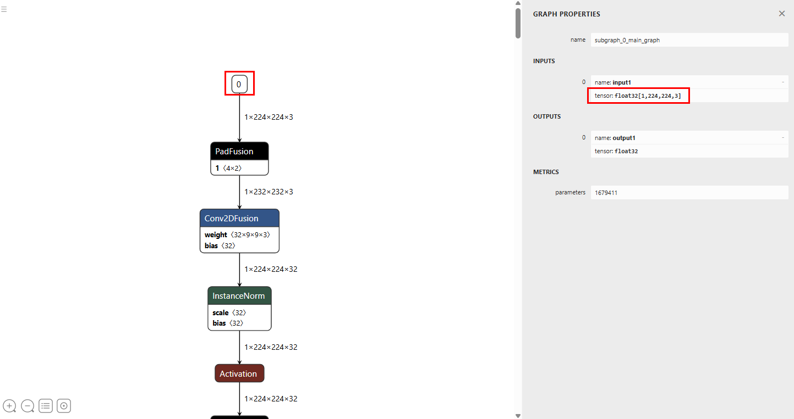
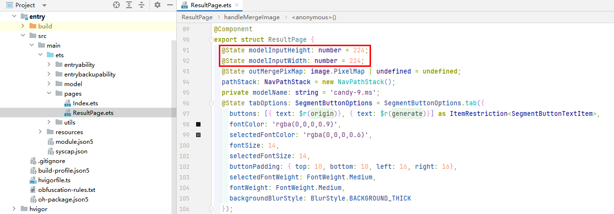
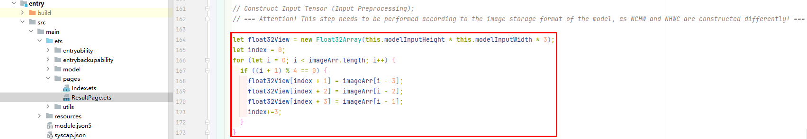

# 模型参数配置指导

1. 以本项目用到的默认模型`candy-9.ms`为例，我们使用[神经网络模型可视化工具](https://netron.app/)打开该模型,
2. 查看模型的输入值为1x224x224x3，见图一，和工程中[ResultPage.ets](./entry/src/main/ets/pages/ResultPage.ets)的模型输入值对应，见图二。

图一

图二
3. 模型输入预处理时，需要弄清楚模型存储图像的格式是[NCHW还是NHWC](https://zhuanlan.zhihu.com/p/31633814799)，开发者可以通过[MindSpore Lite模型转换工具](https://developer.huawei.com/consumer/cn/doc/harmonyos-guides/mindspore-lite-converter-guidelines)转换模型时得知模型存储图片的格式或者通过日志打印来判断模型存储图片的格式。本工程所用到的模型均是以NHWC格式存储图像（建议开发者使用该格式的模型，否则需要修改模型预处理的算法如下图）。

