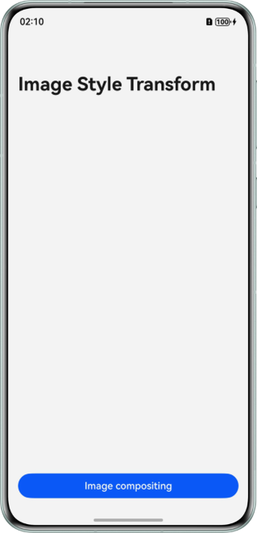
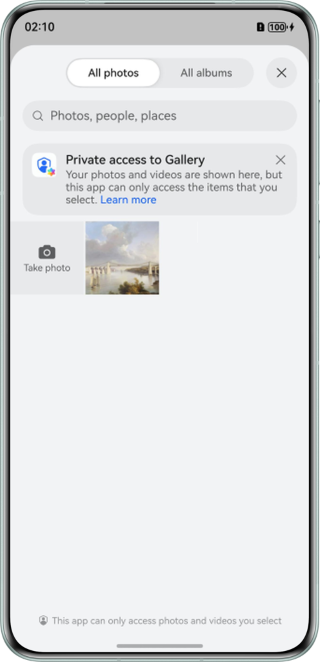
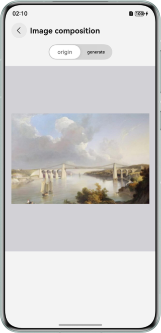
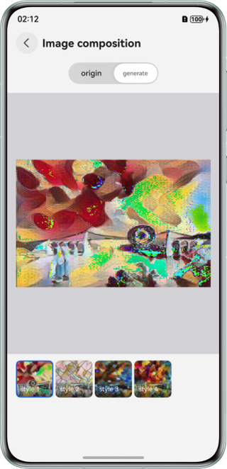
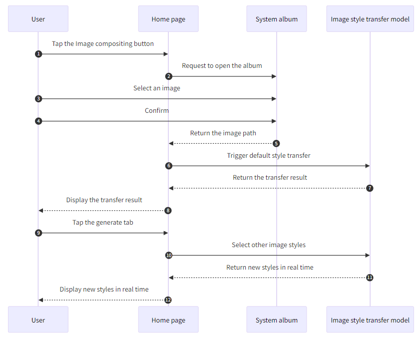

# On-Device Image Style Transfer Using MindSpore Lite

## Overview
This sample demonstrates how to implement on-device inference using the ArkTS APIs and image style transfer model provided by `@ohos.ai.mindSporeLite` to transfer image styles.

## Effect
| Home Page                                                          | Album Page                                                           | Original Image                                                               | Composite Image                                                                          |  
|--------------------------------------------------------------------|----------------------------------------------------------------------|------------------------------------------------------------------------------|------------------------------------------------------------------------------------------|  
|  |  |  |  |  

## How to Use
1. On the home page, tap the `Image compositing` button to access the album page for selecting images.
2. Select an image from the album and confirm.
3. After the image is selected, the image composition page is displayed. By default, the origin tab is selected and the selected original image is displayed.
4. Tap the generate tab. By default, the image transfers to the first style in the list, with the result displayed on the main page.
5. On the generate tab page, you can select any style in the list. The inference result is displayed on the main page in real time.

Note: The open-source model is used. You can search for other open-source image style transfer models online, refer to [Using MindSpore Lite for Model Conversion](https://developer.huawei.com/consumer/en/doc/harmonyos-guides/mindspore-lite-converter-guidelines) to convert the third-party model into a format supported by MindSpore Lite, replace the model and its parameters (for details, see Model Parameter Configuration Guide), and view the image compositing effect.

## Project Directory
```
├──entry/src/main/ets/
│  ├──entryability
│  │  └──EntryAbility.ets          // Entry ability lifecycle callbacks
│  ├──entrybackupability
│  │  └──EntryBackupAbility.ets    // Backup ability
│  ├──model
│  │  └──NavigationParam.ets       // Navigation parameter transfer class
│  ├──pages
│  │  ├──Index.ets                 // Home page
│  │  └──ResultPage.ets            // Composition page
│  └──utils                  
│     ├──Logger.ets                // Log utility
│     └──Predict.ets               // Model inference implementation 
└──entry/src/main/resources/       
   └──rawfile
      ├──candy-9.ms                // Candy style 
      ├──mosaic-9.ms               // Mosaic style 
      ├──pointilism-9.ms           // Pointilism style  
      └──rain-princess-9.ms        // Rain-princess style  
```  

## Implementation Details
The following four device image styles are used: candy-9.ms, mosaic-9.ms, pointilism-9.ms, and rain-princess-9.ms. They are stored in the `entry\src\main\resources\rawfile` project directory. By default, the candy-9.ms model is loaded.
- On the home page, call APIs in [@ohos.file.photoAccessHelper](https://developer.huawei.com/consumer/en/doc/harmonyos-references/js-apis-photoaccesshelper) (Album management module)to open the album. For details about the complete code, see [Index.ets](entry/src/main/ets/pages/Index.ets).
- On the composition page, call APIs in [@ohos.ai.mindSporeLite](https://developer.huawei.com/consumer/en/doc/harmonyos-references/js-apis-mindsporelite) (on-device AI framework) to implement inference. For details about the complete code, see [Predict.ets](entry/src/main/ets/utils/Predict.ets).
- Call the inference APIs and process the result. For details about the complete code, see [ResultPage.ets](entry/src/main/ets/pages/ResultPage.ets).

## Sequence Diagram


## Required Permissions
N/A

## Dependencies
Add the `syscap.json` file to the `main` directory of the project.

```json5  
{  
  "devices": {  
    "general": [  
      "phone" // Enter the device type as required.
    ]  
  },  
  "development": {  
    "addedSysCaps": [
      "SystemCapability.Ai.MindSpore"
    ]  
  }  
}  
```  

## Constraints
1. This sample is only supported on Huawei phones running standard systems.
2. The HarmonyOS version must be HarmonyOS 5.1.0 Release or later.
3. The DevEco Studio version must be DevEco Studio 5.1.0 Release or later.
4. The HarmonyOS SDK version must be HarmonyOS 5.1.0 Release SDK or later.