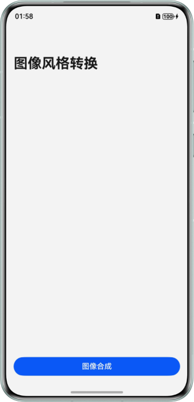
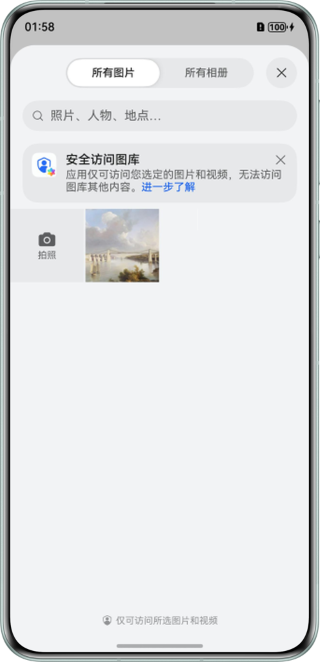
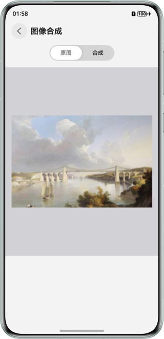
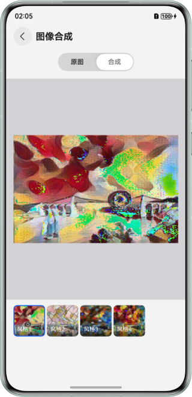
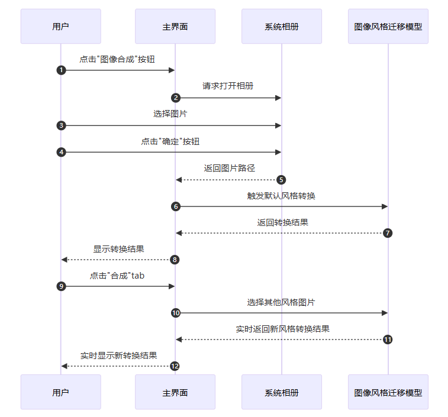

# 基于MindSpore Lite实现端侧图像风格迁移

## 介绍
本示例基于`@ohos.ai.mindSporeLite`提供的ArkTS API，MindSpore Lite风格迁移模型完成端侧推理，实现“端侧图像风格迁移”示例程序。

## 效果预览
| 主页                                                | 相册页                                                     | 原图预览页                                                          | 图像合成页                                                              |
|---------------------------------------------------|---------------------------------------------------------|----------------------------------------------------------------|--------------------------------------------------------------------|
|  |  |  |  |


使用说明
1. 在主页面，点击图像合成按钮，进入相册选择图片界面。
2. 在相册界面，选择图片，点击确定按钮。
3. 图像选择好后，会跳转到图像合成页面，默认选中原图tab并展示选择后的原图。
4. 点击合成tab会默认对原图按照第一张风格图进行图像风格类型转换，转换的结果会显示在主界面。
5. 在合成tab下，可以选择列表中的任意风格图片，进行图像风格转换，并实时在主界面展示推理结果。

**合成效果说明**：  
由于当前使用的是开源模型，开发者可以自行在网上寻找其它图像风格迁移开源模型，并[使用MindSpore Lite进行模型转换](https://developer.huawei.com/consumer/cn/doc/harmonyos-guides/mindspore-lite-converter-guidelines)，将第三方模型转换成 MindSpore Lite 支持的格式，自行替换该Sample的模型和模型参数（参考 [模型参数配置指导文档](./MODEL_CONFIG.md)）并查看对应的图像合成效果。

## 工程目录
```
├──entry/src/main/ets/
│  ├──entryability
│  │  └──EntryAbility.ets          // Ability的生命周期回调内容
│  ├──entrybackupability
│  │  └──EntryBackupAbility.ets    // 备份Ability
│  ├──model
│  │  └──NavigationParam.ets       // Navigation参数传递类
│  ├──pages
│  │  ├──Index.ets                 // 首页，获取相册图片
│  │  └──ResultPage.ets            // 原图和合成图预览界面
│  └──utils                  
│     ├──Logger.ets                // 日志工具类
│     └──Predict.ets               // 模型推理实现
└──entry/src/main/resources/
   └──rawfile
      ├──candy-9.ms                // 存放的模型文件：candy风格
      ├──mosaic-9.ms               // 存放的模型文件：mosaic风格
      ├──pointilism-9.ms           // 存放的模型文件：pointilism风格
      └──rain-princess-9.ms        // 存放的模型文件：rain-princess风格
```

## 具体实现
本示例程序中使用的终端图像风格迁移模型文件有4个，分别为candy-9.ms、mosaic-9.ms、pointilism-9.ms、rain-princess-9.ms，放置在entry\src\main\resources\rawfile工程目录下，默认加载candy-9.ms模型。
- 首页调用[@ohos.file.photoAccessHelper](https://developer.huawei.com/consumer/cn/doc/harmonyos-references/js-apis-photoaccesshelper)（相册管理模块）拉起相册，完整代码请参见[Index.ets](entry/src/main/ets/pages/Index.ets)。
- 图像合成页调用[@ohos.ai.mindSporeLite](https://developer.huawei.com/consumer/cn/doc/harmonyos-references/js-apis-mindsporelite)（端侧AI框架）API实现端侧推理。完整代码请参见[Predict.ets](entry/src/main/ets/utils/Predict.ets)。
- 调用推理函数并处理结果。完整代码请参见[ResultPage.ets](entry/src/main/ets/pages/ResultPage.ets)。

## 时序流程图


## 相关权限
无。

## 依赖
在工程main目录中，添加`syscap.json`文件，添加如下配置。

```json5
{
  "devices": {
    "general": [
      "phone" // 根据实际需要填写设备类型
    ]
  },
  "development": {
    "addedSysCaps": [
      "SystemCapability.Ai.MindSpore"
    ]
  }
}
```

## 约束与限制
1. 本示例仅支持标准系统上运行，支持设备：华为手机。
2. HarmonyOS系统：HarmonyOS 5.1.0 Release及以上。
3. DevEco Studio版本：DevEco Studio 5.1.0 Release及以上。
4. HarmonyOS SDK版本：HarmonyOS 5.1.0 Release SDK及以上。