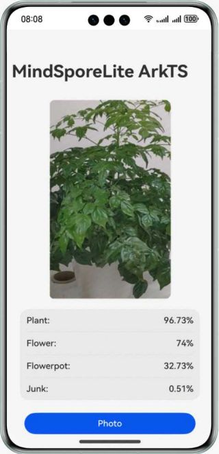

# Classifying Images Using MindSporeLite

### Overview

This sample shows how to use the ArkTS APIs provided by **MindSporeLite** to build an app for classifying images on a device.

1. Select an image classification model.
2. Convert the model into the **MindSporeLite** model format.
3. Use the **MindSporeLite** inference model on the device to display possible classification results.

### Preview

| Home Page                                                  |
|------------------------------------------------------------|
|  |

#### How to Use

1. On the home screen, tap **Photo** to access the screen for selecting photos in the album.
2. Select a photo from the album and tap **OK**.
3. Reference is performed on the selected image, and the inference result is displayed on the home page.

### Project Directory

```
 ├─entry/src/main/ets/                       // Home page of the app
 │  ├──common
 │  │  ├──constants                         
 │  │  │  └──CommonConstants.ets             // Common constants
 │  │  └──utils          
 │  │     └──Logger.ets                      // Logging utility
 │  ├──entryability
 │  │  └──EntryAbility.ets                   // Entry ability
 │  ├──model
 │  │  └─Model.ets                           // Model reference
 │  └──pages                 
 │     └──Index.ets                          // Home page entry
 ├──entry/src/main/resource                  // Static resources of the app
 │  └──rawfile
 │     └──mobilenetv2.ms                     // Model file
 └──entry/src/main/module.json5              // Module configuration
 
```

### How to Implement

* Place the model file **mobilenetv2.ms** in the **entry\src\main\resources\rawfile** directory of the project.

  You can download the [image classification model from MindSpore Model Zoo](https://download.mindspore.cn/model_zoo/official/lite/mobilenetv2_openimage_lite/1.5/mobilenetv2.ms) as required.

* Call @ohos.file.picker, @ohos.multimedia.image, and @ohos.file.fs APIs to obtain and process images in the album. For details about the code, see **Index.ets**.

* Call @ohos.ai.mindSporeLite APIs to implement on-device inference. For details about the code, see **model.ets**.

* Call the inference APIs and process the result. For details about the code, see **Index.ets**.

### Required Permissions

N/A

### Constraints

1. The sample app is supported only on Huawei phones running the standard system.
2. The HarmonyOS version must be HarmonyOS 5.0.5 Release or later.
3. The DevEco Studio version must be DevEco Studio HarmonyOS 5.0.5 Release or later.
4. The HarmonyOS SDK version must be HarmonyOS 5.0.5 Release SDK or later.
