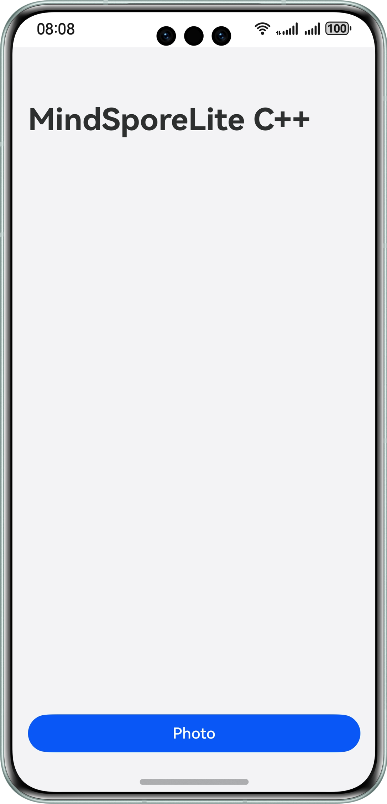

# **基于C++MindSporeLite接口实现图像分类**

### 介绍

本文基于MindSporeLite提供的C++ API，实现“端侧图像分类”示例程序，来演示端侧部署的流程，以便用户掌握图像分类C++接口的能力。

1. 选择图像分类模型。
2. 将模型转换成MindSporeLite模型格式。
3. 在端侧使用MindSporeLite推理模型，显示出可能的分类结果。

### 效果预览

| 主页                                                  |
|-----------------------------------------------------|
|  |

### 使用说明

1. 在主界面，可以点击photo按钮，进入相册选择图片界面；
2. 在相册界面，选择图片，点击确定按钮；
3. 自动进行选择图片的图像分类模型推理，部分推理结果显示在主界面。

### 工程目录

```
 ├──entry/src/main/cpp/                     // 模型推理
 │  ├──types/libentry/                       
 │  │  ├──Index.d.ts                        // 声明C++方法
 │  │  └──oh-package.json5                  // 声明依赖
 │  ├──CMakeLists.txt                       // 链接MindSporeLite动态库
 │  └──napi_init.cpp                        // 图像识别                             
 ├──entry/src/main/ets/                     // 应用首页
 │  ├──common
 │  │  ├──constants                         
 │  │  │  └──CommonConstants.ets             // 常量类
 │  │  └──utils          
 │  │     └──Logger.ets                      // 日志打印类
 │  ├──entryability
 │  │  └──EntryAbility.ets                   // 程序入口类
 │  ├──entrybackupability
 │  │  └──EntryBackupAbility.ets             // 数据备份恢复类
 │  └──pages                 
 │     └──Index.ets                         // 主页入口
 ├──entry/src/main/resource                 // 应用静态资源
 │  └──rawfile
 │     └──mobilenetv2.ms                    // 模型文件
 └──entry/src/main/module.json5             // 模块配置相关
 
```

### 具体实现

* 本示例程序中使用的终端图像分类模型文件为mobilenetv2.ms，放置在entry\src\main\resources\rawfile工程目录下。

  注：开发者可按需手工下载[MindSpore Model Zoo中图像分类模型](https://download.mindspore.cn/model_zoo/official/lite/mobilenetv2_openimage_lite/1.5/mobilenetv2.ms)。

* 调用@ohos.file.picker（图片文件选择）、@ohos.multimedia.image（图片处理效果）、@ohos.file.fs（基础文件操作） 等API实现相册图片获取及图片处理。完整代码请参见Index.ets

* 调用@ohos.ai.mindSporeLite (推理能力) API实现端侧推理。完整代码请参见model.ets

* 调用推理函数并处理结果。完整代码请参见Index.ets

### 相关权限

不涉及。

### 约束与限制

1.本示例仅支持标准系统上运行，支持设备：华为手机。

2.HarmonyOS系统：HarmonyOS 5.0.5 Release及以上。

3.DevEco Studio版本：DevEco Studio 5.0.5 Release及以上。

4.HarmonyOS SDK版本：HarmonyOS 5.0.5 Release SDK及以上。

