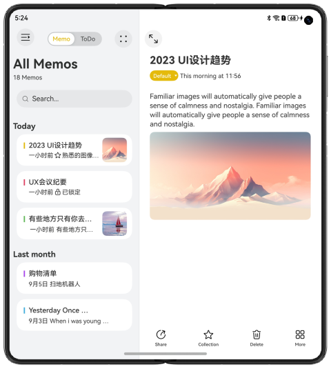
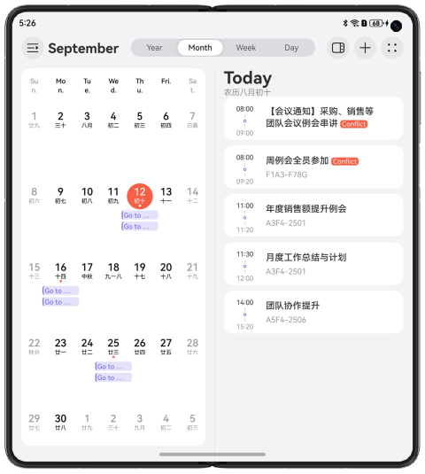

## Responsive Layouts for Business Office Apps Across Devices

### Overview

This sample shows how to use the breakpoint listening, **sidebarContainer** component, and **navigation** component to achieve responsive layouts of content for business office apps on different devices, such as smartphones, foldable screens, and tablets.

### Preview

In this sample, there are three pages: entry page, Notes page, and Calendar page.

**Entry page**

| Smartphone                                  | Foldable Screen (Unfolded)                           | Tablet                                       |
|---------------------------------------------|------------------------------------------------------|----------------------------------------------|
|  |  |  |

**Notes page**

| Smartphone                                  | Foldable Screen (Unfolded)                           | Tablet                                       |
|---------------------------------------------|------------------------------------------------------|----------------------------------------------|
|  |  |  |

**Calendar page**

| Smartphone                                     | Foldable Screen (Unfolded)                              | Tablet                                          |
|------------------------------------------------|---------------------------------------------------------|-------------------------------------------------|
|  |  |  |

### How to Use

* Entry page

  1. Tap **Notepad** or **Calendar** to open the Notepad or Calendar instance page.

  2. The page rotates along with the home page (the home page and individual page are rotatable).

* Notes page

  1. Tap the button in the upper left corner to hide or show the sidebar. 

     If the screen width is less than **lg**, the sidebar is hidden by default and displayed in floating mode. 

     If the screen width is greater than or equal to **lg**, the sidebar is expanded by default, embedded in the component, and displayed in parallel with the content area.

  2. Tap a note in the notes list to go to the details page. 

     If the screen width is greater than or equal to **md**, the notes content is displayed in two columns and the detailed notes information is displayed in the right column.

  3. Tap the button in the upper left corner of the content page to display the content page in full screen. Tap the button again to exit the full screen.

  4. The page rotates along with the home page (the home page and individual page are rotatable).

* Calendar page

  1. Tap the button in the upper left corner to hide or show the sidebar. 

     If the screen width is less than **lg**, the sidebar is hidden by default and displayed in floating mode. 

     If the screen width is greater than or equal to **lg**, the sidebar is expanded by default, embedded in the component and displayed in parallel with the content area.

  2. Tap a date in the calendar to display the schedule. Tap a date without an event to hide or collapse the schedule. 

     If the screen width is **sm**, the schedule is displayed in a single column. If the screen width is greater than or equal to **md**, the schedule is displayed in two columns. If a date without event is selected, the date information is displayed in a single column.

  3. Tap the first of the three buttons on the right corner to control the display of the navigation bar from one column to two columns. If you select a date without event, the navigation bar will not change from one to two.

  4. The page rotates along with the home page (the home page and individual page are rotatable).

### Project Directory

```
├──entry/src/main/ets                             // Code
│  ├──constants                                  
│  │  ├──utils
│  │  │  └──Logger.ets                            // Logging utility
│  │  ├──CommonConstants.ets                      // Common constants
│  ├──entryability  
│  │  └──EntryAbility.ets 
│  ├──entrybackupability  
│  │  └──EntryBackupAbility.ets 
│  ├──pages  
│  │  ├──CalendarPage.ets                          // Calendar page
│  │  ├──Index.ets                                 // Entry page                                
│  │  └──NotesPage.ets                             // Note page
│  ├──secondability  
│  │  └──SecondAbility.ets 
│  ├──thirdability  
│  │  └──ThirdAbility.ets 
│  ├──view
│  │  ├──CalendarSideBarView.ets                   // Calendar sidebar
│  │  ├──CalendarViewPage.ets                      // Calendar content page
│  │  ├──NotesPageC.ets                            // Notes page for column C 
│  │  ├──sidebarContentView.ets                    // Notes sidebar content
│  │  └──TripSchedule.ets                          // Schedule page of Calendar  
│  └──viewmodel
│     ├──CalendarItem.ets                          // Calendar data types 
│     ├──NotesData.ets                             // Notes data types 
│     └──TripData.ets                              // Trip schedule data types     
└──entry/src/main/resources                        // Resources of the app

```

### How to Implement

* Use **UIAbilityContext.startAbility()** to start an instance.
* Set **sidebarContainerType** or **showSidebar** of the **sidebarContainer** component to different values based on the breakpoint type.
* Change **mode** of the **navigation** based on the breakpoint or status to implement the transitions between single column and dual-column.

### Required Permissions

N/A

### Dependencies

N/A

### Constraints

1. The sample app is supported only on Huawei phones running the standard system.

2. The HarmonyOS version must be HarmonyOS 5.0.5 Release or later.

3. The DevEco Studio version must be DevEco Studio 5.0.5 Release or later.

4. The HarmonyOS SDK version must be HarmonyOS 5.0.5 Release SDK or later.
