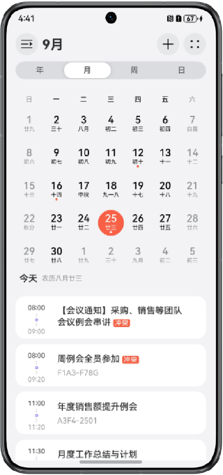

# 多设备商务办公界面

### 介绍

本示例主要使用断点监听和sidebarContainer组件、navigation组件相结合的方式，实现了商务办公类差异化的多场景响应式变化效果。

### 效果预览

本示例分为三个页面：

**入口页**:

| 手机                                       | 折叠屏（展开态）                                        | 平板                                        |
|------------------------------------------|-------------------------------------------------|-------------------------------------------|
|  |  |  |

**备忘录页**:

| 手机                                       | 折叠屏（展开态）                                          | 平板                                        |
|------------------------------------------|---------------------------------------------------|-------------------------------------------|
|  |  |  |

**日历页**:

| 手机                                          | 折叠屏（展开态）                                             | 平板                                           |
|---------------------------------------------|------------------------------------------------------|----------------------------------------------|
|  |  |  |

使用说明：

* 入口页

  1. 点击备忘录或日历按钮，打开备忘录或日历实例页面;

  2. 页面旋转跟随桌面旋转模式（及设备桌面可旋转，页面可旋转）。

* 备忘录页

  1. 点击左上角第一个按钮为sidebar控制按钮，可控制sidebar侧边栏显隐（sidebar在屏幕宽度小于lg时，默认隐藏，且悬浮展示；大于等于lg时，默认展开，且嵌入到组件内部，与内容区并列展示）；
  
  2. 点击备忘内容列表，跳转对应详细内容（在屏幕宽度大于等于md时，展现为双栏，右栏展示详细内容页面）；
  
  3. 点击内容页面左上角按钮，可全屏展示内容页，再次点击可推出全屏；

  4. 页面旋转跟随桌面旋转模式（及设备桌面可旋转，页面可旋转）。

* 日历页

  1. 点击左上角第一个按钮为sidebar控制按钮，可控制sidebar侧边栏显隐（sidebar在屏幕宽度小于lg时，默认隐藏，且悬浮展示；大于等于lg时，默认展开，且嵌入到组件内部，与内容区并列展示）；
  
  2. 点击日历中的具体日期，可展示具体日程，点击无日程的日期不展示/收起具体日程页（屏幕宽度为sm时，上下显示，屏幕宽度大于等于md时，双栏显示。选中无日程的日期时，一直单栏显示）；
  
  3. 点击右侧三个按钮中的第一个，可以控制navigation单双栏变化，单栏状态下且选中无日程的日期时，点击按钮不会由单栏变双栏；

  4. 页面旋转跟随桌面旋转模式（及设备桌面可旋转，页面可旋转）。

### 工程目录

```
├──entry/src/main/ets                              // 代码区
│  ├──constants                                  
│  │  ├──utils
│  │  │  └──Logger.ets                             // 日志
│  │  └──CommonConstants.ets                       // 常用常量
│  ├──entryability  
│  │  └──EntryAbility.ets 
│  ├──entrybackupability  
│  │  └──EntryBackupAbility.ets 
│  ├──pages  
│  │  ├──CalendarPage.ets                          // 日历页
│  │  ├──Index.ets                                 // 入口页                                
│  │  └──NotesPage.ets                             // 备忘录页
│  ├──secondability  
│  │  └──SecondAbility.ets 
│  ├──thirdability  
│  │  └──ThirdAbility.ets 
│  ├──view
│  │  ├──CalendarSideBarView.ets                   // 日历侧边栏 
│  │  ├──CalendarViewPage.ets                      // 日历内容页 
│  │  ├──NotesPageC.ets                            // 备忘录C栏页 
│  │  ├──sidebarContentView.ets                    // 备忘录侧边栏内容 
│  │  └──TripSchedule.ets                          // 日历日程页  
│  └──viewmodel
│     ├──CalendarItem.ets                          // 日历数据类型 
│     ├──NotesData.ets                             // 备忘录数据类型 
│     └──TripData.ets                              // 日程数据类型     
└──entry/src/main/resources                        // 应用资源目录

```

### 具体实现

* 使用UIAbilityContext.startAbility()方法实现拉起新实例的功能。
* 在不同断点下，sidebarContainer组件的断点类型sidebarContainerType属性或侧边栏显示隐藏showSidebar属性不同，实现侧边栏根据不同断点显示隐藏及显示类型的变化。
* 根据不同断点或状态改变navigation的mode属性，实现单双栏的切换效果。

### 相关权限

不涉及。

### 依赖

不涉及。

### 约束与限制

1. 本示例仅支持标准系统上运行，支持设备：华为手机。

2. HarmonyOS系统：HarmonyOS 5.0.5 Release及以上。

3. DevEco Studio版本：DevEco Studio 5.0.5 Release及以上。

4. HarmonyOS SDK版本：HarmonyOS 5.0.5 Release SDK及以上。
