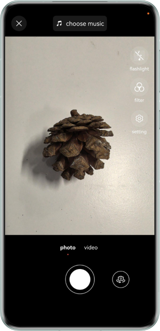
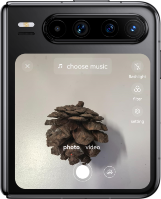
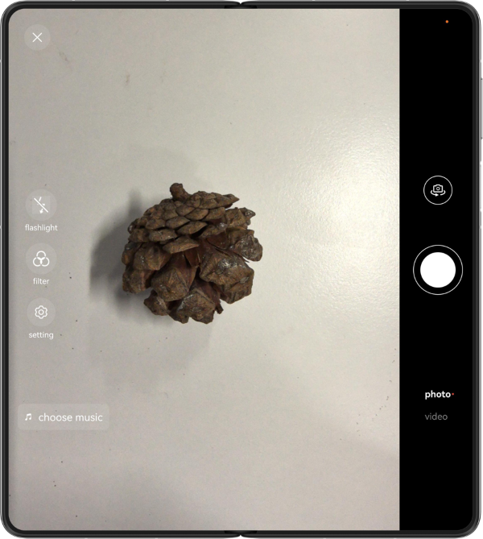
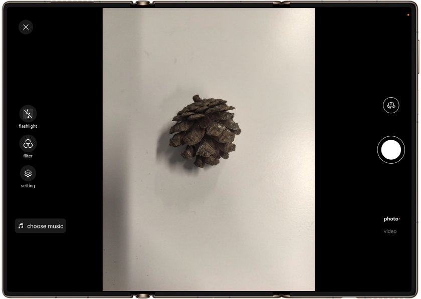
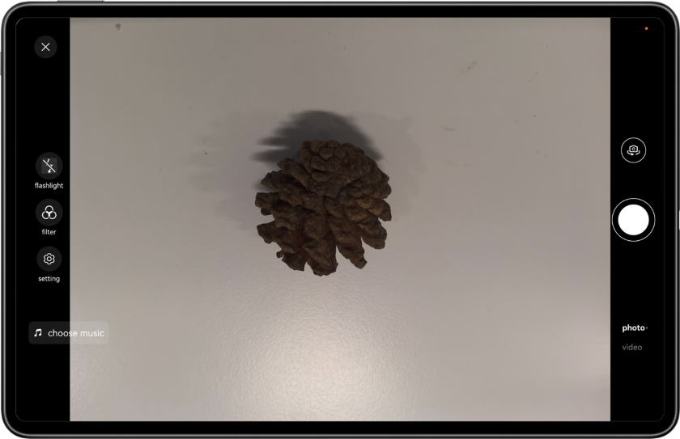

# Camera Capabilities Across Devices

## Overview
This sample shows how to apply the open camera capabilities of HarmonyOS across multiple devices, including Camera Kit for preview and photographing, photoAccessHelper for saving photos, and breakpoints for implementing different layouts and functionalities on multiple devices. By running this sample, you can implement features such as preview rotation, photo rotation, and camera switch on devices (smartphones, large-screen foldable phones, widescreen foldable phones, triple-screen foldable phones, and tablets) in either unfolded state or folded state.

## Effect

Running effect on smartphones



Running effect on widescreen foldable phones



Running effect on large-screen foldable phones



Running effect on triple-screen foldable phones



Running effect on tablets



## How to Use

Tap the button at the bottom to take photos and preview. In this process, you can set camera rotation angles, switch between the front and rear camera, and adjust the fold state.

## Project Directory

```
├──entry/src/main/ets/ 
│  ├──entryability 
│  │  └──EntryAbility.ets 
│  ├──entrybackupability 
│  │  └──EntryBackupAbility.ets 
│  ├──pages 
│  │  └──Index.ets                       // Home page 
│  ├──utils 
│  │  ├──BreakpointType.ets              // Breakpoint utility 
│  │  ├──CameraUtil.ets                  // Camera utility 
│  │  └──WindowUtil.ets                  // Window utility 
│  └──views 
│     └──CommonView.ets                  // Common view 
└──entry/src/main/resource               // Static resources of the application
```

## How to Implement

⦁	Use Camera Kit to preview and take photos.
⦁	Use photoAccessHelper to save photos.
⦁	Use breakpoints to implement different page layouts and functionalities on multiple devices.

## Required Permissions

⦁	Camera permission: ohos.permission.CAMERA, which is required for camera development.
⦁	Restricted permission - media library permission: ohos.permission.READ_IMAGEVIDEO, which is used to read files from Gallery. Applicable scenarios and functionalities: The application needs to clone, back up, or sync images or videos.
⦁	Restricted permission - media library permission: ohos.permission.WRITE_IMAGEVIDEO, which is used to save files to Gallery. Applicable scenarios and functionalities: The application needs to clone, back up, or sync images or videos.

## Dependencies

N/A

## 约束与限制

1. This sample is only supported on Huawei phones with standard systems.
2. The HarmonyOS version must be HarmonyOS 5.0.5 Release or later.
3. The DevEco Studio version must be DevEco Studio 5.0.5 Release or later.
4. The HarmonyOS SDK version must be HarmonyOS 5.0.5 Release SDK or later.

