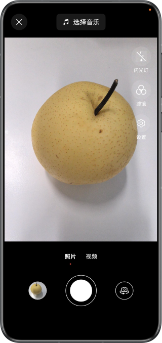
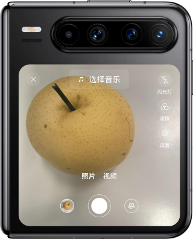
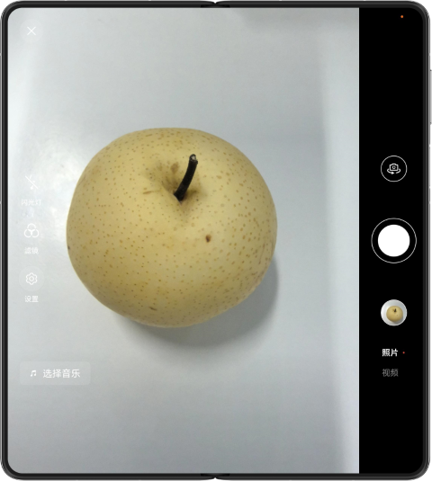
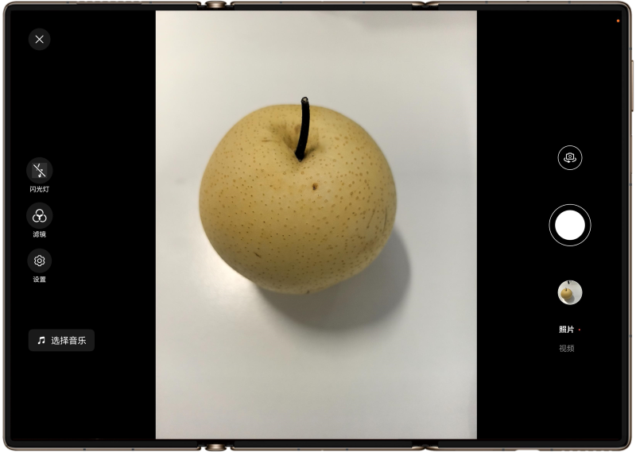
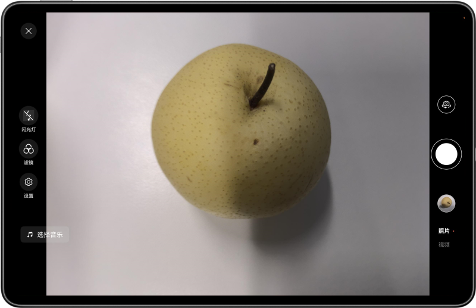

# 基于相机开放能力和一多能力实现多设备相机

## 介绍

本示例展示了如何使用HarmonyOS提供的相机开放能力和一多能力，主要包括使用Camera Kit预览拍照、photoAccessHelper进行保存图片和一多断点实现多设备页面及功能差异。本示例主要用于如何在多设备（手机、大折叠、阔折叠、三折叠、平板）上实现正常状态和折叠状态切换时的预览旋转、拍照旋转、切换镜头等功能。

## 效果展示

手机运行效果图：



阔折叠运行效果图：



大折叠运行效果图：



三折叠运行效果图：



平板运行效果图：



## 使用说明

应用可以点击底部按钮拍摄照片，同时可以实现旋转相机角度、切换前后摄像头、切换折叠状态完成拍摄的操作，拍摄完成后可以预览照片。

## 工程目录

```
├──entry/src/main/ets/
│  ├──entryability
│  │  └──EntryAbility.ets
│  ├──entrybackupability
│  │  └──EntryBackupAbility.ets
│  ├──pages
│  │  └──Index.ets                       // 主页
│  ├──utils
│  │  ├──BreakpointType.ets              // 一多断点工具类
│  │  ├──CameraUtil.ets                  // 相机工具类
│  │  └──WindowUtil.ets                  // 窗口工具类
│  └──views
│     └──CommonView.ets                  // 公共视图类
└──entry/src/main/resource               // 应用静态资源目录
```

## 实现思路

1.  使用Camera Kit预览拍照。
2.  使用photoAccessHelper保存图片。
3.  使用一多断点能力实现多设备页面和功能差异。

## 相关权限

1. 相机权限：ohos.permission.CAMERA，用于相机开发场景。
2. 受限开放权限-媒体库权限：ohos.permission.READ_IMAGEVIDEO，用于读取图库文件。可申请此权限的特殊场景与功能： 应用需要克隆、备份或同步图片/视频类文件。 
3. 受限开放权限-媒体库权限：ohos.permission.WRITE_IMAGEVIDEO，用于保存文件至图库。可申请此权限的特殊场景与功能： 应用需要克隆、备份或同步图片/视频类文件。

## 依赖

不涉及。

## 约束与限制

1.本示例仅支持标准系统上运行，支持设备：华为手机。

2.HarmonyOS系统：HarmonyOS 5.0.5 Release及以上。

3.DevEco Studio版本：DevEco Studio 5.0.5 Release及以上。

4.HarmonyOS SDK版本：HarmonyOS 5.0.5 Release SDK及以上。
