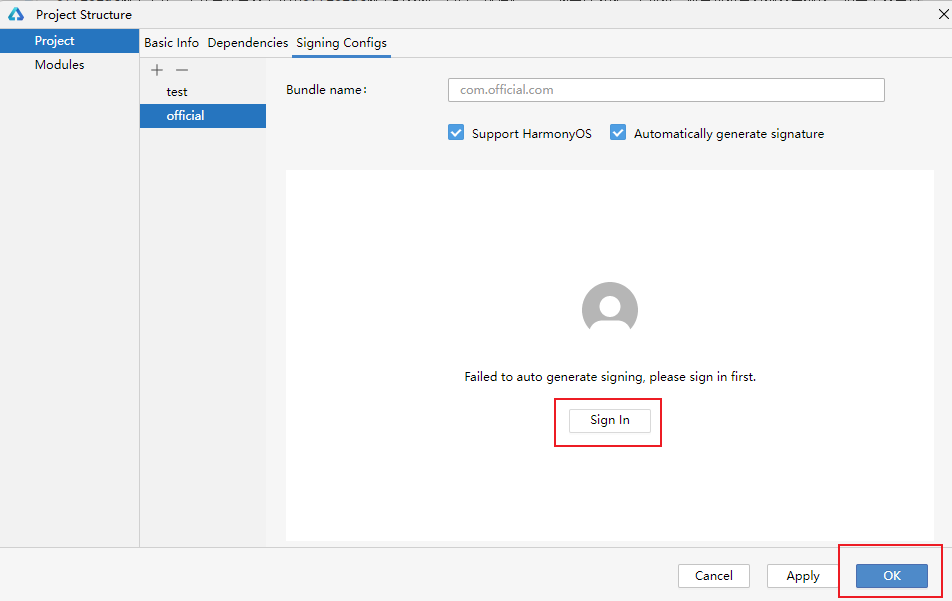

# Building a Multi-target Product Project

### Introduction

This sample demonstrates how to build a project that generates two application packages: one of the official version and the other of the test version. Through this sample, you can understand the multi-target customization items supported by different types of packages and how to perform differentiated resource customization. This helps you better build multi-target products.
* Official version: The resources of the official version are displayed on the home page of the project, including a short description, an image, and a button. Touching the button implements page redirection. The second page contains a calculator logic for the addition and subtraction operations. When you enter two numbers (each with no more than five digits) and touch the corresponding button, the calculation result is displayed in the pop-up window.
* Test version: The resources of the test version are displayed on the home page of the project, including a short description, an image, and a button. Touching the button implements page redirection. The second page contains a calculator logic only for the subtraction operation. When you enter two numbers (each with no more than five digits) and touch the subtraction button, the calculation result is displayed in the pop-up window. If you touch the addition button, a message is displayed, indicating that the function is not supported.

### Preview

| official version                        | test version                        |
|-----------------------------------------|-------------------------------------|
|  |  |

### How to Use

Configure the signature for each product, build the corresponding versions, and check the UI effect. Touch the button to go to the next page. On the second page, set parameters, touch the corresponding buttons, and view the calling result.

**Precautions**

This sample demonstrates only the content comparison between the official version and the test version. The default version does not implement its logic. Do not use the default version.

**Multi-product Signature Configuration**

1. This sample demonstrates only the content comparison between the official version and the test version. The default version does not implement its logic. Do not use the default version.


2. On the Signing Configs tab page, click the plus sign (+) to add signing information.


3. Select the corresponding bundle name and enter the configured signingConfigs information.


4. Click OK after signing.



**How to Build**

Click Product (marked with 1 in the figure) in the upper right corner of DevEco Studio. Select the corresponding product project in the area (marked with 2 in the figure). After the project is selected, the dependent target in the file is automatically mapped. Then, click Apply. After the preceding operations are complete, you can click the run button to view the multi-target product effect.


### How to Implement

1. In the module-level build-profile.json file of each HAP and HAR module, customize the targets corresponding to the official and test versions, and then customize resources for each target.
2. In the project-level build-profile.json file, customize the products corresponding to the official and test versions, customize multiple target resources for each product, and add the targets generated by each module to the product of the corresponding version.

### High-Performance Knowledge Points

**N/A**

### Project Directory
```
├──entry/src                            // Entry module
│  ├──main
│  │  ├──ets/pages                  
│  │  │  └──Index.ets                   // Home page  
│  │  ├──resources                      // Public resources     
│  │  ├──official                        
│  │  │  └──resources                   // Custom resources of the official version
│  │  └──test                        
│  │     └──resources                   // Custom resources of the test version
│  ├──official_pages               
│  │  └──VersionInfo.ets                // Custom page information of the official version  
│  └──test_pages    
│     └──VersionInfo.ets                // Custom page information of the test version
└──myhar/src                            // HAR module
   ├──main
   │  ├──cpp
   │  │  ├──cpp/types                   // Third-party library API declaration  
   │  │  └──CmakeLists.txt              // CMake configuration file  
   │  ├──ets/components              
   │  │  └──MainPage.ets                // Main page of the HAR package  
   │  ├──ets/view                 
   │  │  └──ParamTextInputComponent.ets // Custom component page  
   │  ├──resources                      // Public resources     
   │  ├──official                        
   │  │  └──resources                   // Custom resources of the official version 
   │  └──test                        
   │     └──resources                   // Custom resources of the test version
   ├──official_pages
   │  └──OfficialSecondPages.ets        // Second page of the HAR package of the official version
   ├──test_pages
   │  └──TestSecondPages.ets            // Second page of the HAR package of the test version
   └──BuildProfile.ets                  // Custom parameter file
```

### Module Dependencies

**N/A**

### Required Permissions

**N/A**

### References

**N/A**

### Constraints

1. This sample demonstrates only the content comparison between the official version and the test version. The default version does not implement its logic. Do not use the default version.
2. The sample is only supported on Huawei phones with standard systems.
3. The HarmonyOS version must be HarmonyOS 5.0.5 Release or later.
4. The DevEco Studio version must be DevEco Studio 5.0.5 Release or later.
5. The HarmonyOS SDK version must be HarmonyOS 5.0.5 Release SDK or later.
