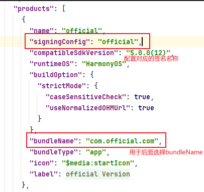
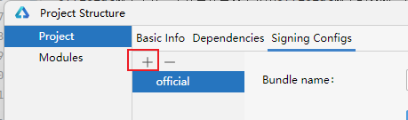
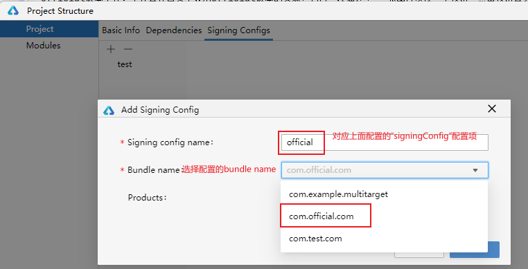
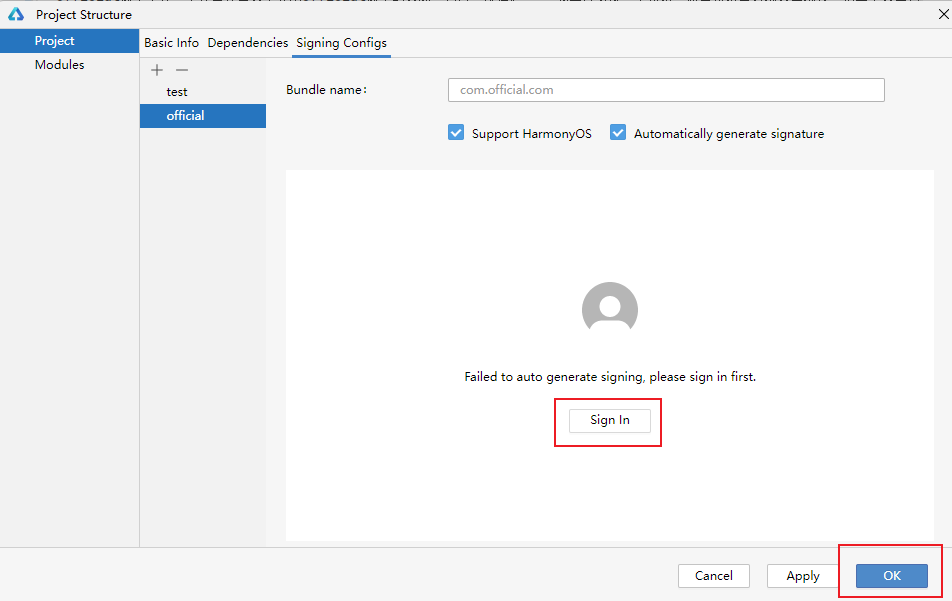
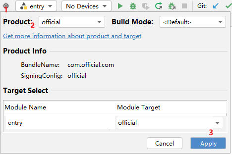

# 构建多目标产物工程

### 介绍

本示例展示了如何通过一个工程构建出多个不同的应用包，该示例可以构建出official和test两个版本的应用包。通过该示例，开发者能够了解不同类型包支持的多目标定制项以及如何进行资源的差异化定制。便于开发者更好的掌握构建多目标产物的能力。
* official版本工程：工程会在首页中显示Official版本的资源，包含一段描述、 一张图片以及一个按钮。点击按钮会实现页面跳转，第二个页面包含一个运算器逻辑，official版本支持进行加法运算和减法运算。输入两个不超过五位的数字，点击对应按钮，弹窗显示计算结果。
* test版本工程：工程会在首页中显示Test版本的资源，包含一段描述、 一张图片以及一个按钮。点击按钮会实现页面跳转，第二个页面包含一个运算器逻辑，test版本仅支持进行减法运算。输入两个不超过五位的数字，点击减法按钮，弹窗显示计算结果；点击加法按钮，弹窗显示不支持该功能。

### 效果图预览

| official版本                             | test版本                           |
|----------------------------------------|----------------------------------|
|    |  |

### 使用说明

需要先对每个product进行签名配置，然后构建对应的版本，查看页面效果。点击按钮，跳转下一个页面。在第二个页面输入参数，点击对应方法按钮，查看调用结果。

**注意事项**

该示例仅展示official版本与test版本内容对比，default版本未实现其逻辑，开发者请勿使用default版本运行。

**多目标产物签名配置方案：**

1. 在工程级的build-profile.json5文件中，给每个需要构建的多目标product下配置如图所示参数：



2. 然后进入到签名配置页面，点击加号，添加签名信息：



3. 然后选择对应的bundle name，并填写上面配置的"signingConfigs"信息：



4. 签名之后点击ok即可：



**工程构建方法：**

首先点击DevEco Studio工具右上角的Product按钮，即图中的1号标识处，然后在2号标识处选择对应的Product工程，选择完工程之后会自动映射出我们文件中已经依赖的target，最后点击Apply应用。上述操作完成之后就可以点击运行按钮查看多目标产物的效果了。



### 实现思路

1. 在每个HAP，HAR模块的模块级build-profile.json文件中定制出official版本和test版本对应的target，然后为每个target进行资源的差异化定制。
2. 在工程级build-profile.json文件中定制出official版本和test版本对应的product，并为每个product定制APP多目标资源，并将每个模块生成的target依赖到对应版本的product中。

### 高性能知识点

**不涉及**

### 工程结构&模块类型
```
├──entry/src                            // entry模块
│  ├──main
│  │  ├──ets/pages                  
│  │  │  └──Index.ets                   // 主页界面  
│  │  ├──resources                      // 共有资源目录     
│  │  ├──official                        
│  │  │  └──resources                   // official版本定制资源目录 
│  │  └──test                        
│  │     └──resources                   // test版本定制资源目录
│  ├──official_pages               
│  │  └──VersionInfo.ets                // official版本定制页面信息  
│  └──test_pages    
│     └──VersionInfo.ets                // test版本定制页面信息
└──myhar/src                            // Har模块
   ├──main
   │  ├──cpp
   │  │  ├──cpp/types                   // 三方库接口声明信息  
   │  │  └──CmakeLists.txt              // cmake配置文件  
   │  ├──ets/components              
   │  │  └──MainPage.ets                // Har包主页面  
   │  ├──ets/view                 
   │  │  └──ParamTextInputComponent.ets // 自定义组件页面  
   │  ├──resources                      // 共有资源目录     
   │  ├──official                        
   │  │  └──resources                   // official版本定制资源目录 
   │  └──test                        
   │     └──resources                   // test版本定制资源目录
   ├──official_pages
   │  └──OfficialSecondPages.ets        // official版本Har包第二页面
   ├──test_pages
   │  └──TestSecondPages.ets            // test版本Har包第二页面
   └──BuildProfile.ets                  // 自定义参数文件
```

### 模块依赖

**不涉及**

### 相关权限

**不涉及**

### 参考资料

**不涉及**

### 约束与限制

1. 该示例仅展示official版本与test版本内容对比，default版本未实现其逻辑，开发者请勿使用default版本运行。
2. 本示例仅支持标准系统上运行，支持设备：华为手机。
3. HarmonyOS系统：HarmonyOS 5.0.5 Release及以上。
4. DevEco Studio版本：DevEco Studio 5.0.5 Release及以上。
5. HarmonyOS SDK版本：HarmonyOS 5.0.5 Release SDK及以上。