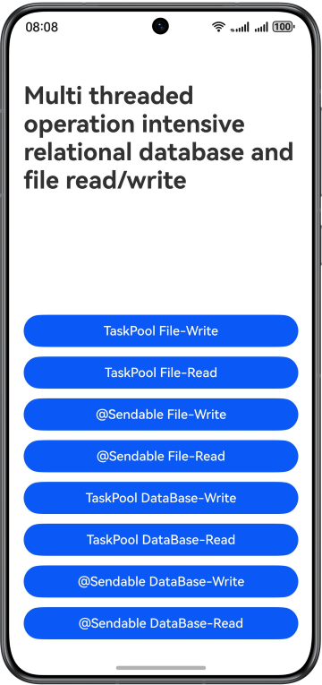

# Using TaskPool and @Sendable to Read/Write RDB Store and Files

### Overview

This sample demonstrates how to use TaskPool and @Sendable to implement multithreaded read and write operations on intensive files and relational databases. TaskPool is used to create threads, and @Sendable is used to transfer data between threads.

### Preview

| Preview                              |
|--------------------------------------|
|  |

### How to Use：

In this sample, eight buttons are provided to implement the read and write operations on files and RDB store:
1.	Write File (TaskPool): Touch this button to write files using TaskPool.
2.	Read File (TaskPool): Touch this button to read files using TaskPool.
3.	Write File (@Sendable): Touch this button to write files using TaskPool and @Sendable.
4.	Read File (@Sendable): Touch this button to read files using TaskPool and @Sendable.
5.	Write RDB Store (TaskPool): Touch this button to write data to the RDB store using TaskPool.
6.	Read RDB Store (TaskPool): Touch this button to read the RDB store using TaskPool.
7.	Write RDB Store (@Sendable): Touch this button to write data to the RDB store using TaskPool and @Sendable.
8.	Read RDB Store (@Sendable): Touch this button to read the RDB store using TaskPool and @Sendable.
9.	After the read and write operations are successful, a toast indicating success is displayed. When other I/O tasks are performed, a message is displayed, indicating that the task is being executed. If there is no content in the file or database, a message is displayed, indicating that no content is read.

### Project Directory

```
├──entry/src/main/ets/ 
│  ├──commons                                   
│  │  ├──constants                
│  │  │  └─CommonConstants.ets          // Common constants 
│  │  └──utils           
│  │     ├─DatabaseSendable.ets         // Operations on RDB store using Sendable 
│  │     ├─DatabaseTaskPool.ets         // Operations on RDB store using TakPool 
│  │     ├─FileSendable.ets             // Operations on file using Sendable 
│  │     └─FileTaskPool.ets             // Operations on file using TakPool 
│  ├──entryability 
│  │  └──EntryAbility.ets               // Entry ability 
│  ├──entrybackupability 
│  │  └──EntryBackupAbility.ets         // Data backup and restoration 
│  └──pages                  
│     └──Index.ets                      // Home page 
└──entry/src/main/resources             // Static resources
```

### How to Implement
1.	TaskPool: Use @Concurrent to decorate the encapsulated read and write functions and pass them to taskpool.execute() for execution.
2.	@Sendable: Encapsulate data into a class and use @Sendable to decorate it.

### Permissions
NA

### Dependencies
NA

### Constraints

1. The sample is only supported on Huawei phones with standard systems.
2. The HarmonyOS version must be HarmonyOS 5.0.5 Release or later.
3. The DevEco Studio version must be DevEco Studio 5.0.5 Release or later.
4. The HarmonyOS SDK version must be HarmonyOS 5.0.5 Release SDK or later.