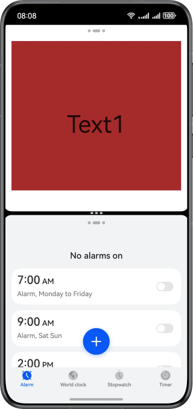
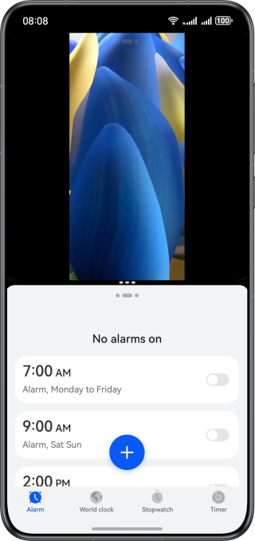
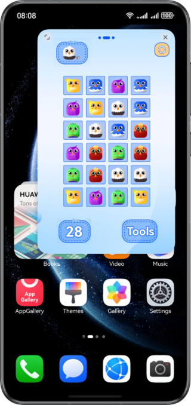

# Multi-Window UI Adaptation Based on ArkUI

### Introduction

This sample demonstrates how to implement UI adaptation during multi-window (split-screen/floating window) development. By optimizing the layout and adjusting the element display logic, ensure that your application provides consistent and high-quality user experience across different window modes.

### Preview

The following figures show the effects after optimization.

| Optimized Page Content Truncation                      | Fixed Video Component Truncation in Split-Screen Mode  | Resolved Unresponsive Operation Bar of Floating Windows |
|--------------------------------------------------------|--------------------------------------------------------|---------------------------------------------------------|
|  |  |   |

**How to Use**
1.	After installing the application, touch the button indicating that the page is truncated and cannot be swiped up or down, to jump to a level-2 page.
2.	Touch the before optimization button on the level-2 page to go to the page before optimization. Swipe up from the bottom of the screen to the hot zone in the upper left corner to enter the split-screen mode. Touch another application icon or widget that supports split-screen on the home screen, and view the split-screen effect before optimization.
3.	Return to the level-2 page and touch the after optimization button to go to the page after optimization. Perform the preceding operations to view the split-screen effect after optimization.

### Project Directory

```
├──entry/src/main/ets/ 
│  ├──common 
│  │  ├──AVPlayerUtil.ets                 // Video playback utilities 
│  │  ├──Constants.ets                    // Encapsulated constants 
│  │  └──Logger.ets                       // Loggers 
│  ├──entryability 
│  │  └──EntryAbility.ets                 // Entry ability lifecycle callbacks 
│  ├──entrybackupability 
│  │  └──EntryBackupAbility.ets           // Backup entry abilities 
│  └──pages 
│     ├──Index.ets                        // Application entry page 
│     ├──Question.ets                     // Entry menu for abnormal scenarios 
│     ├──Question1Correct.ets             // Abnormal scenario 1—after optimization 
│     ├──Question1Incorrect.ets           // Abnormal scenario 1—before optimization 
│     ├──...                              // Other abnormal scenarios are not listed here. 
│     └──Question8Incorrect8.ets          // Abnormal scenario 8—before optimization 
└──entry/src/main/resources               // Static resources
```

### How to Implement

In split-screen mode:
1.	To solve the problem that the page is truncated and cannot be swiped up or down, nest the Scroll component.
2.	To solve the incomplete display of XComponent video rendering in split-screen mode, use the aspectRatio property to specify the aspect ratio of the XComponent.
3.	To solve the problem that the Video component is truncated in split-screen mode, set the .objectFit(ImageFit.Contain) property for the Video component.
4.	To solve the problem that the child component exceeds the scope of the parent component, use constraintSize to restrict the child component to follow the size of the parent container.
5.	To solve the display exceptions of the Image component in split-screen mode, use the displayPriority property to control whether to display or hide the Image component.
6.	To solve the dialog box layout exceptions, use the constraintSize property to set the maximum height of the dialog box, and use the Scroll component to wrap the content area of the dialog box.

In floating window mode:
1. To solve the problem that the top operation bar of an application in immersive mode cannot be operated, use the getWindowAvoidArea API to obtain topRect to be avoided on the top of the screen, and perform layout avoidance based on the value obtained.
2. To solve the problem of horizontal floating window adaptation, add landscape_auto to the preferMultiWindowOrientation property under the abilities tag in the module.json5 configuration file, and use enableLandscapeMultiWindow or disableLandscapeMultiWindow to optimize the layout.

### Required Permissions
N/A

### Dependencies
N/A

### Constraints
1. The sample is only supported on Huawei phones with standard systems.
2. The HarmonyOS version must be HarmonyOS 5.0.5 Release or later.
3. The DevEco Studio version must be DevEco Studio 5.0.5 Release or later.
4. The HarmonyOS SDK version must be HarmonyOS 5.0.5 Release SDK or later.


