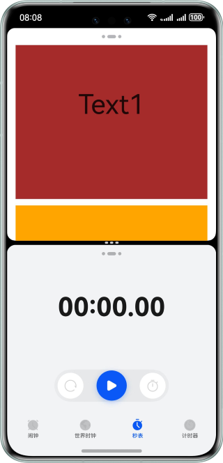
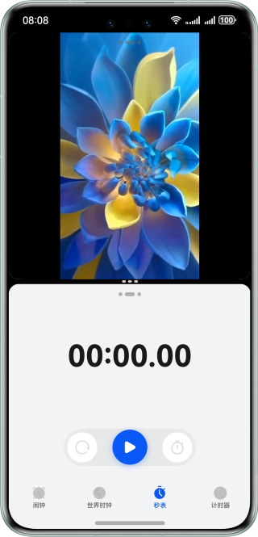
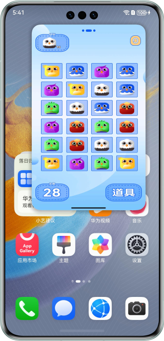

# 基于ArkUI实现智慧多窗界面适配

### 介绍

本示例展示了在智慧多窗（分屏和悬浮窗）开发中解决界面适配问题的方案。通过优化布局和调整元素显示逻辑，确保应用在不同窗口模式下均能提供一致且优质的用户体验。

### 效果预览

部分效果图如下

| 页面被截断问题优化                                           | Video组件分屏状态下被截断问题优化                                 | 悬浮窗顶部操作栏无法响应操作问题优化                                  |
|-----------------------------------------------------|-----------------------------------------------------|-----------------------------------------------------|
|  |  |  |

使用说明
1. 安装应用后，点击应首页上的某些按钮，例如点击“页面被截断，无法上下滑动”按钮，跳转到二级页面。
2. 点击二级页面上的“优化前”按钮，跳转到问题优化前的页面，从屏幕底部向上滑至左上方热区，进入待分屏状态，点击桌面另一个支持分屏的应用图标或卡片，查看优化前界面分屏效果。
3. 返回二级页面，点击二级页面上的“优化后”按钮，跳转到问题优化后的页面，查看优化后的分屏效果。

### 目录结构

```
├──entry/src/main/ets/
│  ├──common
│  │  ├──AVPlayerUtil.ets                 // 视频播放工具类
│  │  ├──Constants.ets                    // 常量封装类
│  │  └──Logger.ets                       // 日志打印工具类
│  ├──entryability
│  │  └──EntryAbility.ets                 // Ability的生命周期回调内容
│  ├──entrybackupability
│  │  └──EntryBackupAbility.ets           // 程序入口类
│  └──pages
│     ├──Index.ets                        // 应用入口页
│     ├──Question.ets                     // 通用问题场景入口菜单
│     ├──Question1Correct.ets             // 问题场景一优化后
│     ├──Question1Incorrect.ets           // 问题场景一优化前
│     ├──...                              // 此处省略其它问题场景描述
│     └──Question8Incorrect8.ets          // 问题场景八优化前
└──entry/src/main/resources               // 应用静态资源目录
```

### 具体实现

分屏模式下：
1. “界面被截断，无法上下滑动”问题，通过使用Scroll组件嵌套来进行优化。
2. “XComponent视频画面在分屏页面显示不全”问题，通过使用布局约束的aspectRatio属性，指定XComponent组件的宽高比进行优化。
3. “Video组件在分屏状态下截断”问题，通过给Video组件设置.objectFit(ImageFit.Contain)属性进行优化。
4. “子组件超出父组件的范围”问题，通过使用constraintSize约束子组件跟随父容器的大小进行优化。
5. “Image组件在分屏状态下显示异常”问题，通过设置布局优先级（displayPriority属性）来控制显隐。
6. “弹窗布局错乱”问题，使用constraintSize属性给弹窗高度限定最大值，同时使用Scroll组件包裹弹窗内容区域进行优化。

在悬浮窗模式下：
1. “沉浸式应用在悬浮窗场景下顶部操作栏无法操作”问题，通过getWindowAvoidArea接口可获取屏幕顶部需要规避的矩阵区域topRect，获取到该值后应用可对应做布局避让。
2. “横向悬浮窗适配”问题，通过在module.json5配置文件中abilities标签下的preferMultiWindowOrientation属性增加“landscape_auto”，配合API（enableLandscapeMultiWindow / disableLandscapeMultiWindow）进行优化。

### 相关权限

不涉及。

### 依赖

不涉及。

### 约束与限制

1. 本示例仅支持标准系统上运行，支持设备：华为手机。
2. HarmonyOS系统：HarmonyOS 5.0.5 Release及以上。
3. DevEco Studio版本：DevEco Studio 5.0.5 Release及以上。
4. HarmonyOS SDK版本：HarmonyOS 5.0.5 Release SDK及以上。


