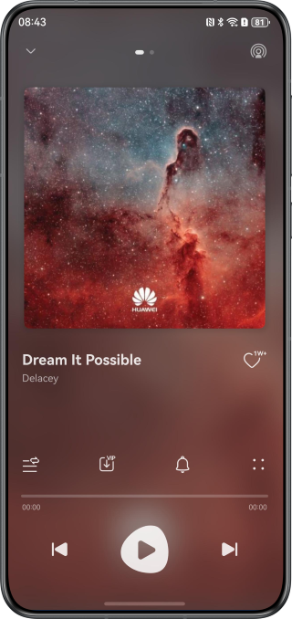
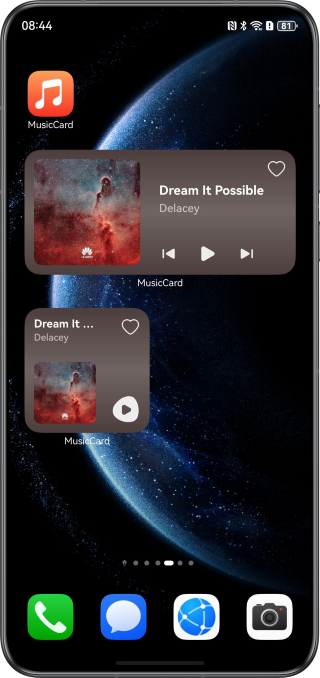
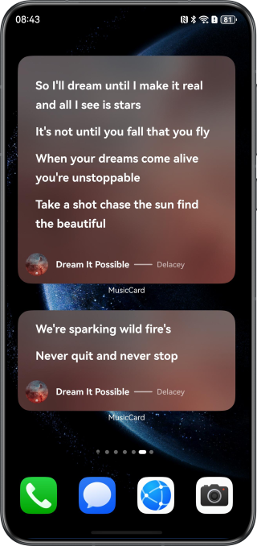
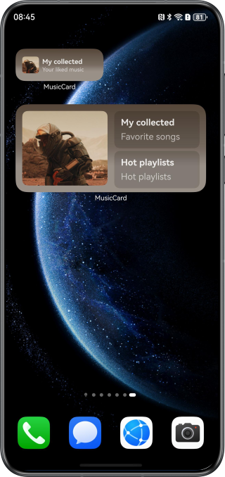
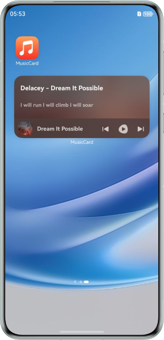

# Implementing Music Widget Using Form Kit

### Overview

The music widget is a form of service widgets in the music field. It integrates the core features of music applications, such as song playback, playlist recommendation, and lyrics, all displayed in the form of widgets. These widgets are designed with a user-friendly UI that enables instant access to key features such as music playing, pausing, and switching. Users can perform these operations without opening the application, significantly boosting the ease of use.

### Preview

| Playback screen                     | Playback Control Widget                | Lyrics Widget                         | Recommendation Widget                      | DynamicLyrics Widget |
|-------------------------------------|----------------------------------------|---------------------------------------|--------------------------------------------|----------------|
|  |  |  |  |                |

### Project Directory

```
├──entry/src/main/ets                     // Code area 
│  ├──components                          // Custom components 
│  │  ├──CustomTabBar.ets                 // Custom navigation tab bar on the home page 
│  │  ├──PlayController.ets               // Music playback control component at the bottom of the home page 
│  │  ├──PlayerView.ets                   // Music playback page 
│  │  ├──PlayList.ets                     // Playlist 
│  │  ...                                  
│  │  └──SongListItem.ets                 // Song list 
│  ├──database                            // Utility class for the database 
│  │  ├──FormRdbHelper.ets                // Utility class for widget data 
│  │  ├──PreferencesUtil.ets              // Utility class for preferences 
│  │  ├──RdbUtils.ets                     // Utility class for relational data 
│  │  └──SongRdbHelper.ets                // Utility class for the song database 
│  ├──entryability 
│  │  └──EntryAbility.ets                 // Entry ability 
│  ├──entrybackupability                   
│  │  └──EntryBackupAbility.ets           // Application data backup and restore class 
│  ├──entryformability 
│  │  └──EntryFormAbility.ets             // Widget lifecycle class 
│  ├──lyric                               // Module for implementing songs and lyrics 
│  ├──pages 
│  │  └──MainPage.ets                     // Application home page 
│  ├──utils                               // Utility class 
│  │  ├──BackgroundUtil.ets               // Utility class for background task management 
│  │  ├──FormUtils.ets                    // Utility class for widget management 
│  │  ├──ImageUtils.ets                   // Utility class for images 
│  │  ├──MediaService.ets                 // Audio playback control management class 
│  │  ...                                  
│  │  └──WindowUtils.ets                  // Utility class for window 
│  ├──view 
│  │  ├──CollectedMusic.ets               // Collected song view 
│  │  ├──HotPlaylist.ets                  // Popular playlist view 
│  │  └──RecommendedMusic.ets             // Recommended song view 
│  ├──viewmodel                           // Data model 
│  └──widget 
│     ├──model 
│     │  ├──ActionUtils.ets               // Encapsulation class of widget event interaction methods 
│     │  └──FormCardConstant.ets          // Encapsulation class of widget constants 
│     └──pages 
│        ├──LyricsCard.ets                // Lyrics widget 
│        ├──DynamicLyrics.ets             // Dynamic lyrics
│        ├──PlayControlCard2x2.ets        // 2 × 2 playback control widget 
│        ├──PlayControlCard2x4.ets        // 2 × 4 playback control widget 
│        ├──RecommendedMusic1x2.ets       // 1 × 2 recommendation widget 
│        └──RecommendedMusic2x4.ets       // 2 × 4 recommendation widget 
└──entry/src/main/resources               // Static resources

```

### How to Use
1. Touch and hold the application icon on the home page to add three types of widgets: playback control, lyrics,
   recommendation,and DynamicLyrics.
2. Touch the play, pause, previous, or next button on the playback control widget to control music playback.
3. The lyrics on the lyrics widget will be updated every half an hour.
4. Touch the favorites button on the recommendation widget to go to the Favorites page.
5. The lyrics on the Dynamic Lyrics card will display the corresponding lyrics as the playback progresses.

### How to Implement
1. Use the [updateForm](https://developer.huawei.com/consumer/en/doc/harmonyos-references/js-apis-app-form-formprovider#formproviderupdateform-1) method of formProvider to proactively update widgets, such as song information and lyrics.
2. The music playback control widget and Dynamic Lyrics card uses [postCardAction()](https://developer.huawei.com/consumer/en/doc/harmonyos-references/js-apis-postcardaction#postcardaction) to send the call event to control music playback. For details, see [Updating Widget Content Through the router or call Event](https://developer.huawei.com/consumer/en/doc/harmonyos-guides/arkts-ui-widget-event-uiability).
3. The relational database is used to implement data persistence of basic widget information in onAddForm() of EntryFormAbility.
4. Use postCardAction() to send the router event to redirect to the application page from the music widget; use the [FormLink](https://developer.huawei.com/consumer/en/doc/harmonyos-references/ts-container-formlink) component to redirect to the application page from the lyrics and playlist recommendation widgets.
5. In the widget configuration file, configure scheduledUpdateTime and updateDuration in form_config, and set updateEnabled to true to enable the widgets to update periodically. Implement the scheduled and time-specific update logic in onUpdateForm() of EntryFormAbility.
6. Use [getMainColor()](https://developer.huawei.com/consumer/en/doc/harmonyos-references/js-apis-effectkit#getmaincolor) of ColorPicker in the @ohos.effectKit module to obtain the main color of the song cover image and set this color as the card background color.
7. Use AVPlayer to play the audio. For details, see [Using AVPlayer to Play Audio (ArkTS)](https://developer.huawei.com/consumer/en/doc/harmonyos-guides/using-avplayer-for-playback).


### Permissions
* ohos.permission.KEEP_BACKGROUND_RUNNING: allows to keep service ability running in the background.
* ohos.permission.INTERNET: allows the application to access the Internet.

### Constraints
1. The sample is only supported on Huawei phones with standard systems.
2. The HarmonyOS version must be HarmonyOS 6.0.0 Beta2 or later.
3. The DevEco Studio version must be DevEco Studio 6.0.0 Beta2 or later.
4. The HarmonyOS SDK version must be HarmonyOS 6.0.0 Beta2 SDK or later.
