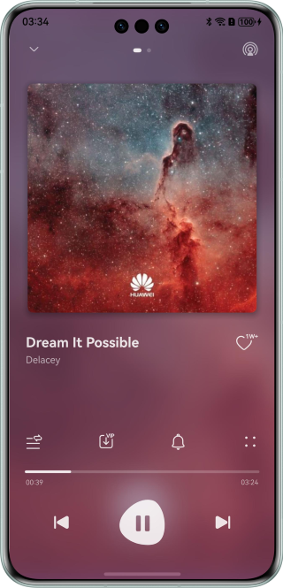

# 基于Form Kit实现音乐服务卡片

### 介绍

音乐服务卡片是服务卡片在音乐领域的一种应用形式。它集成了音乐APP
的核心功能，如歌曲播放、歌单推荐、心动歌词、动态歌词等，并以卡片的形式呈现给用户。音乐服务卡片通常设计有简洁明了的交互界面，用户可以快速访问音乐播放、暂停、切换等功能，无需打开完整的应用即可实现操作，大大提高了使用的便捷性。

### 效果预览

| 播放界面                             | 播控卡片                                | 歌词卡片                               | 推荐卡片                                    | 动态歌词卡片 |
|----------------------------------|-------------------------------------|------------------------------------|-----------------------------------------|--------|
|  |  |  |  |         |

### 工程目录

```
├──entry/src/main/ets                     // 代码区
│  ├──components                          // 自定义组件
│  │  ├──CustomTabBar.ets                 // 首页自定义导航Tabbar
│  │  ├──PlayController.ets               // 首页底部音乐播控组件
│  │  ├──PlayerView.ets                   // 音乐播放界面
│  │  ├──PlayList.ets                     // 歌曲播放列表
│  │  ...                                 
│  │  └──SongListItem.ets                 // 音乐列表列表项目
│  ├──database                            // 数据库工具类
│  │  ├──FormRdbHelper.ets                // 卡片数据库工具类
│  │  ├──PreferencesUtil.ets              // 首选项工具类
│  │  ├──RdbUtils.ets                     // 关系型数据工具类
│  │  └──SongRdbHelper.ets                // 歌曲数据库工具类
│  ├──entryability
│  │  └──EntryAbility.ets                 // 程序入口类
│  ├──entrybackupability                  
│  │  └──EntryBackupAbility.ets           // 应用数据备份和恢复类
│  ├──entryformability
│  │  └──EntryFormAbility.ets             // 卡片生命周期类
│  ├──lyric                               // 歌曲歌词实现模块
│  ├──pages
│  │  └──MainPage.ets                     // 应用主界面
│  ├──uiextensionability
│  │  ├──pages
│  │  │  └──Index.ets                      // 互动卡片UI
│  │  └──UIExtensionAbility.ets            // 互动卡片生命周期类
│  ├──utils                               // 工具类
│  │  ├──BackgroundUtil.ets               // 后台任务管理类
│  │  ├──FormUtils.ets                    // 卡片管理类
│  │  ├──ImageUtils.ets                   // 图片工具类
│  │  ├──MediaService.ets                 // 音频播控管理类
│  │  ...                                 
│  │  └──WindowUtils.ets                  // 窗口工具类
│  ├──view
│  │  ├──CollectedMusic.ets               // 收藏歌曲视图
│  │  ├──HotPlaylist.ets                  // 热门歌单视图
│  │  └──RecommendedMusic.ets             // 推荐歌曲视图
│  ├──viewmodel                           // 数据model
│  └──widget
│     ├──model
│     │  ├──ActionUtils.ets               // 卡片事件交互方法封装类
│     │  └──FormCardConstant.ets          // 卡片常量封装类
│     └──pages
│        ├──LyricsCard.ets                // 歌词卡片
│        ├──DynamicLyrics.ets             // 动态歌词卡片
│        ├──PlayControlCard2x2.ets        // 2x2音乐播控卡片
│        ├──PlayControlCard2x4.ets        // 2x4音乐播控卡片
│        ├──RecommendedMusic1x2.ets       // 1x2歌单推荐卡片
│        └──RecommendedMusic2x4.ets       // 2x4歌单推荐卡片
└──entry/src/main/resources               // 应用静态资源目录
```

### 使用说明

1. 在桌面长按应用图标，分别添加“音乐播控”、“心动歌词”、“歌单推荐”、“动态歌词”四种类型的卡片。
2. 点击“音乐播控”卡片上的播放/暂停、上一曲、下一曲，可以控制音乐的播放。
3. “心动歌词”卡片上的歌词内容会每隔半小时进行刷新。
4. 点击“歌单推荐”卡片上的”我的收藏“按钮，会跳转到应用收藏界面。
5. “动态歌词”卡片上的歌词会随着播放进度，显示对应的歌词。
6. 在2x2卡片中点击播放按钮，可以出现溢出卡牌范围的趣味动效。

### 实现说明
1. 通过formProvider的[updateForm()](https://developer.huawei.com/consumer/cn/doc/harmonyos-references/js-apis-app-form-formprovider#formproviderupdateform-1)方法实现卡片的主动更新，例如更新歌曲信息、歌词信息等。
2. 音乐播控卡片、动态歌词卡片的播控功能均通过[postCardAction()](https://developer.huawei.com/consumer/cn/doc/harmonyos-references/js-apis-postcardaction#postcardaction)发送call事件控制应用音乐播放，具体可以参考：[通过router或call事件刷新卡片内容](https://developer.huawei.com/consumer/cn/doc/harmonyos-guides/arkts-ui-widget-event-uiability)。
3. 在EntryFormAbility的onAddForm()实现卡片基本信息的数据持久化，使用关系型数据库来实现。
4. 音乐卡片通过[postCardAction()](https://developer.huawei.com/consumer/cn/doc/harmonyos-references/js-apis-postcardaction#postcardaction)发送router事件实现跳转应用页面，心动歌词和歌单推荐通过[FormLink](https://developer.huawei.com/consumer/cn/doc/harmonyos-references/ts-container-formlink)组件实现跳转应用页面。
5. 在卡片配置文件中form_config配置scheduledUpdateTime和updateDuration参数，并且设置updateEnabled为true，使能定时和定点刷新。在EntryFormAbility的onUpdateForm()中实现卡片的定时和定点刷新逻辑。
6. 使用@ohos.effectKit模块的ColorPicker的[getMainColor()](https://developer.huawei.com/consumer/cn/doc/harmonyos-references/js-apis-effectkit#getmaincolor)方法获取歌曲封面图像主色，来设置卡片背景色。
7. 音频播放通过AVPlayer来实现，具体可以参考：[使用AVPlayer播放音频(ArkTS)](https://developer.huawei.com/consumer/cn/doc/harmonyos-guides/using-avplayer-for-playback)。
8. 互动卡片通过UIExtensionAbility渲染UI，实现溢出卡片动效效果。

### 相关权限

* ohos.permission.KEEP_BACKGROUND_RUNNING：允许Service Ability在后台持续运行。
* ohos.permission.INTERNET：允许使用Internet网络。

### 约束与限制

1. 本示例仅支持标准系统上运行，支持设备：华为手机。
2. HarmonyOS系统：HarmonyOS 6.0.0 Beta2及以上。
3. DevEco Studio版本：DevEco Studio 6.0.0 Beta2及以上。
4. HarmonyOS SDK版本：HarmonyOS 6.0.0 Beta2 SDK及以上。
