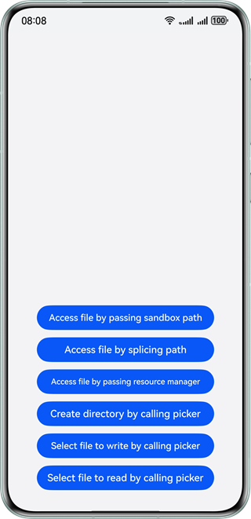

# File Access on the Native Side

### Overview

On the native side, three major types of files are accessed: app sandbox files, app resource files, and common directory files. This sample provides implementation solutions for accessing the three types of files.

### Preview

| Home page of the app                                                             |
|----------------------------------------------------------------------------------|
|  |

### How to Use

There are six buttons on the page, which correspond to different scenarios of file access.
- Tap any of the first three buttons. A dialog box is displayed, which shows the content of the accessed file.
- Tap the fourth button to start the picker and create a file.
- Tap the fifth button to start the picker and select a file. The file operation result is returned.
- Tap the sixth button to start the picker and select a file. The file content is returned.

### Project Directory

```
├──entry/src/main/cpp                 // Native layer
│  ├──types                           // Interfaces exposed by the native layer
│  │  └──libfile_access               // Interfaces exposed to the UI layer
│  ├──CMakeLists.txt                  // Compilation entry
│  └──FileAccessMethods.cpp           // Native file operation methods
├──ets                                // UI layer
│  ├──common                          // Common modules
│  │  └──utils                        // Common utilities
│  │     ├──FileOperate.ets           // File operation methods of invoking the picker
│  │     ├──Logger.ets                // Logger
│  │     └──ReadFile.ets              // File reading methods on the ArkTS side
│  ├──entryability                    // App entry
│  │  └──EntryAbility.ets
│  ├──entrybackupability
│  │  └──EntryBackupAbility.ets
│  ├──model
│  │  └──FileNameModel.ets
│  └──pages                           // Pages contained in the EntryAbility
│     └──Index.ets                    // Home page of the app
├──resources                          // Static resources of the app
│  ├──base                            // Resource files in this directory are assigned unique IDs.
│  │  ├──element                      // Fonts and colors
│  │  ├──media                        // Images
│  │  └──profile                      // Home page of the app entry
│  ├──en_US                           // Resources in this directory are preferentially matched when the device language is American English.
│  ├──rawfile                         // Resource files of the app
│  └──zh_CN                           // Resources in this directory are preferentially matched when the device language is simplified Chinese.
└──module.json5                       // Module configuration
```

### How to Implement

- App sandbox files can be accessed by passing paths or concatenating paths. The NAPI is called to pass parameters and the C standard API is used to access files.
- App resource files can be accessed through resource objects on the native side by passing the resource manager.
- Common directory files can be accessed through **fd** passed by the picker by calling the C standard API.

### Permissions

- N/A

### Dependencies

- N/A

### Constraints

1. The sample is only supported on Huawei phones with standard systems.

2. The HarmonyOS version must be HarmonyOS 5.0.5 Release or later.

3. The DevEco Studio version must be DevEco Studio 5.0.5 Release or later.

4. The HarmonyOS SDK version must be HarmonyOS 5.0.5 Release SDK or later.