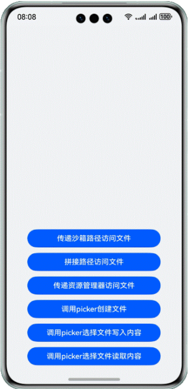

# 实现Native侧文件访问

### 介绍

应用在Native侧进行文件访问主要有三种场景，第一种是访问应用沙箱文件，第二种是访问应用资源文件，最后一种是访问公共目录文件，本sample将针对这三种场景给出实现方案。

### 效果预览

| 应用主界面                                                                      |
|----------------------------------------------------------------------------|
|  | 

### 使用说明

点击进入页面后，页面有六个按钮，分别对应不同的文件访问方案。
- 点击前三个按钮会出现弹窗显示访问的文件内容；
- 点击第四个按钮拉起picker，创建文件；
- 点击第五个按钮会拉起picker选择文件，返回对文件操作的结果；
- 点击第六个按钮会拉起picker选择文件，返回文件的内容。

### 工程目录

```       
├──entry/src/main/cpp                 // Native层
│  ├──types                           // Native层暴露上来的接口
│  │  └──libfile_access               // 暴露给UI层的接口
│  ├──CMakeLists.txt                  // 编译入口
│  └──FileAccessMethods.cpp           // Native文件操作方法       
├──ets                                // UI层
│  ├──common                          // 公共模块
│  │  └──utils                        // 共用的工具类
│  │     ├──FileOperate.ets           // 调用picker文件操作方法
│  │     ├──Logger.ets                // 日志类
│  │     └──ReadFile.ets              // ArkTS侧读取文件方法
│  ├──entryability                    // 应用的入口
│  │  └──EntryAbility.ets            
│  ├──entrybackupability            
│  │  └──EntryBackupAbility.ets          
│  ├──model            
│  │  └──FileNameModel.ets            
│  └──pages                           // EntryAbility 包含的页面
│     └──Index.ets                    // 应用主页面
├──resources                          // 用于存放应用所用到的资源文件
│  ├──base                            // 该目录下的资源文件会被赋予唯一的ID
│  │  ├──element                      // 用于存放字体和颜色 
│  │  ├──media                        // 用于存放图片
│  │  └──profile                      // 应用入口首页
│  ├──en_US                           // 设备语言是美式英文时，优先匹配此目录下资源
│  ├──rawfile                         // 应用资源文件
│  └──zh_CN                           // 设备语言是简体中文时，优先匹配此目录下资源
└──module.json5                       // 模块配置信息
```

### 具体实现

- 访问沙箱文件主要通过传递路径和拼接路径两种方式，主要调用napi接口传递参数，利用C标准接口访问文件；
- 访问应用资源文件通过传递resource manager，在Native侧通过资源对象访问文件；
- 访问公共目录文件通过picker传递的fd，调用C标准接口访问。

### 相关权限

- 不涉及

### 依赖

- 不涉及

### 约束与限制

1. 本示例仅支持标准系统上运行，支持设备：华为手机;

2. HarmonyOS系统：HarmonyOS 5.0.5 Release及以上;

3. DevEco Studio版本：DevEco Studio 5.0.5 Release及以上;

4. HarmonyOS SDK版本：HarmonyOS 5.0.5 Release SDK及以上。    