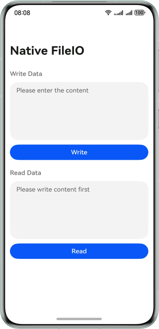

# Reading and Writing Files on the Native Side

### Overview

This sample shows how to read and write files on the native side. It helps you learn how to accurately obtain the length of the string passed from ArkTS side to native side and master the method of reading and writing files on the native side.

### Preview




How to Use

1. Tap the text box, enter content, and tap the Write button to write the entered content to a local file.

2. Tap the Read button to read the data. The data will be displayed.


### Project Directory
```
├──entry/src/main/cpp                   // C++ code area
│  ├──types
│  │  └──libentry                       // Exported C++ APIs
│  │     ├──Index.d.ts
│  │     └──oh-package.josn5
│  ├──CMakeLists.txt                    // CMake file
│  └──napi_init.cpp                     // Implementation of native service code
├──entry/src/main/ets                   // ArkTS code area
│  ├──entryability
│  ├──entrybackupability
│  └──pages
│     └──Index.ets                      // Home page
└──entry/src/main/resources             // Resources
```
### How to Implement
* When writing a file, obtain the file path and content from ArkTS side and pass them to native side.
* Call the **napi_get_value_string_utf8** function to obtain the string length, and then allocate the memory space of the character array accordingly.
* Call the **napi_get_value_string_utf8** function again to obtain the string content and write it to a file.
* When reading a file, use **napi_create_string_utf8** to obtain the file content and return it to ArkTS side.

Note: When allocating memory for the content to be written, you can increase the length by 1 so that it is more convenient to add a terminator '\0' to the string.

### Permissions

N/A

### Dependencies

N/A

### Constraints

1. The sample is only supported on Huawei phones with standard systems.

2. The HarmonyOS version must be HarmonyOS 5.0.5 Release or later.

3. The DevEco Studio version must be DevEco Studio 5.0.5 Release or later.

4. The HarmonyOS SDK version must be HarmonyOS 5.0.5 Release SDK or later.