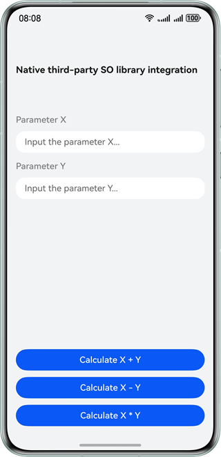

# Third-Party .so Library Integration

### Overview

This sample provides three solutions for referencing third-party .so libraries during development:

1. Compile dynamic link libraries on the native side.
2. Call **dlopen** on the native side.
3. Configure dynamic dependencies of the module on the ArkTS side.

### Preview

| Main page of the app                                            |
|-----------------------------------------------------------------|
|  |

### How to Use

On the main page of the app, enter parameters **X** and **Y**, and tap the three buttons to invoke third-party .so libraries for calculation:

1. Tap the first button to perform addition. The third-party .so libraries are referenced by compiling dynamic link libraries on the native side.
2. Tap the second button to perform subtraction. The third-party .so libraries are referenced by calling **dlopen** on the native side.
3. Tap the third button to perform multiplication. The third-party .so libraries are referenced by configuring dynamic dependencies of the module on the ArkTS side.

### Project Directory

```
├──entry/libs                         // Third-party .so library files
│  └──arm64-v8a
│     ├──libmultiply.so               // Third-party .so library file for multiplication
│     ├──libnativeAdd.so              // Third-party .so library file for addition
│     └──libnativeSub.so              // Third-party .so library file for subtraction
├──entry/src/main/cpp                 // Native layer
│  ├──add
│  │  └──add.h                        // Header file for addition
│  ├──types                           // Interfaces provided by the native layer
│  │  ├──libentry
│  │  │   ├──index.d.ts               // Interfaces on the native side
│  │  │   └──oh-package.json5         // Configuration file on the native side
│  │  └──libmultiply
│  │     ├──index.d.ts                // Native interface file
│  │     └──oh-package.json5          //  Native configuration file
│  ├──CMakeLists.txt                  // Compilation entry
│  └──napi_init.cpp                   // NAPI implementation
├──ets                                // UI layer
│  ├──entryability                    // App entry
│  │  └──EntryAbility.ets
│  ├──entrybackupability
│  │  └──EntryBackupAbility.ets
│  ├──pages
│  │  └──Index.ets                    // Home page of the app
│  └──view
│     └──ParamTextInputComponent.ets  // Parameter text input
├──resources                          // App resources
└──Multiply/src/main/cpp              // Compilation and generation of third-party .so libraries
├──add
│  ├──add.h                        // Header file for addition
│  └──add.cpp                      // Source file for addition
├──sub
│  ├──sub.h                        // Header file for subtraction
│  └──sub.cpp                      // Source file for subtraction
├──types                           // Interfaces provided by the native side
│  └──libmultiply
│     ├──index.d.ts                // Native interface file
│     └──oh-package.json5          // Native configuration file
├──CMakeLists.txt                  // Compilation entry
└──napi_init.cpp                   // NAPI implementation
```

### How to Implement

A Multiply module is created and used to generate the .so libraries for addition, subtraction (C language), and multiplication (adapted to the native side). The generated third-party .so libraries are placed in the corresponding directories of **entry/lib**.

* Solution 1: Modify **CMakeList.txt**, add the .so libraries to the project for compilation and reference, place the header files corresponding to the .so libraries in the **cpp** directory, and import the header files to the native side.
* Solution 2: After the .so libraries are added to the project, pass the sandbox path from ArkTS to the native side, and use dlopen to call the sandbox on the native side.
* Solution 3: Create a directory in **src/main/cpp/types**, create **index.d.ts** and **oh-package.json5**, and declare the .so library dependencies in the module-level **oh-package.json5**. Run the **import** command to reference the calls to the declared dependency names on the ArkTS side.

### Permissions

N/A

### Dependencies

N/A

### Constraints

1. The sample app is supported only on Huawei phones running the standard system.

2. The HarmonyOS version must be HarmonyOS 5.0.5 Release or later.

3. The DevEco Studio version must be DevEco Studio 5.0.5 Release or later.

4. The HarmonyOS SDK version must be HarmonyOS 5.0.5 Release SDK or later.