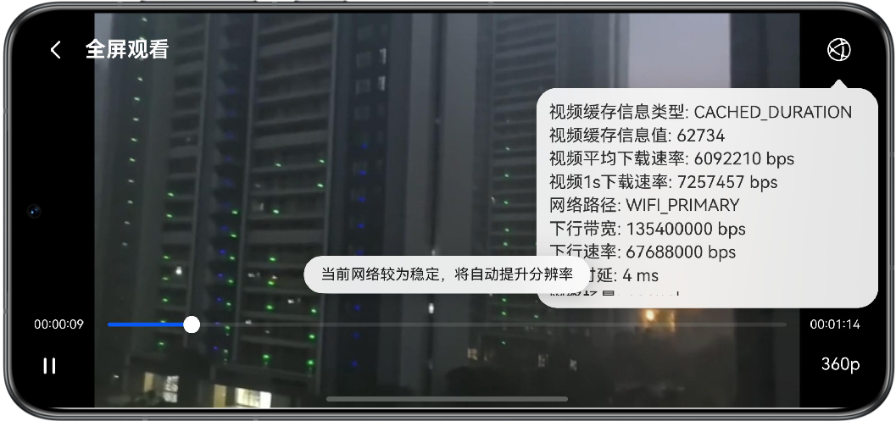

# 网络视频流自适应码率调节

## 简介

本示例基于HarmonyOS提供的媒体(AVPlayer)、网络质量评估(Network Boost Kit)等能力，实现视频流码率的自定义调节功能，可以在弱网环境下以画面质量换取播放流畅度，减少视频卡顿次数。

## 效果预览

| 码率下调                               | 码率上调                             |
|------------------------------------|----------------------------------|
|  |  |

## 工程目录

```
├──entry/src/main/ets
│  ├──common  
│  │  ├──utils                          // 工具类
│  │  │  ├──CommonUtils.ets             // 通用工具类
│  │  │  └──Logger.ets                  // 日志类
│  │  ├──CommonConstants.ets            // 常量类
│  │  └──CustomConfigs.ets              // 自定义配置类                         
│  ├──entryability  
│  │  └──EntryAbility.ets               // 程序入口
│  ├──model                                     
│  │  ├──NetInfoModel.ets               // 网络信息类
│  │  └──ViewInfoModel.ets              // 视频信息类
│  ├──pages                                     
│  │  └──Index.ets                      // 首页
│  ├──viewmodel                                     
│  │  ├──AVPlayerController.ets         // 视频核心控制类
│  │  └──NetInfoViewModel.ets           // 视频信息交互类
│  └──view
│     ├──VideoPlayControl.ets           // 视频播放暂停控制组件
│     ├──VideoPlayInfo.ets              // 视频播放信息展示组件
│     ├──VideoProgressBar.ets           // 视频进度条组件
│     └──VideoResolutionSelector.ets    // 视频分辨率切换组件
└──entry/src/main/resources             // 应用资源目录
```

## 使用说明

1. 准备可用的多码率hls视频流。本示例使用FFmpeg+Nginx搭建测试用视频播放服务器，可参考[测试环境搭建](./server/README.md)进行搭建。

2. 修改`entry/src/main/ets/common/CustomConfigs.ets`中的配置项，补充hls视频流链接、缓冲区大小等配置，其中不同的hls视频流需要正确配置所有的配置项。

   | 配置参数名称                   | 类型                         | 说明                                                         |
   |--------------------------|----------------------------|------------------------------------------------------------|
   | X_COMPONENT_ID           | string                     | XComponent组件自定义id。                                         |
   | URL                      | string                     | hls多码率流链接，需要保证链接有效。                                        |
   | PREFERRED_BUFFER_SIZE    | number                     | 视频缓冲区大小，范围[5, 20]，单位为MB，本示例中为最大值20MB。                      |
   | CACHED_PERCENT_THRESHOLD | number                     | 码率调节判决阈值占比，范围(0, 1)，当可播放时长低于缓冲区最大可播放时长一定占比后则进行判决。本示例中为0.2。 |
   | PLAYBACK_STRATEGY        | media.PlaybackStrategy     | 播放策略配置，默认应用PREFERRED_BUFFER_SIZE。参考AVPlayer文档说明。           |
   | MEDIA_SOURCE             | media.MediaSource          | 播放媒体源配置，默认应用URL。参考AVPlayer文档说明。                            |
   | SELECTABLE_RESOLUTIONS   | Map<number, string>        | 与URL同配置，需保证分辨率高度与码率一一对应。                                   |
   | SELECTABLE_NET_PATH      | Array<netQuality.PathType> | 点击界面右上角查看信息的网络类型，参考Network Boost Kit相关说明。                  |

3. 启动应用后显示视频播放界面，可自由控制播放状态、进度以及分辨率，右上角的“信息”可查看当前视频播放相关信息。

4. AVPlayer自身具有码率自适应能力，因此本示例在视频播放前主动触发了一次码率切换，使得AVPlayer自身的码率自适应能力失效，此时自定义调节策略可正常生效。

## 具体实现

自定义调节策略的核心思想为根据视频缓存余量、下载速率以及当前码率判断播放过程中的缓冲压力，之后根据结果提高或者降低码率。本示例中的策略如下，开发者可根据实际视频资源进行调整。

> **说明**：由于代码示例自身无法实现弱网模拟，因此需要自行进行弱网模拟并测试效果。

1. 视频正常播放中，应用弱网环境，此时视频缓存整体处于降低趋势，缓冲压力较大。当视频剩余播放缓存时长低于阈值时，获取近期视频下载速率，参考其值降低视频码率。

2. 视频码率调节后，网络可以满足当前码率，此时视频缓存整体处于上升趋势，缓存压力较小。此阶段内满足以下条件，考虑上调一级码率：
   - 当前视频码率不为最高码率。
   - 当前码率下已缓存视频的可播放时长达到了上一级码率的最大视频缓存可播放时长。
   - 近期峰值下载速率高于上一级码率。
   - 不处于分辨率切换阶段，即码率发生变化，但分辨率未完成切换的状态。此阶段之前视频的缓存数据未完全消耗。
   - 近期一定时间内未发生分辨率调整，即网络相对稳定。
   
   例如缓存区大小为20MB，上一次降低码率后的峰值下载速率为1MB/s，上一级码率为6000000bps，此时近期峰值下载速率高于上一级码率。根据上述数据，
   计算得到上一级码率的最大视频缓存可播放时长为20 * 1024 * 1024 * 8 / 6000000 = 33.55s。若当前视频剩余缓存播放时长高于33.55s，且近期
   一定时间内未发生分辨率调整，可以上调一级码率。当分辨率完成上调后，由于最后一个条件的限制，下次上调需等待一定时间，避免网络波动时频繁切换码率。

3. 其他情况下，不改变视频码率。

相关代码可参考[AVPlayerController.ets](./entry/src/main/ets/viewmodel/AVPlayerController.ets)中AVPlayer的on('bufferingUpdate')回调内实现。

## 相关权限

1. 网络权限：`ohos.permission.INTERNET`。

2. 获取网络信息权限：`ohos.permission.GET_NETWORK_INFO`。

## 约束与限制

1. 本示例仅支持标准系统上运行，支持设备：华为手机。

2. HarmonyOS系统：HarmonyOS 5.0.5 Release及以上。

3. DevEco Studio版本：DevEco Studio 5.0.5 Release及以上。

4. HarmonyOS SDK版本：HarmonyOS 5.0.5 Release SDK及以上。
