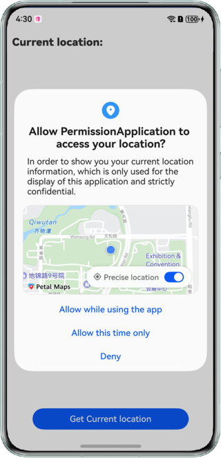
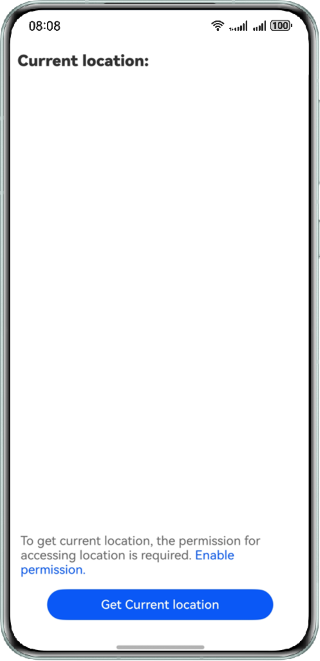
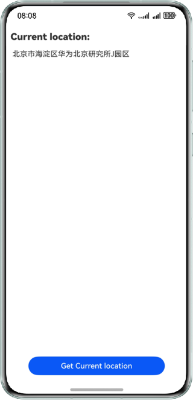

# Requesting Application Permissions

### Overview

This sample showcases how to request location permissions.

### Preview

| Location permission request dialog    | Prompt message                             | Current location information            |
|---------------------------------------|--------------------------------------------|-----------------------------------------|
|  |  |  |

How to Use

1. Tap the Obtain Current Location button. The dialog box for requesting location permissions is displayed.
2. If the permission request is rejected, a message is displayed above the button.
3. Tap the blue text in the message or the Obtain Current Location button. The dialog box for requesting location permissions is displayed again.
4. After the permission request is approved, if precise location is not allowed, the system prompts you to obtain the precise location after the dialog box is closed, and only an approximate location is displayed on the current page.
5. After precise location is enabled, tap the Obtain Current Location button. If the system location service is disabled, the dialog box for the global switch is displayed.
6. If access to the location is prohibited, the system prompts you to enable the location service after the dialog box is closed.
7. If access to the location is allowed, tap the Obtain Current Location button. The current location is displayed.


### Project Directory
```
├──entry/src/main/ets/
│  ├──entryability
│  │  └──EntryAbility.ets
│  ├──entrybackupability
│  │  └──EntryBackupAbility.ets
│  └──pages
│     └──Index.ets                 // Home page
└──entry/src/main/resources        // Static resources of the app
```

### How to Implement

1. The **requestPermissionsFromUser()** method is called to request permissions from the user. The return **authResults** indicates whether the user is authorized. The return **dialogShownResults** indicates whether a dialog box is displayed.
2. If the value of **authResults** is **-1** and the value of **dialogShownResults** is **false**, the current app is not authorized and the permission request dialog box is not displayed to the user. In this case, the app can call the **requestPermissionOnSetting()** method to open the dialog box for setting permissions.
3. The **isLocationEnabled()** method is used to check whether the location service is enabled. If the location service is disabled, the **requestGlobalSwitch()** method is used to open the dialog box for setting the global switch.

### Dependencies
N/A

### Permissions

**ohos.permission.APPROXIMATELY_LOCATION** and **ohos.permission.LOCATION**

### Constraints

1. The sample is only supported on Huawei phones with standard systems.

2. The HarmonyOS version must be HarmonyOS 5.0.5 Release or later.

3. The DevEco Studio version must be DevEco Studio 5.0.5 Release or later.

4. The HarmonyOS SDK version must be HarmonyOS 5.0.5 Release SDK or later.