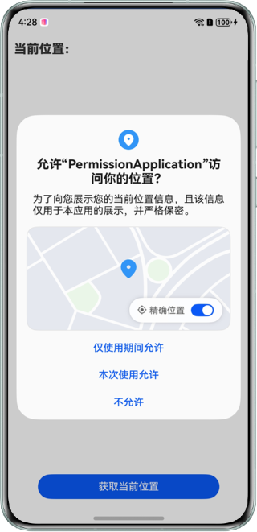

# 实现权限申请功能

### 介绍

本示例以位置权限为例，演示权限申请全流程的实现过程。帮助开发者在权限申请的场景开发中，了解申请全流程。

### 效果预览

| 位置权限申请弹窗                           | 提示文字                                    | 当前位置信息                               |
|------------------------------------|-----------------------------------------|--------------------------------------|
|  |  |  |

使用说明

1. 点击“获取当前位置”，弹出位置权限申请弹窗；
2. 权限申请禁止后，按钮上方显示提示文字；
3. 点击提示文字中蓝色字体或“获取当前位置”按钮，二次弹出权限弹窗；
4. 二次权限申请允许后，若不允许精确位置，关闭弹窗后提示获取精确位置信息，并在当前位置显示模糊定位信息；
5. 允许精确位置后，点击“获取当前位置”按钮，若系统位置服务功能关闭，则拉起全局开关弹窗；
6. 若不允许访问我的位置，关闭弹窗后提示开启位置服务信息；
7. 若允许访问我的位置，点击“获取当前位置”按钮，显示当前位置信息。


### 工程目录
```
├──entry/src/main/ets/
│  ├──entryability
│  │  └──EntryAbility.ets
│  ├──entrybackupability
│  │  └──EntryBackupAbility.ets
│  └──pages
│     └──Index.ets                 // 首页
└──entry/src/main/resources        // 应用静态资源目录
```

### 实现思路

1. 调用requestPermissionsFromUser()方法向用户申请授权，通过返回结果authResults判断用户是否授权，通过返回结果dialogShownResults判断是否有系统弹框；
2. 当authResults为-1，dialogShownResults为false时，表示当前应用没有被授权且没有向用户展示请求授权的弹框，则应用可调用requestPermissionOnSetting()方法，拉起权限设置弹框；
3. 通过isLocationEnabled()方法判断位置服务是否开启，若关闭可使用requestGlobalSwitch()方法拉起全局开关设置弹框。

### 依赖
无

### 相关权限

获取定位权限：ohos.permission.APPROXIMATELY_LOCATION和ohos.permission.LOCATION。

### 约束与限制

1.本示例仅支持标准系统上运行，支持设备：华为手机。

2.HarmonyOS系统：HarmonyOS 5.0.5 Release及以上。

3.DevEco Studio版本：DevEco Studio 5.0.5 Release及以上。

4.HarmonyOS SDK版本：HarmonyOS 5.0.5 Release SDK及以上。